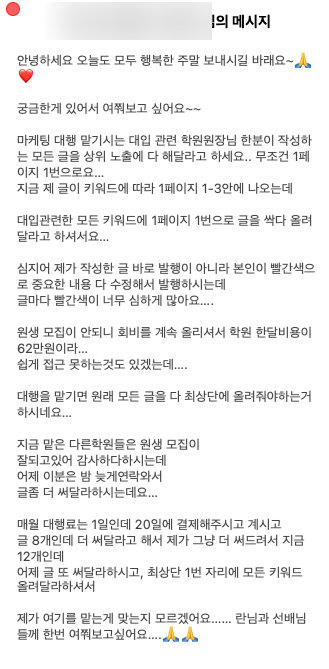
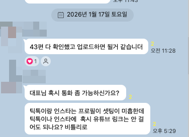
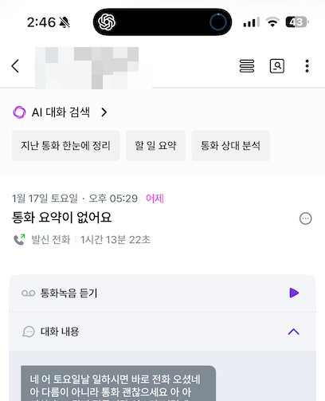

# [수강생질문답변] 수정 요청 많이 하는 클라이언트 어떻게 할까요?

- 원천 ID: EPR-CAFE-33606
- 작성자: 주는사란
- 작성일: 2026-01-18T14:54:39.527000+09:00
- 원문: https://cafe.naver.com/ranschool/33606
- 수집일: 2026-09-21
- 텍스트 정리: HTML 문단 순서 유지, 빈 문단·제로폭 공백만 제거. 원본 HTML·JSON 별도 보존. 이미지는 아래에 모아 보관하며 원래 배치는 HTML에서 확인.

## 원문 본문

<!-- P001 -->
먼저 너무 고생하셨다는 말씀드리고 싶어요. 이런 업체 유지하기 너무 어려운데, 고민하신다는 것은 힘들지만 그래도 극복해보고자 하는 마음이 느껴지셔서요. 그래서 아주 자세히 답변 드립니다.

<!-- P002 -->
계속 맡을까요?

<!-- P003 -->
사실 이건 원하시는대로 하시면 됩니다. 이렇게 말씀드리는 이유는 사실 이 업체를 더 하냐, 마냐가 중요한건 아니라서예요. 제 생각에는 이 업체를 맡게된 '과정' 에서 문제가 있었던것 같아요. 이건 2번에서 말씀드릴게요.

<!-- P004 -->
대신 지속여부에 있어서 기준은 '시간 대비 효율' 은 아니어야 하구요. 내 '커리어' 를 기준으로 생각하셔야 합니다. 그래서 이 블로그를 수정을 해서건 아니건 다른 업체 맡을때 포폴로 내놓기 좋을것 같다 하시면 하시는게 좋구요. 아니면 안하셔도 됩니다.

<!-- P005 -->
개인적으로 지속여부는 '내 포폴로 사용하기 적당한가' 이거로만 판단하면 된다고 생각해요. 그럼 시간대비 효율이 안나와도 포폴이 쌓이는 것으로만으로도 그건 퉁? 쳐진다고 생각합니다.

<!-- P006 -->
자 그럼 이 고객과 지금 수강생분 사이에서의 문제를 좀더 정확히 봐볼게요. 사실 이건 단순히 "왜 이렇게 날 귀찮게해?" 하는 차원의 문제는 아닙니다. 구체적으로 보면

<!-- P007 -->
1. 상위노출에 대한 설명 부족

<!-- P008 -->
고객 상황 -

<!-- P009 -->
1) 마케팅 대행 맡기시는 대입 관련 학원원장님 한분이 작성하는 모든 글을 상위 노출에 다 해달라고 하세요.. 무조건 1페이지 1번으로요…

<!-- P010 -->
지금 제 글이 키워드에 따라 1페이지 1-3안에 나오는데 대입관련한 모든 키워드에 1페이지 1번으로 글을 싹다 올려달라고 하셔서요…

<!-- P011 -->
2) 대행을 맡기면 원래 모든 글을 다 최상단에 올려줘야하는거 하시네요…

<!-- P012 -->
=> 이 고객은 정확히는 상위노출 개념을 이해를 못하고 계세요. 1페이지에 노출이 되면 그 안에서 꼭 1번이 아니더라도 의미가 있다는걸 모르시는 것 같아요. 그래서 이 부분에 대한 설명이 부족했거나, 혹은 설명을 했다면 이걸 고집하는 이유에 대한 서로 소통이 안된것 같습니다. 그리고 이건 우리가 보장할수 있는 부분이 아니라는 것도 설명을 추가로 했어야 했고, 그것에 동의하지 않는다면 계약을 하지 않았어야 했어요.

<!-- P013 -->
2. 수정요청의 적절성

<!-- P014 -->
고객 상황 -

<!-- P015 -->
심지어 제가 작성한 글 바로 발행이 아니라 본인이 빨간색으로 중요한 내용 다 수정해서 발행하시는데 글마다 빨간색이 너무 심하게 많아요….

<!-- P016 -->
=> 글을 거의 수정한다는건 정확히는 글의 문제라기 보다는, 글을 내가 왜 이렇게 썼는지 그 '의도' 가 전달이 안된 것 입니다. 마케팅 대행은 '서비스업' 입니다. 우리는 글을 납품하는 업체가 아니예요. 근데 그냥 블로그 글만 주면 글 납품하는 업체가 됩니다. 왜 이렇게 썼는지 그 의도가 제대로 전달이 되어야해요. 이건 제가 이전에 이미 쓴 글이 있으니 아래 글 참고해주세요.

<!-- P017 -->
대한민국 모임의 시작, 네이버 카페

<!-- P018 -->
cafe.naver.com

<!-- P019 -->
그럼에도 불구하고 수정하기를 원한다면 수정을 해야죠. 근데 이 분처럼 글을 많이 수정한다면, 사실 그냥 그 원장님이 스스로 쓰는게 낫습니다. 그리고 아마 원장님도 그런 차원에서 불만족 하겠죠.

<!-- P020 -->
그래서 아마 3번의 상황이 나오게 된걸거예요.

<!-- P021 -->
3. 대행료 결제일 미뤄짐

<!-- P022 -->
고객상황 -

<!-- P023 -->
지금 맡은 다른학원들은 원생 모집이

<!-- P024 -->
잘되고있어 감사하다하시는데

<!-- P025 -->
어제 이분은 밤 늦게연락와서

<!-- P026 -->
글좀 더 써달라하시는데요…

<!-- P027 -->
매월 대행료는 1일인데 20일에 결제해주시고 계시고

<!-- P028 -->
글 8개인데 더 써달라고 해서 제가 그냥 더 써드려서 지금 12개인데

<!-- P029 -->
어제 글 또 써달라하시고, 최상단 1번 자리에 모든 키워드 올려달라하셔서

<!-- P030 -->
=> 대행료가 미뤄진다는건 사실 그 원장님은 내 동기부여가 자신과 별개라고 생각해서예요. 이게 무슨말이냐면, 결제를 미루는 사람들 특징은 결제일을 안지켜도 내가 받는 결과물(블로그)에 큰 차이가 없을거라고 생각하곤 합니다.

<!-- P031 -->
그럼 이게 내 실력 문제인가? 라는 차원에서 이 수강생분은 그건 아니예요. 이분이 맡은 다른 학원에서는 잘 되고 있느까요. 개인적으로는 처음에 계약전에 신뢰를 쌓는게 부족하지 않았나 싶어요. (상위노출 설명 등) 원래 이런 과정이 탄탄히 되어있어야 이후에 문제가 덜 되곤합니다.

<!-- P032 -->
물론 이게 너무 있어도 조금 힘들때가 있긴 해요.

<!-- P033 -->
어제 한시간 넘게 통화했습니다....

<!-- P034 -->
근데 사실 저는 이런걸 좋아하기도 하고 ㅎㅎ 무엇보다 결국 다른 마케팅도 또 하고 싶다는 거였어요. 그래서 다음에 언제부터 할지를 이야기하는 통화로 마무리 하긴 했습니다.

<!-- P035 -->
정리하자면 -

<!-- P036 -->
저는 업체 지속 여부 결정하는 기준은 '내 포폴' 이예요. 마케팅대행은 어느 업체를 했냐가 포폴인데 그 포폴로 의미있게 내밀수 있으면 계속 하고 아니면 안합니다.

<!-- P037 -->
고객과의 소통에서는 '계약 전'에 서로 어떤 서비스를 주는 것인저 정확히 알려주는게 중요합니다. 근데 상위노출등 그 로직을 제대로 이해못하고 계신것 같아요. 그걸 설명하는 과정을 제대로 해야 이후에 오해가 생기지 않습니다.

<!-- P038 -->
그래서 제가 항상 마케팅 대행은 어떤 '글'이나 '영상'을 판매하는 것이 아니라, 한 '방법''전략'을 판매하는 것이라고 말씀드린것이예요. 아래 글 참조 -

<!-- P039 -->
대한민국 모임의 시작, 네이버 카페

<!-- P040 -->
cafe.naver.com

## 본문 이미지

## 원문에 포함된 링크

- #
- https://cafe.naver.com/ranschool/32665
- https://cafe.naver.com/ranschool/33602
