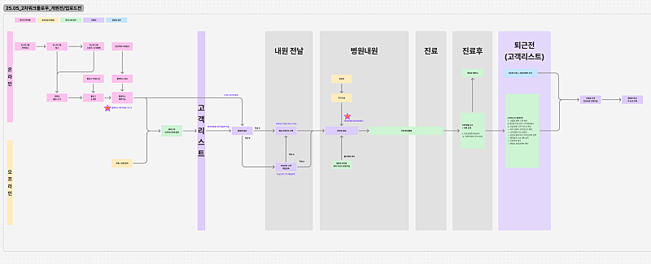
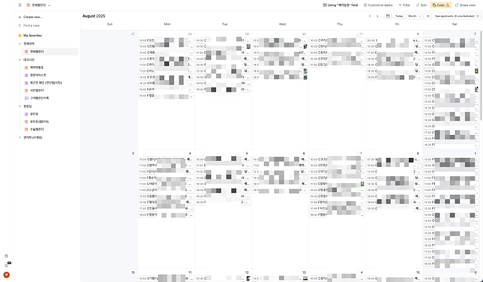
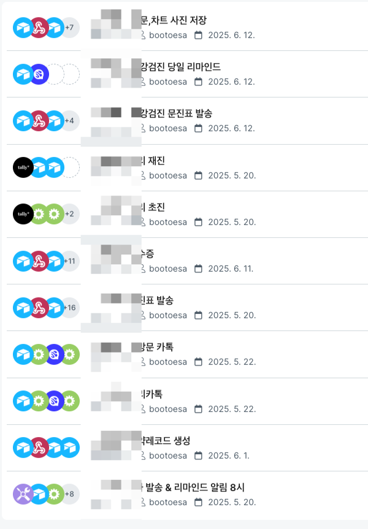
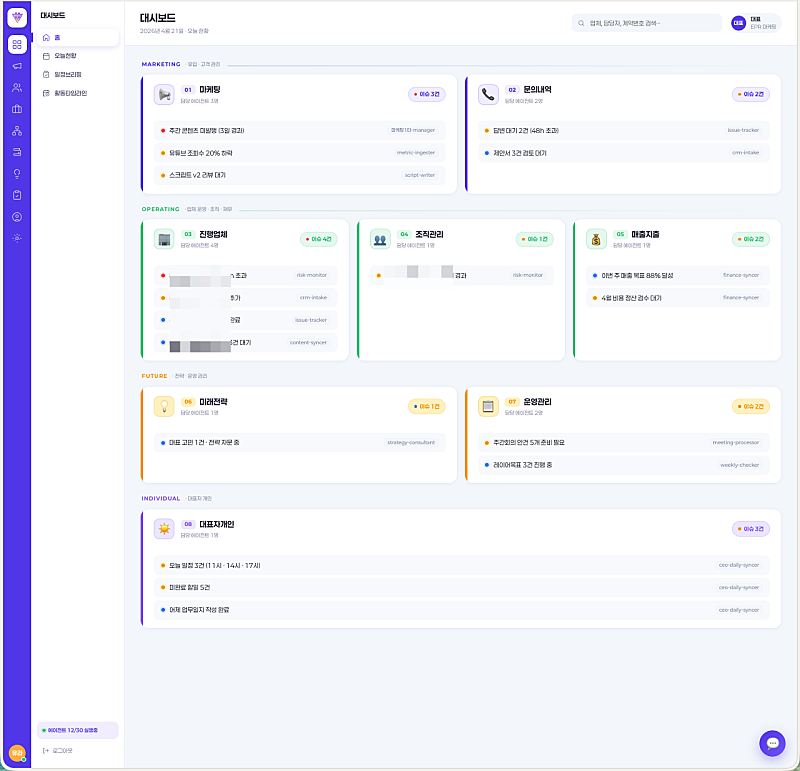
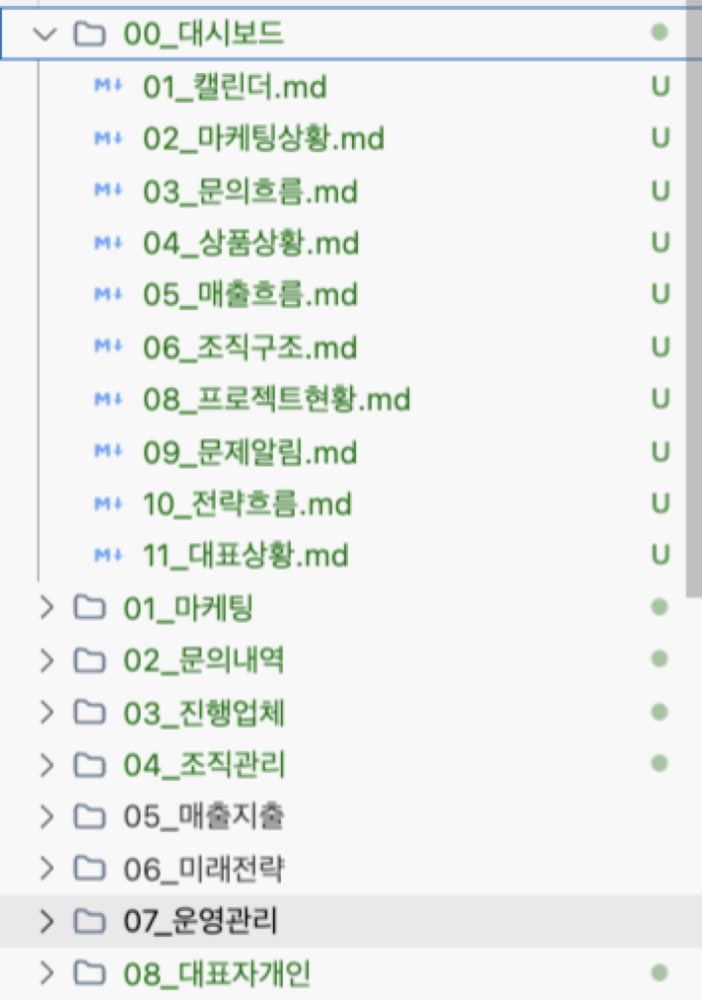
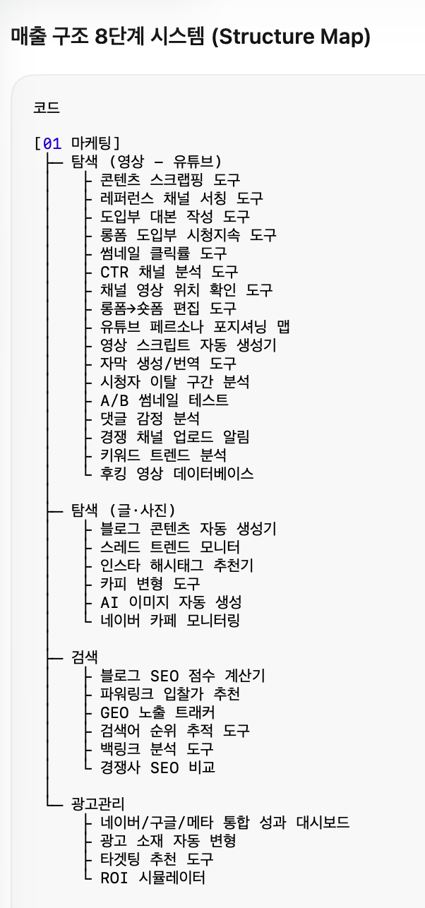
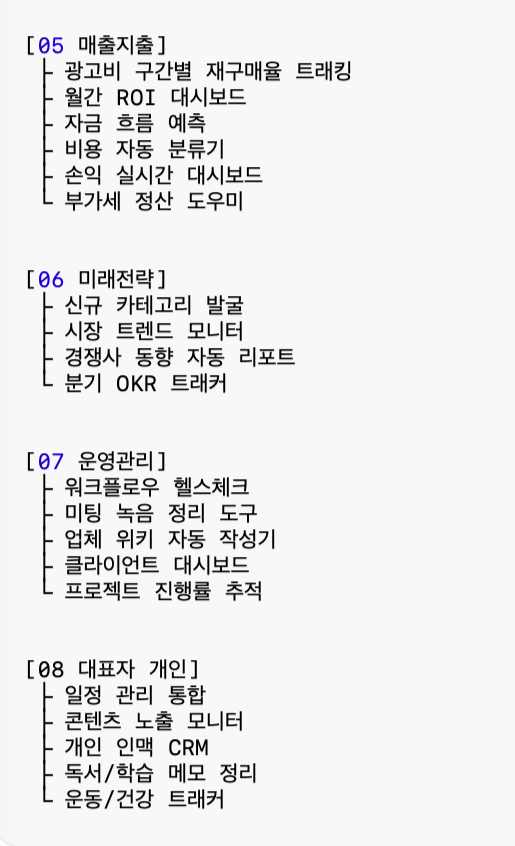
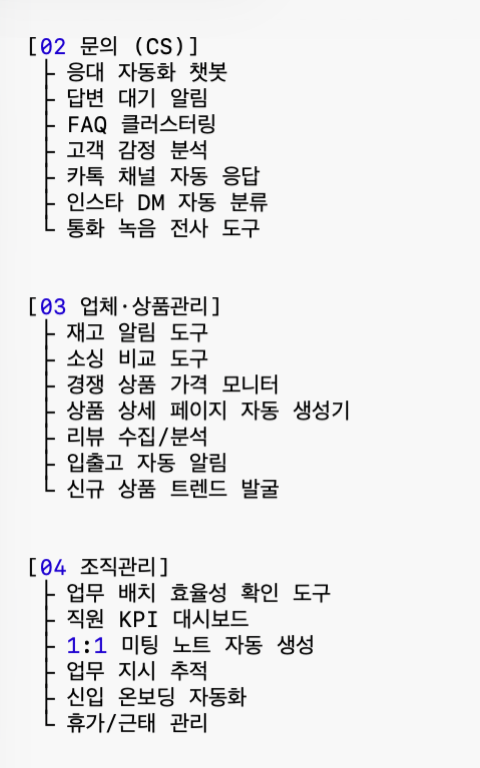
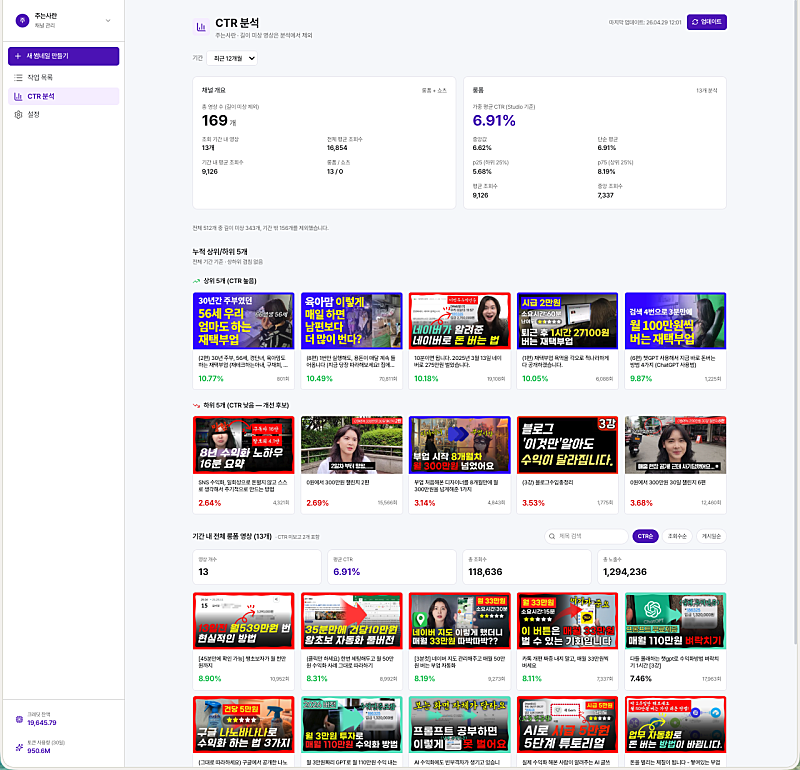
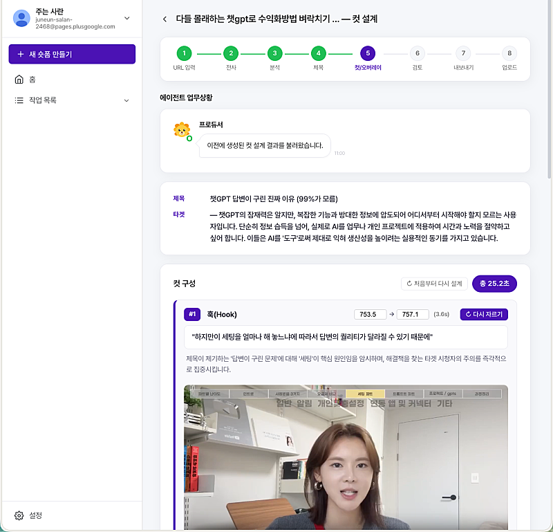

# 마감 - 블로그 마케팅 부업 마지막 오프라인 강의 안내

- 원천 ID: EPR-CAFE-33779
- 작성자: 주는사란
- 작성일: 2026-04-29T14:49:45.507000+09:00
- 원문: https://cafe.naver.com/ranschool/33779
- 수집일: 2026-09-21
- 텍스트 정리: HTML 문단 순서 유지, 빈 문단·제로폭 공백만 제거. 원본 HTML·JSON 별도 보존. 이미지는 아래에 모아 보관하며 원래 배치는 HTML에서 확인.

## 원문 본문

<!-- P001 -->
4년간 함께해주신 모든 분들께 감사드립니다. 사실 2월부터 이미 판매를 중단했는데, 고민이 길어지다 보니 공지가 늦었습니다. 문의가 계속 오고 있어 이제는 말씀드려야 할 것 같아 적습니다.

<!-- P002 -->
1. 강의를 중단하게 된 이유에 대해 솔직히 말씀드리고,

<!-- P003 -->
2. 현 수강생분들에게 마지막으로 도움드릴수 있는 부분과

<!-- P004 -->
3. 이후 강의 수강 그리고 이 카페의 이후 방향에 대해 적어보고자 합니다.

<!-- P005 -->
1. 강의 중단 계기

<!-- P006 -->
제 강의는 마케팅 대행 부업을 알려드리는 강의였습니다. 월 100만원 수익을 목표로, 5인 이하 서비스업 사장님들에게 블로그를 대신 써주는 서비스를 판매하는 방법이었어요.

<!-- P007 -->
구체적으로는 준최 5 수준의 블로그로 시작해서, 세부 키워드 100 이하의 키워드를 공략하고, 10가지 제목 형식과 본문 구조 공식을 적용하는 방법을 배웁니다. 글 몇 개를 써야 반응이 오는지, 어떤 업종에 잘 먹히고 안 먹히는지까지 제가 직접 검증한 내용을 정리한 강의였습니다.

<!-- P008 -->
그런데 지금은 이 방법을 굳이 사람이 배워서 할 이유가 줄었습니다. AI가 이미 초보자 수준의 블로그 글을 더 잘 쓰거든요. 배우는 분 입장에서는 AI를 따라잡기 어렵고, 자영업자 입장에서는 AI를 직접 써서 쓰는 게 더 저렴하니 굳이 대행을 맡길 이유가 없어졌습니다. 실제로 저도 현재 블로그 마케팅 대행은 모두 중단한 상태입니다.

<!-- P009 -->
다만 오해는 없으셨으면 합니다. AI가 대체한 건 '초보자 수준의 블로그 대행'이지, 마케팅 대행 전체가 의미 없어졌다는 뜻은 아닙니다. 하지만 지금 시점에 이 방법을 새로 배우는 건 저라면 권하지 않겠습니다. 그래서 강의를 중단했습니다.

<!-- P010 -->
물론 일부에서는 자체 AI 프로그램을 수강생에게 판매하고, 그걸로 글을 써주며 수익화하는 방식을 가르치기도 합니다. 그분들 나름의 판단이 있겠지만, 저는 시장성이 줄었다고 판단한 것을 계속 파는 건 제 기준에 맞지 않았습니다.

<!-- P011 -->
이쯤에서 두 가지 질문이 드실 것 같습니다.

<!-- P012 -->
그럼 기존 수강생분들은 앞으로 어떻게 하면 되는지,

<!-- P013 -->
그리고 저는 대행사를 운영하면서 이 변화에 어떻게 대응하고 있는지를요.

<!-- P014 -->
2. 저만의 대처법

<!-- P015 -->
일단 제가 대행사를 어떻게 운영하고 있는지를 먼저 말씀드리겠습니다. 그래야 지금 수강생분들도 앞으로 어떤 방향으로 가면 좋을지 감이 오실 것 같아서요.

<!-- P016 -->
제가 마케팅 업계에 6년 넘게 있으면서 보니깐 마케팅이 크게 3계층으로 나뉘더라구요.

<!-- P017 -->
1 - 어떤 방법이 먹히는지를 찾아내는 발견

<!-- P018 -->
2 - 그 방법이 어떤 업종 어떤 타겟에 통하는지를 검증하고 공식으로 만드는 기획,

<!-- P019 -->
3 - 그리고 그걸 꾸준히 실행하는 것이에요.

<!-- P020 -->
동물병원을 예시로 들면 이해가 쉬울 것 같아요. 동물병원은 노쇼가 많고 재진 유도가 핵심 문제라는 걸 먼저 아는 게 발견이에요. 그걸 해결하기 위해 예약하면 미리 문진표를 보내고, 진료 후 다음날 카톡으로 내용을 정리해서 재진을 유도하는 구조를 설계하는 게 기획이고요. 그 설계대로 실제로 카톡을 보내고 콘텐츠를 만들고 발행하는 게 실행입니다.

<!-- P021 -->
구체적으로는 벌써 작년 초부터 이걸 임의로 해봤는데, 제가 발견을 해보고 싶어서 만든 동물병원 워크플로우구요.

<!-- P022 -->
이거로 실제 약하면 미리 문진표를 보내고, 진료 후 다음날 카톡으로 내용을 정리해서 재진을 유도하는 프로그램을 기획했어요.

<!-- P023 -->
그리고 이걸 실제 이걸 아예 실행할수 있도록 자동화를 해놨어요.

<!-- P024 -->
제가 이렇게까지 한 이유는 더 착해서가 아니에요. 발견부터 같이 해줘야 더 높은 비용을 받을 수 있기 때문입니다.

<!-- P025 -->
원장님이 스스로 "문진표를 방문 전에 미리 보내야겠다"고 문제를 발견해서 기획만 의뢰하면 비용이 줄어요. 거기서 더 나아가 "카톡 자동화만 만들어주세요"라고 실행만 맡기면 비용은 당연히 더 줄어들고요.

<!-- P026 -->
그니깐 같은 일을 해도, 문제를 내가 발견했는지, 그 문제를 해결하기 위한 기획을 어디까지 할 수 있는지, 그리고 꾸준히 유지될 수 있도록 실행까지 도와줄 수 있는지에 따라 받는 비용이 달라지더라고요.

<!-- P027 -->
이걸 단적으로 보여주는 게 크몽이에요. 블로그 건당 얼마, 플레이스 세팅 얼마, 상세페이지 얼마. 다 실행 단계들이라 비용을 올리기가 어렵습니다. 수강생분들 중에 같은 블로그를 써도 매출이 더 큰 업체를 붙잡으면 돈을 더 받을 수 있을 거라고 생각하시는 분들이 많은데요. 정확히는 클라이언트 규모의 문제가 아니라 발견과 기획 단계로 못 올라가서 생기는 문제입니다. 그리고 지금 이 실행 단계를 AI가 빠르게 대체하고 있어요.

<!-- P028 -->
지금에야 AI가 나와서 기획도 해야겠다고 느끼시겠지만, 사실 저는 강의에서 계속 강조했습니다. 그냥 블로그만 쓰는 사람이 되지 말라고요. 블로그 글을 쓰되 설득하는 글쓰기를 배우라고 했어요. 그걸 제대로 배우셨다면 지금 스레드도 충분히 할 수 있거든요. 또 블로그 안에서도 자기소개 글과 노출형 글을 나눠서 서로 연결하라고 했는데, 그것 자체가 블로그 안에서 퍼널을 설계하는 거였어요. 아주 간단하게라도 기획을 해보는 것이었습니다.

<!-- P029 -->
AI가 나오기 전에는 기획을 하는 게 선택이었어요. 실행만 잘해도 먹고살 수 있는 시장이 있었으니까요. 근데 이제는 마케팅을 업으로 하는 사람이든 아니든, 기획을 모르면 점점 쉽지 않아질 거라고 생각합니다. 그래서 제 수강생분들만은 이걸 꼭 아셨으면 좋겠어요.

<!-- P030 -->
그럼 이제 그 기획을 구체적으로 어떻게 해야 하는지, 그리고 저는 여기서 발견까지 하려고 하는데 그걸 어떻게 접근하고 있는지, 그래서 제가 지금 뭘 팔고 있는지를 말씀드려볼게요.

<!-- P031 -->
제가 원래 이걸 온라인 강의를 리뉴얼 해서 올릴까 했는데, 기존 수강생분들을 위해 정말 마지막으로 오프라인 강의를 하고 이 강의는 아예 마무리 하려고 합니다. 이 오프라인 강의에서는 제가 지금 판매하고 있는 것, 그리고 기존 수강생분들과 어떤 식으로 협업하면 좋을지까지 이야기 해보려구요.

<!-- P032 -->
3. 지금은 무엇을 파시나요?

<!-- P033 -->
제가 지금 파는 것은 대시보드를 기반으로 한 마케팅입니다. 마케팅, CS, 상품관리, 조직관리, 매출지출관리, 미래전략, 운영관리, 대표자 개인까지 회사 구조 전체를 8단계 레이어로 나눠서 볼 수 있는 대시보드를 AI로 먼저 구축하고, 거기서 보이는 것들을 바탕으로 마케팅을 설계하는 거예요.

<!-- P034 -->
예를들어 지금 제가 제 회사거를 이런식으로 만들고 있는데요.

<!-- P035 -->
크게 8단계로 나뉘어져있어요.

<!-- P036 -->
보시면 대시보드 안에 폴더가 8개로 나뉘어져 있어요. 마케팅, 문의내역, 진행업체, 조직관리, 매출지출, 미래전략, 운영관리, 대표자개인. 이게 그냥 제가 임의로 나눈 게 아니에요.

<!-- P037 -->
회사를 운영하는 흐름을 그대로 따라가면 자연스럽게 이 순서가 나옵니다. 마케팅을 해서 사람을 모으면 문의가 들어오고, 그 문의를 상품으로 연결하려면 상품관리가 필요하고, 상품을 굴리려면 사람이 필요하니까 조직관리가 나오고, 사람을 쓰면 돈이 나가니까 매출지출을 봐야 하고, 지금 구조가 어느 정도 갖춰지면 앞으로 어디로 갈건지 미래전략을 세워야 하고, 이 모든 게 제대로 돌아가는지 운영관리로 점검하고, 마지막으로 이걸 대표자 개인의 삶과 연결하는 거예요.

<!-- P038 -->
그래서 이 8단계는 회사 안에서 돈이 들어오고 나가는 흐름, 그리고 사람이 움직이는 흐름을 순서대로 정리한 겁니다. 이게 한눈에 보여야 어디가 막혀 있는지, 어디서 마케팅을 해야 하는지가 보이거든요.

<!-- P039 -->
그리고 각 단계 안에서도 더 세부적으로 나뉩니다. 아예 그 하나하나에서 실행이 가능하도록 하는게 최종적인 목표예요.

<!-- P040 -->
예를 들어 마케팅 파트만 봐도 유튜브 탐색, 글과 사진 탐색, 검색, 광고관리로 나뉘고, 그 안에서 썸네일 클릭률 도구, 키워드 트렌드 분석, 블로그 SEO 점수 계산기, 광고 ROI 시뮬레이터 같은 것들이 하나하나 붙어 있어요. CS 파트에는 응대 자동화 챗봇, FAQ 클러스터링, 카톡 채널 자동 응답 같은 것들이 있고, 상품관리에는 재고 알림, 소싱 비교, 리뷰 수집 분석 같은 것들이 들어가 있어요.

<!-- P041 -->
그러니까 8단계 각각이 하나의 큰 파트이고, 그 안에 실제로 회사를 굴리는 데 필요한 도구들이 세부적으로 연결되어 있는 구조입니다.

<!-- P042 -->
사실 아직 저기서 10%도 못 만들었는데요. 일단 지금은 롱폼 영상 링크를 숏폼으로 자르는 도구라던가, 썸네일 클릭률 개선 도구라던가 이런식으로 하나하나 지금 사내에서 하는 마케팅 활동을 더 체계적으로 하기 위해 만들고 있습니다.

<!-- P043 -->
그리고 이걸 이제 아예 클라이언트사로 확장하고 있어요. 왜냐면 이 대시보드가 세팅되면 저도 그 회사 안에서 무슨 일이 일어나고 있는지를 실시간으로 공유받을 수 있거든요.

<!-- P044 -->
문의내역 폴더에 어떤 문의가 반복해서 들어오는지 보이면, 그게 곧 이 회사 고객들이 가장 많이 궁금해하는 게 뭔지를 알 수 있는 거거든요. 그러면 그걸 바탕으로 어떤 콘텐츠를 만들어야 하는지가 자연스럽게 나와요. 매출지출 폴더를 보면 지금 어디서 돈이 새는지가 보이고, 거기서 광고비를 줄이고 어디에 집중해야 하는지도 나오고요.

<!-- P045 -->
그러니까 제가 원하는건, 이 대시보드를 통해서 그 회사의 발견을 같이 하는 거예요. 대표님 혼자 머릿속에만 있던 것들이 데이터로 쌓이기 시작하면, 거기서 어떤 방법으로 마케팅을 해야 하는지가 보이거든요. 그때부터 기획을 붙이고, 실행을 연결하는 겁니다.

<!-- P046 -->
실제로 지금 저희가 진행 중인 업체 중에 연매출 100억대 답례품회사가 있어요. 이 회사는 12년 동안 쌓인 고객 DB가 있는데, 아이들 출생 연월일부터 연락처까지 엄청난 양이 있거든요. 근데 이걸 아무것도 안 하고 그냥 들고만 있었어요. 그래서 저희가 먼저 그 DB를 대시보드로 정리하고, 거기서 어떤 고객에게 어떤 메시지를 언제 보내야 하는지를 설계했습니다. 그다음 그걸 바탕으로 육아 커뮤니티를 만들어서 다음 상품까지 연결하는 구조를 붙이는 거예요. 이게 대시보드 기반으로 마케팅을 하는 방식입니다.

<!-- P047 -->
또 다른 업체는 연매출이 95억 정도 나오는데, 원래 광고비를 월 3천정도만 썼거든요. 근데 이걸 다른 업체가 광고 더 해보라고 해서 광고비를 월 1억 2천까지 늘렸는데도 매출이 그대로였어요. 돈만 날린거죠. 그래서 지금 저는 대시보드로 어느 레이어에서 막혀 있는지를 먼저 봤고 보완하고 있어요.

<!-- P048 -->
이런 식으로 저는 지금 채널을 대신 운영해드리는 게 아니라, 회사 구조를 먼저 파악해서 거기서 마케팅이 가장 효과적으로 연결될 수 있는 지점을 찾아드리는 일을 하고 있습니다.

<!-- P049 -->
그래서 순서가 이렇습니다. 먼저 대시보드를 구축하고, 그 구조 안에서 지금 어느 레이어가 막혀 있는지를 봅니다. 그다음 거기서 가장 먼저 손봐야 하는 부분 하나를 잡아서 마케팅을 붙이는 거예요. 대시보드 구축 자체는 프로젝트성으로 비용을 받구요. 이후 유지관리와 마케팅은 월 단위로 진행하고 있어요.

<!-- P050 -->
그럼 이제 기존 수강생분들은 이걸 어떻게 하면 좋을지 말씀드릴게요.

<!-- P051 -->
4. 혼자서 이걸 어떻게 할수 있나요?

<!-- P052 -->
블로그 강의를 들으신 분들은 이미 기획의 기초를 한 번 해보신 분들이에요. 어떤 업종에 어떤 키워드로 접근해야 하는지, 글 하나를 쓸 때도 그냥 쓰는 게 아니라 설득하는 구조로 써야 한다는 걸 배우셨으니까요. 그 감각 자체는 지금도 유효합니다.

<!-- P053 -->
다만 지금 시점에서 그 다음 단계로 가시려면 두 가지 방향이 있어요.

<!-- P054 -->
첫 번째는 직접 기획을 할 수 있는 사람이 되는 거예요. 블로그에서 배운 논리를 다른 채널에도 적용해서, 어떤 업종에 어떤 방법이 먹히는지를 스스로 검증하고 공식으로 만들어가는 거죠. 이걸 블로그 차원에서 어떻게 적용할 수 있는지는 이번 오프라인 강의에서 직접 말씀드릴 예정이에요. 참석이 어려우신 분들은 해당 내용을 촬영해서 기존 온라인 강의에 함께 올려드릴 거예요.

<!-- P055 -->
참고로 기존 블로그 강의는 연장과 오프라인 강의는 모두 올해까지만 연장해드릴 예정입니다. 왜냐면 이제 네이버 알고리즘도 많이 바뀌고 ai 이용하면 그 내용이 안맞는 경우가 있어서 연장이 의미가 없어지기 때문입니다. 그래서 이번 오프라인 강의 가능한 참석하시고, 안되신다면 온라인으로 올려드리는 것도 올해 안에 꼭 봐주세요. 정확히 2026년 12월 31일 23시 59분까지만 보실수 있습니다.

<!-- P056 -->
두 번째는 이 8단계 대시보드 구축법 자체를 제대로 배우고 싶으신 분들을 위한 방향이에요. 제가 지금 대시보드를 구축하면서 클라이언트사가 늘어나고 있는데, 거기서 실행 부분을 도와줄 수 있는 분들이 필요하거든요. 이건 아예 마케팅 대행 창업반으로 진행할 예정이고, 수강하신 분들 중 몇몇 분들에게는 저희 실제 작업을 주기적으로 외주로 맡길 계획입니다. 배우면서 실제 프로젝트에 참여하는 구조예요. 이것도 오프라인 강의에서 정확히 말씀드리겠습니다.

<!-- P057 -->
마지막으로 앞으로의 카페 방향과 강의 수강에 관해 안내드립니다.

<!-- P058 -->
5. 부퇴사 카페와 온라인 강의는 어떻게 되나요?

<!-- P059 -->
기존 온라인 강의는 2026년 12월 31일 23시 59분까지 연장해 드릴 예정입니다. 오프라인 강의 또한 온라인 강의로 녹화되서 기존 강의 수강생 모두에게 공개할 예정이나, 오프라인 녹화 특성상 화면 품질이나 목소리 품질을 장담할수 없어 가능한 참석해주시기 바랍니다.

<!-- P060 -->
부퇴사 카페는 AI를 활용한 마케팅 방법이 꾸준히 업로드 될 예정입니다. 기존 블로그나 마케팅 내용과 연결하여 개편할 예정입니다.

<!-- P061 -->
블로그와 플레이스 강의판매는 현재 이뤄지지 않고 있습니다. 본 강의는 기존 수강생 분들이 앞으로 꾸준히 하실수 있도록 돕기 위한 마지막 보너스 오프라인 강의입니다.

<!-- P062 -->
앞으로는 아예 저와 외주를 전제로 한 AI 마케팅대행창업반만 진행할 예정입니다. 이 부분은 별도 공지드리겠습니다.

<!-- P063 -->
오프라인 강의 신청 안내

<!-- P064 -->
강의 제목

<!-- P065 -->
AI 시대 마케팅대행사가 살아남는 법

<!-- P066 -->
- AI로 브랜드 블로그 마케팅 하는 법 중심으로

<!-- P067 -->
강의 일정

<!-- P068 -->
2026년 05월 25일 (월) 부처님오신날

<!-- P069 -->
10:00 - 18:00 (점심시간 1시간 포함)

<!-- P070 -->
신청 조건

<!-- P071 -->
기존 블로그, 플레이스 수강생

<!-- P072 -->
준비물

<!-- P073 -->
노트북 필참

<!-- P074 -->
참여비용

<!-- P075 -->
7만원

<!-- P076 -->
*식대 + 장소대여비용이며, 현금영수증 불가합니다

<!-- P077 -->
*신청후 취소 불가합니다

<!-- P078 -->
신청 마감

<!-- P079 -->
20명 이내

<!-- P080 -->
*마감시 장소 특성상 추가 인원이 불가합니다

<!-- P081 -->
* 선착순 마감입니다

<!-- P082 -->
*마감시 제목에 마감으로 해놓겠습니다. 그 전까지 신청 가능합니다

<!-- P083 -->
신청방법

<!-- P084 -->
1.  참여 비용(7만원)을 입금해주세요.

<!-- P085 -->
카카오뱅크 3333-03-5886556 이세란

<!-- P086 -->
2. 아래 신청서를 작성해주세요.

<!-- P087 -->
1. 일정 : 2026년 05월 25일 (월) 부처님오신날 10:00 - 18:00 (점심시간 1시간 포함) 2. 위치 : 건대입구역 근처 커뮤니티 룸 3. 준비물 : 노트북 4. 신청 조건 : 기존 블로그, 플레이스 수강생 5. 참여비용 : 7만원 (식대 + 장소대여비용이며, 현금영수증 불가합니다, 신청후 취소 불가합니다) 6. 참여 마감 : 20명 이내 (마감시 장소 특성상 추가 인원이 불가하며, 선착순 마감입니다. 마감시 제목에 마감으로 해놓겠습니다) 7. 신청 방법 : 1) 참여 비용을 입금해주세요. 카카오뱅크 3333-...

<!-- P088 -->
docs.google.com

<!-- P089 -->
이외 궁금하신 점은 카톡채널로 문의 부탁드립니다!

## 본문 이미지

## 원문에 포함된 링크

- #
- https://docs.google.com/forms/d/e/1FAIpQLSdDggE1VQ0tuKO5sD2pzT9ovqAxSUT2pR0K25v_igLLmu2vhA/viewform?usp=header
