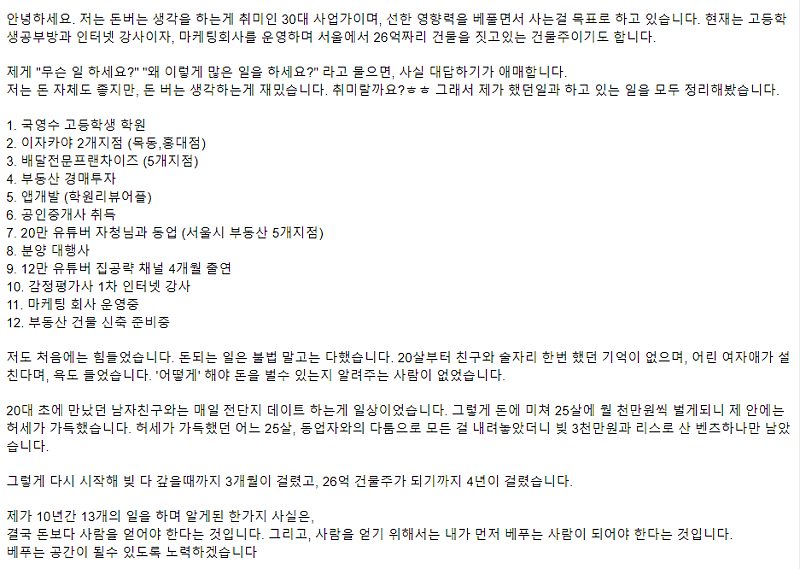
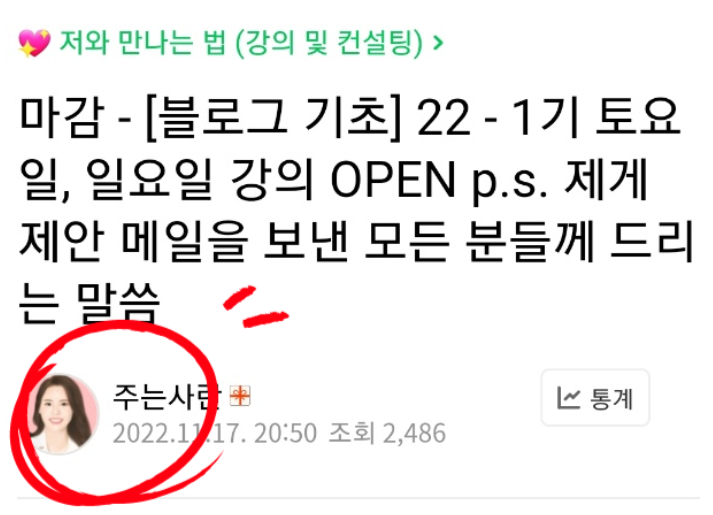
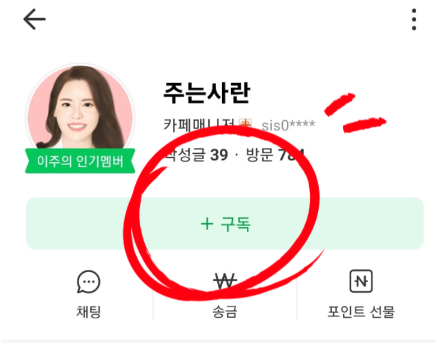

# 자영업 성공공식? 학원 3번 + 음식점 5개 + 부동산 5개 + 마케팅 대행사 + 4만 유튜버가 알려드림

- 원천 ID: EPR-CAFE-4447
- 작성자: 주는사란
- 작성일: 2023-04-07T20:00:05.507000+09:00
- 원문: https://cafe.naver.com/ranschool/4447
- 수집일: 2026-09-21
- 텍스트 정리: HTML 문단 순서 유지, 빈 문단·제로폭 공백만 제거. 원본 HTML·JSON 별도 보존. 이미지는 아래에 모아 보관하며 원래 배치는 HTML에서 확인.

## 원문 본문

<!-- P001 -->
안녕하세요.

<!-- P002 -->
4만 유튜버 주는사란입니다.

<!-- P003 -->
4만 돌파했습니다. 감사합니다..!!

<!-- P004 -->
앞으로 2주간 제가 경험했던 분야의 업종별, 마케팅 방법별 모든 종류를 전자책으로 다 작성할 예정입니다. 해당 책을 작성하면서 머릿속 정리를 위해, 10년간의 온갖 사업을 하면서 겪었던 제 경험을 하나하나 써볼까 합니다.

<!-- P005 -->
오늘 글은 오프라인 매장이나 뭘 하고 있지 않은 분들도 시작하기전에 보신다면, 제가 날렸던 1억 6800만원 정도는 아낄수 있을겁니다.

<!-- P006 -->
혹시나 제가 누군지 모르실까봐 카페 대문에 적힌글을 가져왔습니다. 저는 아래와 같은 일을 했습니다.

<!-- P007 -->
돈을 벌기 위해서는 무언가를 팔아야 합니다. 물건을 팔수도 있고, 음식을 팔수도 있고, 내 시간을 팔수도 있습니다. 제가 했던 대부분의 일은 내 시간을 파는 일이었습니다. 물건이나 음식도 팔아봤죠. 이중에서 무엇을 파는게 좋냐는건 다음에 이야기 하기로 하고 오늘은 이 3가지 모두를 파는 방법에 대해 보겠습니다. 파는 방법에는 2가지가 있습니다. 온라인과 오프라인 입니다.

<!-- P008 -->
8년간의 오프라인 사업(학원, 음식점, 프랜차이즈, 부동산 등) 과 최근 2년간의 온라인 사업(마케팅대행사, 유튜버 등)을 하면서 느낀건 둘 다에서 성공하기 위해선 공식이 있다는 것입니다. 잘나간다는 유튜버들은 다 이렇게 하고 있었고, 꽤 잘 운영된다는 오프라인 매장 사장님들은 다 알고 있는것입니다.

<!-- P009 -->
그래서 오늘은 자영업을 하고 있는 분들에게, 매출 3배를 올릴 수 있는 아주 쉽고 정확한 공식을 알려드리겠습니다. 이거 해보고 안되면 그냥 저 고소하세요.

<!-- P010 -->
망하는 이유

<!-- P011 -->
오프라인 매장을 운영하는 분들은 사실상 자신의 꽤 큰 부분을 차지하는 돈을 쓰면서 제대로된 공부를 하지 않고 합니다. 지금 여러분은 이미 차렸을수도 있고, 아니면 차리려는 마음을 먹었을수도 있고, 아예 관심이 없을수도 있습니다.

<!-- P012 -->
이것만 알면 차린 분들은 지금보다 최소 매출이 3배 오를수 있구요. 차리려는 분들은 절대 망하지 않을수 있구요.  아예 관심이 없는 분들은 최소한 내가 좋아하는 음식점이나 카페가 앞으로 계속 살아남아있을지를 알수 있습니다.

<!-- P013 -->
장사의 신이나 백종원 선생님등 많은 분들이 매장을 어떻게 운영해야하냐에 대한 예시를 많이 보여주고 있습니다. 근데 이게 '음식점'에 국한되서 알려준다는게 조금 아쉬운 점인데요. 저는 음식점 뿐 아니라 부동산, 학원, 이자카야, 카페 부터 왠만한 여러분이 생각하는 오프라인 매장에는 다 한번씩은 발을 담궈 봤기 때문에 감히 분석이라는걸 좀 해보겠습니다.

<!-- P014 -->
아 물론 저도 모든게 잘되진 않았습니다. 망한것도 있어요. 오히려 이 망한 경험이 지금 마케팅 대행을 하면서 자영업부터 연매출 6000억 회사의 마케팅을 성공적으로 이끄는데 더 도움이 됐습니다. 그건 앞으로 저를 잘 따라오시다 보면 자연스럽게 고개가 끄덕여지실겁니다.

<!-- P015 -->
공식을 알려드리기 전에 자영업 '성공'의 기준에 대해서 정확히 짚고 넘어가겠습니다. 성공이란 단어는 어짜피 주관적이지만 제가 말씀드릴 성공공식에서의 성공은 이렇습니다. 만약 원가가 없는 '서비스' 위주인 사업 (학원, PT, 네일아트, 미용실, 핸드폰가게 등)은 월 1000만원 이상을 버는 것을 말합니다. 반면 원가가 있는 '상품' 위주인 사업은 월 500만원 이상 버는 것을 말합니다.

<!-- P016 -->
이제 다른 소리 그만하고 자영업 성공공식을 알려드리겠습니다.

<!-- P017 -->
자영업 성공공식

<!-- P018 -->
자영업이 성공하려면 아주 간단합니다. 손님이 많이 오면 됩니다. 너무 당연하죠? 그래서 얼마나 많이 오느냐는 사실 중요하지 않습니다. 더 중요한건 못 벌때 얼마나 못버느냐 입니다. 그 기간을 버틸 수 있어야 성공의 기초를 닦을수 있습니다.

<!-- P019 -->
그럼 과연 업종별로 좀더 구체적으로 최소 하루 몇명의 손님이 왔을때 얼마정도 벌수 있는지 보겠습니다. 이 이상만 벌면 사실 최소 반 이상은 성공한겁니다.

<!-- P020 -->
핸드폰 가게를 한다고 가정해 보겠습니다. 그럼 핸드폰을 개통하려는 손님이 많이 오면 됩니다. 기종 마다 다르지만 하나 개통할때마다 수수료가 대략 20만원이상 받는거로 알고 있습니다. 그럼 이 사장님이 월 500만원이상의 순이익을 가져가기 위해서는 일주일에 6일 일한다는 가정하에 하루에 2명정도 개통하면 됩니다.

<!-- P021 -->
하루 2명 X 20만원 = 하루 매출 40만원

<!-- P022 -->
하루 매출 40만원 X 24일 = 한달 매출 960만원

<!-- P023 -->
한달 매출 960만원 - 월세 = 약 500만원 (사장 혼자 일한다는 가정하에)

<!-- P024 -->
결국 핸드폰 가게는 하루 2명이상 개통하게 만들수 있는 입지와 마케팅이 필요한겁니다.

<!-- P025 -->
이번엔 무인 카페로 생각해보겠습니다. 요즘 무인카페가 엄청 많이 생기는데요. 얘네들이 곧 망할지 계속 남아있을지 예측하는건 너무 쉽습니다. 무인 카페는 사람이 있는 카페보다 음료값이 저렴합니다. 대략 검색해 보니깐 한잔에 2500원 정도가 평균이네요.

<!-- P026 -->
한잔 2500 X 70잔 = 하루 매출 175,000원

<!-- P027 -->
하루 매출 175,000원 X 30일 = 한달 매출 5,250.000원

<!-- P028 -->
한달 매출 5,250.000원 X 순이익 비율 평균 30% (월세포함) = 월 순이익 1,575,000원

<!-- P029 -->
카페 차리기 위해 쓴 돈과 매일 1-2시간 정도는 가서 청소를 해야된다는 가정하에 사실상 이정도면 알바비 버는 것과 같습니다. 그니깐 무인카페도 돈을 벌려면 최소 하루 70잔 이상 팔릴만한 입지와 마케팅이 필요한 겁니다.

<!-- P030 -->
아마 이 두 사례를 보면 이런 생각이 드실겁니다. "무인 카페 하지 말아야겠다" ㅋㅋㅋㅋㅋㅋㅋㅋㅋㅋ 제가 예시는 이렇게 들었지만 생각보다 쉽지 않습니다. 사실 핸드폰 가게에서 주 6일 일한다는 가정하에 하루 2대씩 핸드폰을 개통하기 쉽지 않습니다. 무인카페에서 하루에 70잔 커피가 팔리는게 더 쉬울수도 있습니다.

<!-- P031 -->
여기서 제가 말하고 싶은건 어떤 업종이 좋냐 안좋냐를 말하는게 아닙니다. 업종마다 이렇게 '최소' 기준 매출이 다르단 겁니다. 이 매출을 계산해 보고 내가 어느정도 입지에 어떤 마케팅을 얼마나 하느냐를 고민해 보는게 시작입니다.

<!-- P032 -->
놀라지 마세요. 아직 성공공식은 시작도 안했습니다. 성공공식을 듣기 위한 아주 기초적인 내용일 뿐입니다. 다음 글에서 본격적으로 성공공식을 알려드리기전 과제를 내드리겠습니다. 여러분이 자주 가는 음식점이나 카페, 미용실, 네일아트, PT샵 뭐든 좋으니 아무 업종이나 제가 말씀드린대로 하루 몇명이, 몇잔이 팔려야 지속할수 있는지를 찾아보세요. 그리고 댓글로 연습해 보세요. 댓글이 별로 안달리면 더이상 진도 안나갑니다 ㅋㅋㅋㅋㅋㅋㅋㅋㅋㅋ

<!-- P033 -->
다음 글을 가장 빠르게 보려면?

<!-- P034 -->
1) 핸드폰으로 제 글 아무거나를 들어가서 '주는사란' 닉네임을 클릭합니다.

<!-- P035 -->
2) 구독을 누르면, 핸드폰에 제가 카페에 글을 쓸때마다 알림이 갑니다.

## 본문 이미지

## 원문에 포함된 링크

- #
