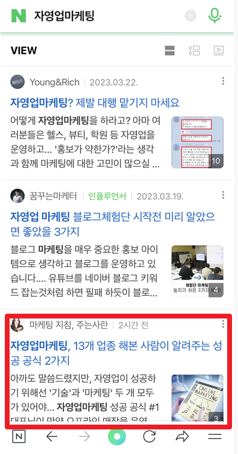
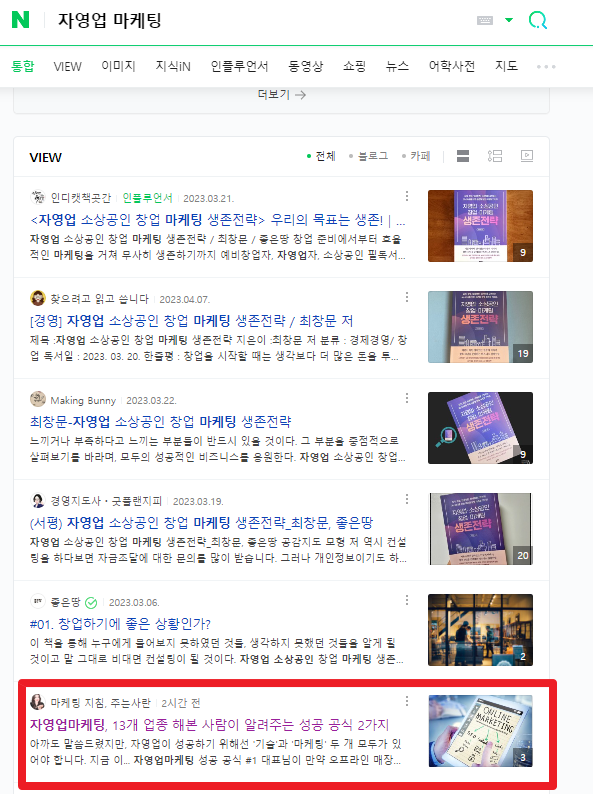

# 수포자에서 수학학원원장까지, 마이너스  3000만원에서 서울 50평짜리 땅주인까지

- 원천 ID: EPR-CAFE-4800
- 작성자: 주는사란
- 작성일: 2023-04-18T21:35:56.370000+09:00
- 원문: https://cafe.naver.com/ranschool/4800
- 수집일: 2026-09-21
- 텍스트 정리: HTML 문단 순서 유지, 빈 문단·제로폭 공백만 제거. 원본 HTML·JSON 별도 보존. 이미지는 아래에 모아 보관하며 원래 배치는 HTML에서 확인.

## 원문 본문

<!-- P001 -->
이 글을 본 모든 사람이 다 읽고 나서 "뭐야 결국 뻔한 이야기잖아?"라고 이 글을 폄하해주길 바란다. 혹시나 이 글의 가치를 알았다면, 제발 날 앞지르지 않길 바란다. 아주 배아플테니 말이다.

<!-- P002 -->
제목부터 뻔한 이야기라 예상하고, 이 글을 보지 않는 사람이 더 많길 바란다. 이 글을 공감할 정도라면, 이미 시행착오를 겪고 성공의 문턱앞에서 갸우뚱 거리고 있는 사람일 것이다. 그런 사람이라면 더욱이 이 글을 읽지 않길 바란다. 혹시나 이 글을 보고 나보다 앞서나갔다면, 제발 내 앞에 나타나지 않길 바란다. 아주 배아플테니 말이다.

<!-- P003 -->
그래서 오늘 글은 좀 어렵게 쓸테다. 아무나 이해 못 하게 말이다.

<!-- P004 -->
내 주위에는 누구나 들으면 알만한 좋은 대학을 나온 친구들이 많다. 또 내 다른 주위에는 누구나 들으면 알만한 대학을 나오진 않았지만 누구나 들으면 알만한 회사를 운영하거나, 본인 스스로가 누구나 들으면 알만한 사람이 되었다.

<!-- P005 -->
그럼 공부할 필욘 없는것일까?

<!-- P006 -->
대한민국 중 98%이상은 "공부를 잘해야 성공한다"고 믿는다. 도대체 누가 만들어낸 괴담일까? 이 말이 사실이건 아니건, 확실한건 우리 모두 '공부'와 '성공'간의 상관관계가 있다고 생각한다는 것이다. 오해하지 말길 바란다. 공부를 잘해야 성공한다는 말이 아니다. 원인과 결과의 관계(인과관계)가 아니라는 것이다.

<!-- P007 -->
학원을 10년간 하면서 가장 많이 듣는 질문도 이랬다.

<!-- P008 -->
선생님. 공부는 왜 해야되나요?

<!-- P009 -->
어쩌면 아이들이 이런 질문을 하는건 너무나 당연한 것이다. 어른들 조차 제대로된 답을 못 내놓고 있으니 말이다. 그래서 대부분의 부모들은 자기 나름의 합리적인 대답을 하곤 한다. 아이들에겐 씨알도 안 먹히는.

<!-- P010 -->
이 질문에 대한 내 대답은 이랬다.

<!-- P011 -->
20대 초반에는 "대학 가야지" 라고 대답해줬다.

<!-- P012 -->
20대 중반에는 "그래야 인생이 편하단다" 라고 대답해줬다.

<!-- P013 -->
20대 후반에는 "성공을 선택할 확률이 높아진다"라고 대답해줬다.

<!-- P014 -->
그리고 지금은

<!-- P015 -->
이렇게 대답할테다.

<!-- P016 -->
닥치고 공부해라 ~ ㅎㅎ

<!-- P017 -->
20대 초반, 첫 학원을 오픈했을때는 인생에서 '공부'가 꼭 필요하다고 믿었다. 우리나라에 수능만큼 좋은 시스템은 없다고 생각했다.

<!-- P018 -->
20대 중반, 빚이 생기고 인생이 나락으로 갔을때는 "공부를 더 할껄..."이라는 후회가 남았다. 학원을 재 오픈 하고, 세무사, 감정평가사, 공인중개사 등 공부를 안해본 전문직이 없었다.

<!-- P019 -->
20대 후반, 유튜브 세계를 알고 나서 이 모든게 깨졌다. 공부 말고도 성공하는 방법을 알아버렸다. '공부'따윈 하면 좋고 아니면 말고 였다.

<!-- P020 -->
30대 초반이자, 유튜버 7개월차인 지금 내 견해는 이렇다. 내가 아이를 낳는다면, 첫번째로는 기획력을 가르칠테고, 두번째로는 공부를 하라고 할것이다.

<!-- P021 -->
내 스스로 '공부'와 '성공'간의 상관관계에 대해 내놓은 답에 대해선 어제 이미 썼지만, 요약하자면 이렇다. 공부와 성공이 줄수 있는 경우의 수는 4가지다.

<!-- P022 -->
1번. 공부를 잘해서, 성공한다.

<!-- P023 -->
2번. 공부를 잘했지만, 성공하지 못 한다.

<!-- P024 -->
3번. 공부를 못했지만, 성공한다.

<!-- P025 -->
4번. 공부를 못해서, 성공하지 못 한다.

<!-- P026 -->
각각의 경우에 해당하는 사람들의 특징은 어제 글에 적었으니 참고하길 바란다.

<!-- P027 -->
학원을 운영했을때, 어머님들이 한숨과 함께 하는 말이 있었다. "수업이 문제가 아니니까요!!" 그때는 이말을 하지 못했다. 상처 받으실까봐. 근데 이제는 말해야겠다....

<!-- P028 -->
cafe.naver.com

<!-- P029 -->
만약 당신이 부모라면, 4가지 중 어떤 길로 이끌것인가? 단언컨대 전국민의 100%가 1번을 선택할 것이다. 그래서 오늘은 공부를 잘하게 되는 과정과 돈을 잘벌게 되는 과정이 어떤 상관관계가 있는지 내 경험에 빗대어 하고자 한다. 당신이 공부를 못했어도 괜찮다. 이 과정만 이해하면 앞서나가는건 쉽다.

<!-- P030 -->
P.S. 확증편향의 오류를 범할수도 있다는걸 잘안다. 비판은 자제하길 바란다. 핵심은 둘의 공통점 파악이다.

<!-- P031 -->
단계를 좀 나눠서 보겠다. 오늘은 LV 1~2 초보 단계 극복하기부터 알아보겠다. 공부 이야기를 듣는건 지겨울테지만, 최소한 이 이야기가 먼 훗날 내 아이가 "왜 공부를 해야 되는데?"라는 질문을 했을때 꽤 괜찮은 대답을 한 부모로 만들어줄 것이다.

<!-- P032 -->
LV 1. 수포자

<!-- P033 -->
나는 중3 때까지 무용을 했어서 공부를 못했다. 중학생 시절 나의 가장 큰 불행은 공부를 잘하는 애들이 모여있는 곳에 살고 있다는 것이었고, 가장 큰 행운은 나처럼 못하는 아이가 반에 1-2명씩은 있다는 것이었다. 그렇게 맞이한 고1 중간고사때 일이다. 나는 시험을 못 보는데 꽤나 단련된 마음을 가지고 있었다. 한번도 잘해본 적이 없었으니깐. 그럼에도 고1 중간고사 수학성적은 충격적이었다. 28점. 정말 다 찍었다. 아예 몰랐다. 그래도 그때는 나름 긍정적인 아이라 찍은것 치고 28점이면 나쁘지 않았다고 행운이라 생각했다.

<!-- P034 -->
하지만 행운이 오면 불행도 오는 법. 수준별 수업을 하고 있는 학교였기 때문에 A,B,C,D,E반중 당연히 E반을 배정받았다. 이건 내게 불행이 아니었다. E반은 내게 익숙했다. 내게 불행은 E반만 다른 층에서 수업을 받는다는 것이었다. 나에게도 자존심이 있었다. 수학수업 전 쉬는시간에 자지 못하고 다른층에 간다는건 곧 모든 아이들은 내가 'E반' 이란걸 알게된다는 소리였다. 이 자존심이 내게 동력이 되었다. 나는 공부를 하기로 마음먹었다.

<!-- P035 -->
LV 2. 덜 수포자

<!-- P036 -->
공부를 하겠다는 마음과 현실은 차이가 컸다. 이때 내 수학실력은 +가 = 반대편으로 가면 - 가 되는 '이항' 이라는 쌩 기초 개념도 몰랐기 때문이다. 학원도 다닐수가 없었다. 지역 특성상 학원에는 '공부를 잘하던' 선생님밖에 없어서 나를 이해해 주지 못했다. 내가 할수 있는 방법은 한가지밖에 없었다. '통째로 외우기' 수학 문제집 중에는 '쎈'이라는 책이 있다. 이 책에 있는 문제와 풀이 과정을 시험범위만큼 다 외워버렸다. 지금 생각하면 이 의지가 어디서 나왔는지 모르겠다. 맨날 나를 무시했던 친구들을 보면서 이를 갈았다.

<!-- P037 -->
고1 기말고사 시험지를 받았을때 느낌을 아직도 생생하다. 눈에 문제가 보였다. 답이 보였다. 인생 첫 성취감이었다. 새로운 반 배정이 되는 날은 얼마나 떨렸는지 모른다. 아이들이 "와~"하는 함성소리를 얼마나 기다렸는지 모른다. 나는 그날로 학교에서 '수학선생님'이 되었다.

<!-- P038 -->
LV 1과 LV 2에서 내가 얻은걸 정리하자면 이렇다.

<!-- P039 -->
1. 자극을 동기부여로 바꾸는 법

<!-- P040 -->
2. 기본기 다지기

<!-- P041 -->
3. 성취감 맛보기

<!-- P042 -->
'돈' '성공' '부자' 이런 단어에서 말하는 초보단계를 벗어나기 위해서도 똑같다.

<!-- P043 -->
1. 자극을 동기부여로 바꾸는 법

<!-- P044 -->
돈을 벌기 위한 행위는 자극을 받지 않으면 절대 시작할 수 없다. 우물안의 개구리라는 말도 있지 않은가. 물론 이 자극은 종종 나를 괴롭게 한다. 이건 자극이 동기부여 단계로 넘어가지 못해서다. 자극을 동기부여로 바꿀수 있는 '전환키'만 있으면 끝이다.

<!-- P045 -->
그래서 앞으로 나 스스로의 동기부여를 위해서라도 특강을 한달에 1-2회는 꼭 하려한다.

<!-- P046 -->
2. 기본기 다지기

<!-- P047 -->
중학교때까지 공부를 잘하다가 고등학교와서 무너지는 아이들의 특징은 기본기가 없어서다. 내가 10년간 13개의 사업을 하면서 기본기가 흔들릴때가 많았다. 얼마전에도 기본기가 흔들려 굉장히 마음이 어려웠다.

<!-- P048 -->
그래서 내가 할수 있는 기본기가 뭘까? 하다가 글쓰기로 돌아가기로 했다. 요즘 매일 카페와 블로그 글쓰기를 하고 있다. 블로그 강의를 한다면서 내 블로그를 키우지 않는다는게 스스로 기본기 부족이라 생각했다. 카페에는 내 생각을 적고 있고, 블로그는 '마케팅'에 관한 내 노하우를 모두 정리할 생각이다. 진짜 블로그 강사가 하는 블로그가 뭔지 보여주기 위함이다. 어제 오늘 두편을 썼는데 노출도 잘 되고 반응이 좋았다.

<!-- P049 -->
모바일 / PC 기준 노출 순위

<!-- P050 -->
3. 성취감 맛보기

<!-- P051 -->
오늘 쓴 블로그 글이 꽤나 만족스러웠다. 이 성취감은 내일 또 글을 쓰게 하는 동력이다. 어떤 부업을 하던 처음 벌어본 단돈 천원, 만원이 다음달에 100만원, 1000만원, 1억을 벌게하는 원동력이다. 그러나 경계해야 할 것은 노력 한것 이상으로 성취감을 느끼면 성취감 중독에 걸린다. 그럼 점점 더 가한 성취감을 원하게 된다. 마약중독과 같다.

<!-- P052 -->
그래서 당분간 놓았던 내 모든 노하우를 블로그에 쓰는 것과 내 생각을 카페에 쓰는것을 놓치 않으려 한다.

<!-- P053 -->
여러분은 오늘 이 3가지를 하기 위해 무엇을 하실건가요?

## 본문 이미지

## 원문에 포함된 링크

- https://cafe.naver.com/ranschool/4768
- #
