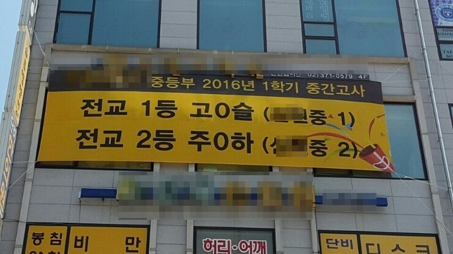

# 10년차 사업가가 학교 앞에서 달고나를 판다면?

- 원천 ID: EPR-CAFE-4860
- 작성자: 주는사란
- 작성일: 2023-04-20T19:47:13.060000+09:00
- 원문: https://cafe.naver.com/ranschool/4860
- 수집일: 2026-09-21
- 텍스트 정리: HTML 문단 순서 유지, 빈 문단·제로폭 공백만 제거. 원본 HTML·JSON 별도 보존. 이미지는 아래에 모아 보관하며 원래 배치는 HTML에서 확인.

## 원문 본문

<!-- P001 -->
당신은 오늘 당장 가진 모든 돈을 잃는다면

<!-- P002 -->
무엇을 할것인가?

<!-- P003 -->
오늘 운동하러 가는 길에 학교앞에서 달고나 파는 아저씨를 보았다. 이런생각을 했다.

<!-- P004 -->
"나라면 저렇게 안 팔 것 같은데..."

<!-- P005 -->
내가 만약 지금 가진 머릿속 지식 외에 모든것을 잃고, 달고나 장사를 해야 한다면 어떻게 팔까?

<!-- P006 -->
지금부터 달고나 판매 게임을 시작해보겠다. 나라면 이렇게 하겠다.

<!-- P007 -->
1. 설탕을 쓰지 않겠다. 학교 앞에서 달고나를 판매하는데 가장 큰 적(?)은 엄마들이다. 엄마들이 달고나를 싫어하는 가장 큰 이유는 '설탕'을 너무 많이 먹게되서 건강에 안좋다는 것이다. 물론 설탕을 대신할 대체재를 쓴다고 해서 건강에 좋은 것은 아니지만, 적의 공격력을 낮출수 있다. 실제로 설탕의 대체제로 많이 쓰이는 알룰로스(맛은 거의 비슷하나 0칼로리에 가까움)로 달고나 만드는게 가능하다.

<!-- P008 -->
알룰로스로 만든 저칼로리 달고나

<!-- P009 -->
2. 책상 앞에 이렇게 써서 붙여놓겠다.

<!-- P010 -->
[임산부도 먹을수 있는 설탕 없는 달고나]

<!-- P011 -->
1. 아이들의 키성장을 위해 설탕을 넣지 않습니다.

<!-- P012 -->
설탕 발견시 100%환불

<!-- P013 -->
2. 위생을 위해, 주문 즉시 조리합니다.

<!-- P014 -->
(혹은 미리 만들어 놓지 않습니다)

<!-- P015 -->
3. 아이들의 건강을 위해, 1일 1개 수량 제한

<!-- P016 -->
3. 엄마들에게 먼저 시식을 권유하겠다. 물론 엄마들은 권유해도 먹지 않을것이다. (오징어게임이 한창 유행했을때라면 모를까) 그래서 시식을 시작하기 전, 학부모 나이대와 맞는 알바 2명을 고용하겠다.  이 2명의 역할은 아이들을 기다리는 척 하다가 시식을 권유할때 '주위를 둘러보다가 못 이기는척 눈치를 보며 달고나를 한입 하는것'이다. 아마 주위 엄마들은 이 2명의 반응에 귀를 기울이게 될것이다. 그때 이 2명의 알바는 이렇게 말한다. 한 알바는 "오? 옛날에 먹던맛이 나네" 라고 한다. 다른 알바는 "이게 설탕으로 만든게 아니라고?" 라고 한다.

<!-- P017 -->
4. 마지막으로 아이들을 상대로 달고나 모양 뽑기 컨테스트를 연다. 매주 컨테스트 1등에게는 상품과 상장을 주고, 현수막에 1등 몇학년 몇반 이XX / 2등 몇학년 몇반 김 XX 이런식으로 쓴다. 상품은 포켓몬카드(남자아이용) 와 립스틱 (여자아이용)으로 한다.

<!-- P018 -->
5. 반응이 괜찮으면, 달고나 커피 (학부모타겟으로)까지 판다.

<!-- P019 -->
알룰로스로 만든 달고나 커피

<!-- P020 -->
대략적으로 한달 매출을 계산해 보겠다. 이전에 자영업 성공공식이라고 쓴 글이 있다. 그 방식대로 해보겠다.

<!-- P021 -->
달고나 2000원

<!-- P022 -->
달고나 커피 3500원

<!-- P023 -->
서울시내 평균 초등학교 전교생 300명 + 로드 손님

<!-- P024 -->
하루 20명 X 5500원 = 하루 매출 110,000원 (아이들 하교시간인 2시간만 근무)

<!-- P025 -->
하루매출 110,000원 X 20일 = 한달 매출 220만원 (총 40시간 근무기준)

<!-- P026 -->
한달매출 220만원 - 재료비 (약 20만원) = 약 200만원 (총 40시간 근무기준)

<!-- P027 -->
=> 시급 5만원

<!-- P028 -->
위 계산법이 이해가 안가시는 분은 아래 글 참조해주세요. 계산기도 첨부파일로 첨부해 놓습니다.

<!-- P029 -->
안녕하세요. 4만 유튜버 주는사란입니다. 앞으로 2주간 제가 경험했던 분야의 업종별, 마케팅 방법별 모든 종류를 전자책으로 다 작성할 예정입니다. 해당 책을 작성하면서...

<!-- P030 -->
cafe.naver.com

<!-- P031 -->
내가 만약 망한다면, 이렇게 살겠다.

<!-- P032 -->
오전시간에는 책읽고

<!-- P033 -->
12시 30분 - 3시 30분 까지는 달고나 팔고

<!-- P034 -->
3시 30분 - 7시 까지는 글 쓰고

<!-- P035 -->
저녁시간에는 다른 장사

<!-- P036 -->
그리곤 최종적으로 위 모든 삶을 다 찍어서 유튜브를 한다 ㅋㅋㅋㅋㅋㅋㅋㅋㅋㅋㅋ

<!-- P037 -->
당신이라면 어떻게 달고나를 파시겠어요? 댓글로 적어주세요.

## 본문 이미지

## 원문에 포함된 링크

- #
- https://cafe.naver.com/ranschool/4447
- https://downapi.cafe.naver.com/v1.0/cafes/article/file/aa88fab4-df68-11ed-a2f2-0050568da23d/download

## 첨부파일 보관

- [주는사란의 성공_실패 미리보기.xlsx](<../첨부파일/4860_주는사란의 성공_실패 미리보기.xlsx>) — saved. 첨부 음성은 전사·내용 검토 전.
