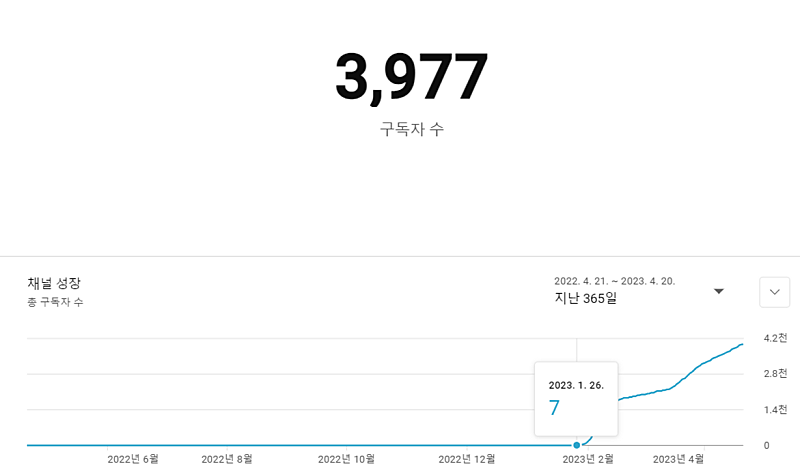
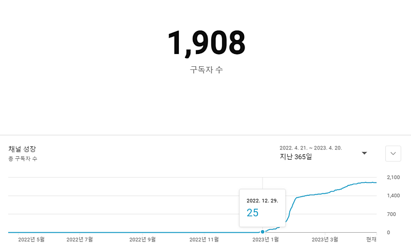
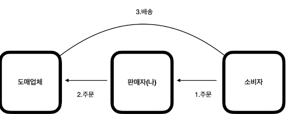
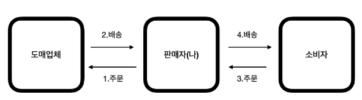
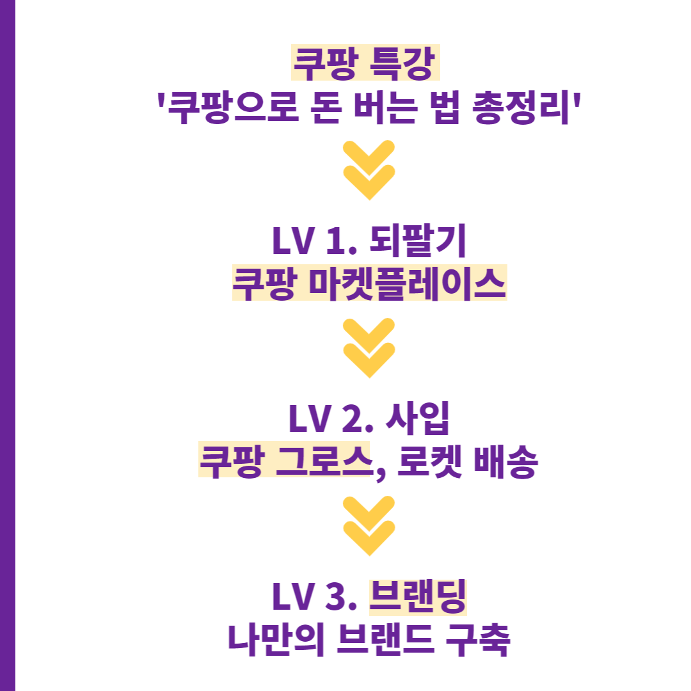

# 온라인 판매, 연매출 6000억 대표님이 말하는 레벨 1~ 레벨3

- 원천 ID: EPR-CAFE-5050
- 작성자: 주는사란
- 작성일: 2023-04-25T12:06:51.620000+09:00
- 원문: https://cafe.naver.com/ranschool/5050
- 수집일: 2026-09-21
- 텍스트 정리: HTML 문단 순서 유지, 빈 문단·제로폭 공백만 제거. 원본 HTML·JSON 별도 보존. 이미지는 아래에 모아 보관하며 원래 배치는 HTML에서 확인.

## 원문 본문

<!-- P001 -->
돈을 벌기 위해선 결국 둘 중 하나를 팔아야 합니다.

<!-- P002 -->
'물건' 또는 '서비스'

<!-- P003 -->
제가 유튜버가 되고 나서 연봉 10억이 넘는다는 분들을 약 200분 이상 만났는데요. 만나뵌 분 중에서 가장 부자(?)인 업계 1위이자 연매출 6000억 대표님이 알려주신 온라인 '물건' 판매 (커머스)의 레벨을 알려드리겠습니다. 솔직히 오늘 글은 알려드리긴 아까운데, 스스로 기억에 오래 남기려면 써놓는게 좋을것 같아서 씁니다.

<!-- P004 -->
만약 스마트 스토어, 구매대행, 쿠팡, 등 온라인판매를 하고 싶으신 분이라면 단계별로 얼마정도를 벌수 있는지를 아실수 있구요. 이미 해봤지만 돈을 못 번 분이라면, 왜 내가 제대로 못 벌었는지를 알 수 있게 되실겁니다.

<!-- P005 -->
제가 직접 업계 1~2위를 다투는 연매출 6000억대 회사의 블로그, 유튜브, 인스타 마케팅을 했었습니다. 아래는 운영했던 마케팅 채널 구독자입니다.

<!-- P006 -->
LV 1. 되팔기 (RE SELL)

<!-- P007 -->
(정의) 남이 판다고 올려놓은 물건에 내 마진을 붙인 후 다른(혹은 같은) 플랫폼에서 다시 팔기

<!-- P008 -->
(장점)

<!-- P009 -->
1.초기 자본금이 들어가지 않는다. 미리 물건을 사 놓을 필요가 없다. 주문이 들어오면 그때 주문한다.

<!-- P010 -->
2. 저렴한 물건을 찾아서 플랫폼에 업로드 할 최소한의 의지만 있으면 된다. 실력의 문제가 아니다. 심지어는 내가 직접 배송 할 필요도 없다. 주문이 들어오면 내 상품을 판다고 올려 놓은 더 저렴한 사이트에 가서 나에게 주문한 고객의 주소로 주문한다.

<!-- P011 -->
(단점)

<!-- P012 -->
1. 사업에 있어서 자본금은 사실상 진입장벽의 역할을 한다. 자본금이 필요없다는 소리는 진입장벽이 없다는 소리다. 누구나 할수 있다는건 곧 가격경쟁(최저가로만 팔아야함)을 의미한다. 결국 들어오는 사람이 많아질수록 점점 매출은 줄어든다. 지금이 그렇다.

<!-- P013 -->
2. 똑같은 상품을 비슷한 가격으로 경쟁을 하기 때문에 약간의 센스가 필요하다. 무엇보다 이제 상품 업로드만 해놨을때 팔리는 곳은 쿠팡밖에 안남았다. 쿠팡도 이제 전략 없이 '등록'만 해서는 팔기 어렵다.

<!-- P014 -->
(핵심) 남들과 똑같은 상품을 팔더라도 나 혼자만 팔수 있는 곳에서 팔면 된다.

<!-- P015 -->
1. 쿠팡은 전략적으로 접근하면 '상품 업로드'만 해도 물건이 판매된다.

<!-- P016 -->
2. 플랫폼에 올려만 놓지말고 별도 마케팅을 해야한다. 나 또한 위에 공개한 2개의 유튜브 모두 유튜브로 홍보하고 2개월만에 800이상의 매출을 올렸다. 그럼 가격 경쟁할 필요가 없다. (영상참조) 그게 아니라면 평균 100이하, 최대 2-300만원 벌기도 쉽지 않을것이다.

<!-- P017 -->
(한마디로 정리하기) 다음 레벨로 도약하기 전, 경험을 해보기엔 좋으나 매출은 미약하다.

<!-- P018 -->
*주의사항

<!-- P019 -->
남이 올려놓은 물건에 내 마진을 붙여서 파는건 사기 아닌가요? 라고 묻는 사람이 있을까봐 미리 답한다. 이번 한달간 카드내역을 봐라. 다 최저가로 샀다고 확신하는가? 우리가 물건을 살때 몇명의 사람을 거쳐서 오는지를 알면 놀랄것이다. 만약 도저히 리셀 개념을 이해하기 어렵다면, 빠르게 레벨업 해서 다음 레벨로 올라가면 된다.

<!-- P020 -->
LV 2. 사입 (BUYING)

<!-- P021 -->
(정의) 물건을 대량으로 싸게 사온 물건에 내 마진을 붙인 후 다른(혹은 같은) 플랫폼에서 다시 팔기

<!-- P022 -->
(장점)

<!-- P023 -->
1. 리셀러들보다 훨씬 저렴한 가격에 물건을 사올수 있다. 내가 가져갈수 있는 수입이 커지며, 리셀러들하고 경쟁하지 않아도 된다. 여기부터는 월 순수익 1000만원 이상도 가능하다.

<!-- P024 -->
2. CS 를 좀더 잘 할 수 있다. 리셀은 실제로 물건을 본적도 없는 상태에서 물어보면 당황스럽다. 사입은 내 물건을 잘 알기 때문에 상세하게 응대가 가능하다.

<!-- P025 -->
(단점)

<!-- P026 -->
1. 초기에 자본금이 든다. 팔리기 전에 내가 물건을 미리 사놔야 하기 때문에 내 돈이 필요하다. 평균 1000만원이상은 필요하다.

<!-- P027 -->
2. 재고부담이 있다. 팔릴때까지 물건을 보관해야되며, 다 못 팔 경우 마이너스가 날 수도 있다.

<!-- P028 -->
3. 할게 많다. 그냥 놔두고 팔아서는 마이너스난다. 마케팅을 포함해, 상세페이지, 제품촬영 등 신경써야 할게 많다. 그만큼 다 팔리면 수익은 크지만.

<!-- P029 -->
(핵심) 마케팅으로 경쟁자를 다 물리쳐버리면 된다.(매출 6000억 회사의 마케팅 방식에 대해 블로그에 작성 예정)

<!-- P030 -->
1. 쿠팡 제트배송이 대표적인 예이다. 물건을 사서 쿠팡 창고에 넣어놓으면, 쿠팡이 팔아준다. 물론 쿠팡내에서 마케팅을 해야한다.

<!-- P031 -->
2. 마케팅을 잘한다는건 두가지 의미가 있다. 마케팅에 쓸 여유자금이 있다는 것과 효율적으로 마케팅을 할 기술이 있다는 것. 마케팅의 기초 개념을 모른다면 아래 글을 참고하라. 마케팅에서 핵심은 '노출'과 '설득'이다. '노출'은 돈이 도와주며, '설득'은 마케팅 기술이 도와준다.

<!-- P032 -->
마케팅 기초 이해하러 가기 -

<!-- P033 -->
안녕하세요. 저는 10년간 중·고등학원부터 부동산, 음식점, 프랜차이즈 본사, 분양대행사까지 해본, 4만 유...

<!-- P034 -->
blog.naver.com

<!-- P035 -->
(한마디로 정리하기) 월 1000만원 이라는 왕관을 쓰려는자, 사입의 무게를 견뎌라

<!-- P036 -->
LV 3. 브랜딩 (BRANDING)

<!-- P037 -->
(정의) 내가 물건을 만들거나 기존 물건의 조합을 바꿔서 새로운 상품을 만들어서 팔기

<!-- P038 -->
(장점)

<!-- P039 -->
1. 사입보다 마진이 더더더 커진다. 리셀에서 핵심이 뭔지 기억나는가? 같은 상품을 같아보이지 않게 파는게 능력이라고 했다. 브랜드가 들어가면 애초에 같은 상품 자체가 아니다. 즉 가격은 붙이기 나름이다. (이렇게 말하면 반박하는 분도 있을걸 안다. 이건 나중에 한번더 다루겠다)

<!-- P040 -->
2. 재구매가 일어난다. 브랜딩이 된다는건 그 회사의 '팬'이 생겼다는 의미다. 사입은 팔기 위해 마케팅을 계속 해야되지만, 브랜딩은 마케팅 비용을 줄이거나 중단해도 계속 판매가 된다. 브랜딩이 되야 진정 셀러로서 '안정권' 에 들었다고 할수 있다. 연매출 6000억 회사 대표님도 가장 강조한건 '브랜딩'이었다. 브랜드를 남겨야 연매출 1000억대 이상이 된다.

<!-- P041 -->
(단점)

<!-- P042 -->
1. 초기 자본금이 더 많이 들어간다. 사입은 기존에 있는 물건을 사는 것이기 때문에 내가 '사고 싶은 만큼' 살수 있다. 그러나 브랜딩을 하기 위해 물건을 '제조' 한다면 공장에서 요구하는 '최소 물량' 이라는것이 있다. 이 물량만 하더라도 사입보다 돈이 더 필요하다.

<!-- P043 -->
2. 물건을 잘못 만들면 X된다. 답이 없다. 기존에 있는 물건은 어느정도 '검증'된 제품이다. 근데 내가 만든 제품은 어느정도 팔릴지 예측하기 어렵다.

<!-- P044 -->
3. 그외 단점은 사입과 동일하다.

<!-- P045 -->
(핵심) 마마마마마케팅이다. 이건 진짜 내가 마케팅을 해서가 아니고 진짜다.

<!-- P046 -->
1. 이번에 공장을 운영하시는 분과 이미 제조를 시작하신 수강생분이 마침 브랜딩 마케팅을 부탁하셨다. 2분과 함께 이 브랜딩 과정을 해보려 한다. 내가 6000억 회사 마케팅을 하면서 노하우를 다 쏟으려한다. 그럼 뭐 매출이 60억 아니...6억은 나오지 않겠는가?

<!-- P047 -->
2. 개인적으로 지금 내가 B2B나 공장 운영 혹은 제조쪽에 몸을 담고 있다면 무조건 브랜딩을 해보라고 말하고 싶다. 그들에겐 남들에 비해 리스크가 반밖에 안되는거니깐. 이렇게 말하긴 그렇지만 제조를 하면서 브랜딩을 안하는건 돈을 다 뺏기고 있는것과 같다.

<!-- P048 -->
(한마디로 정리하기) 결국 셀러의 종착지는 브랜딩이다.

<!-- P049 -->
🔔주는 사란의 온라인 판매 레벨 1 마켓플레이스 수익인증

<!-- P050 -->
지난주에 월억님 쿠팡특강이 있었습니다. 거두절미 하고 그냥 제가 해봤습니다. 이거로 진짜 돈 벌수 있는지. 오늘 1시 36분 쿠팡 마켓플레이스로 제품 1개를 등록했습니...

<!-- P051 -->
cafe.naver.com

<!-- P052 -->
🔔온라인 판매 강의 커리큘럼

<!-- P053 -->
📣 '쿠팡으로 돈 버는법 총 정리' 특강 신청하기

<!-- P054 -->
대한민국 모임의 시작, 네이버 카페

<!-- P055 -->
cafe.naver.com

<!-- P056 -->
📢레벨 1. 쿠팡 마켓플레이스 정규강의 신청하기

<!-- P057 -->
대한민국 모임의 시작, 네이버 카페

<!-- P058 -->
cafe.naver.com

## 본문 이미지

이미지 6: 로컬 보관 실패. [원래 이미지 주소](https://dthumb-phinf.pstatic.net/?src=%22https%3A%2F%2Fcafeptthumb-phinf.pstatic.net%2FMjAyMjA5MjVfNTUg%2FMDAxNjY0MDg3OTMwNzc4.EhYNOaMVqsKmYSUoBQpdO51FdE8NvXWLPIBOahCMZZMg.FF8hkTQq_b9IoHwDDpftRCS__r-VqLv7Nk1A90kFNiIg.JPEG%2FexternalFile.jpg%3Ftype%3Dw740%22&type=ff120) — 수집 응답은 `_관리/이미지수집.json`에 기록.

이미지 7: 로컬 보관 실패. [원래 이미지 주소](https://dthumb-phinf.pstatic.net/?src=%22https%3A%2F%2Fcafeptthumb-phinf.pstatic.net%2FMjAyMjA5MjVfNTUg%2FMDAxNjY0MDg3OTMwNzc4.EhYNOaMVqsKmYSUoBQpdO51FdE8NvXWLPIBOahCMZZMg.FF8hkTQq_b9IoHwDDpftRCS__r-VqLv7Nk1A90kFNiIg.JPEG%2FexternalFile.jpg%3Ftype%3Dw740%22&type=ff120) — 수집 응답은 `_관리/이미지수집.json`에 기록.

## 원문에 포함된 링크

- #
- https://blog.naver.com/giver-ran/223078206267
- https://cafe.naver.com/ranschool/3920
- https://cafe.naver.com/ranschool/5415
- https://cafe.naver.com/ranschool/5411
