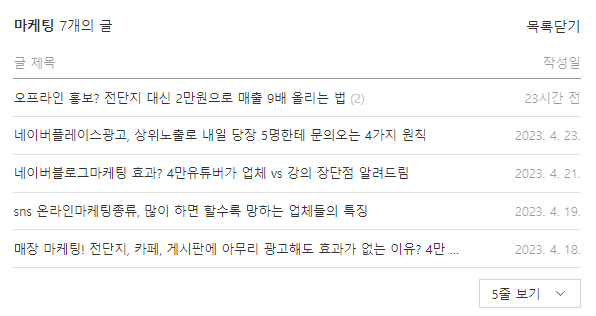
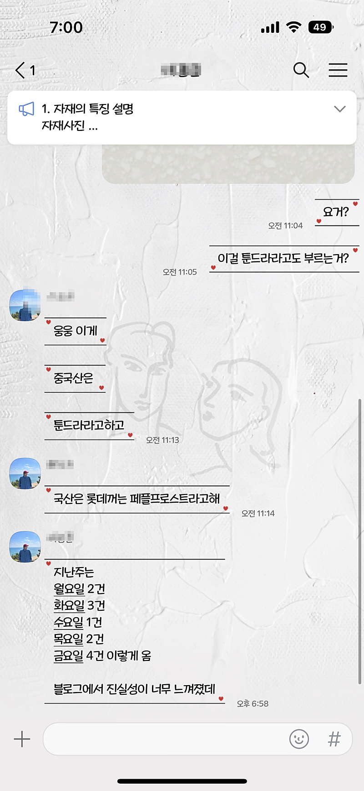
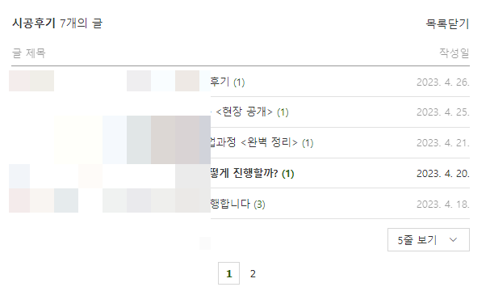

# 저는 무슨 일을 해야 돈을 가장 많이 벌까요?

- 원천 ID: EPR-CAFE-5144
- 작성자: 주는사란
- 작성일: 2023-04-27T18:08:13.510000+09:00
- 원문: https://cafe.naver.com/ranschool/5144
- 수집일: 2026-09-21
- 텍스트 정리: HTML 문단 순서 유지, 빈 문단·제로폭 공백만 제거. 원본 HTML·JSON 별도 보존. 이미지는 아래에 모아 보관하며 원래 배치는 HTML에서 확인.

## 원문 본문

<!-- P001 -->
이 질문은 구독자가 4만명이 넘고, 수강생이 200명이 넘어가면서 가장 많이 듣는 질문이다. 사실 이 질문에 대답은 정해져 있다.

<!-- P002 -->
'뭘 해도 돈은 다 많이 벌수 있습니다.'

<!-- P003 -->
심지어 이 질문을 하는 사람 중에는 "저는 월 천만원이상 버는데요? 근데 저는 무슨 일을 해야 돈을 가장 많이 벌까요?" 라는 사람도 있다. 사실 우리는 뭘 하든 돈은 다 많이 벌수 있다는 걸 알고 있다. 그런데 왜 월 천만원 버는 사람조차도 “뭘 하면 돈을 많이 벌수 있을까요?” 물어보는 것일까? 역시 인간의 욕심은 끝이 없는 걸까?

<!-- P004 -->
이 사람들이 나에게 진짜 물어보고 싶은 것은 “뭘하면 돈을 많이 벌수 있을까요?” 가 아니라고 생각한다. 사실 물어보고 싶은것은 따로 있다.

<!-- P005 -->
“돈을 많이 벌수 있는것중에 나에게 맞는 일은 뭐가 있을까요?”

<!-- P006 -->
유튜브만 검색해봐도 사실 돈버는 방법은 널렸다. 그냥 하기만 하면 돈을 벌수있다.(과장이 아니다) 근데 이 사람들은 왜 한가지를 정하지 못할까? 그건 바로 내가 관심이 없기 때문이다. “아 저건 별론데, 이건 이래서 별론데, 나한텐 안맞는데..”

<!-- P007 -->
월천만원씩 버는 사람들도 마찬가지다. 지금 하는일을 조금 더 발전시키면 돈을 더 번다. 아니 발전시키는게 힘들다면 한시간이라도 일을 더 하면 돈을 더번다. 하지만 그럼에도 이 일이 아닌 다른 돈많이버는 일을 찾는 이유는 이 일이 돈은 벌지만 흥미가 없고 좋아하지 않기 때문이다. 아주 유명하고 뻔한 말이지만 돈이 행복의 전부가 아니기 때문이다.

<!-- P008 -->
이 사람들은 사실 지금 나에게 맞는일을 찾고 싶어 하는 것이다. 그리고 우린 이걸 적성이라고 부른다. 그럼 어떻게 적성을 찾을수 있을까?

<!-- P009 -->
TO. 적성에 맞는 일을 찾는 당신에게

<!-- P010 -->
대단한 대답을 해줄거라고 생각했다면 미안하다. 안타깝게도 나는 ‘일단 뭐든 해봐라’ 라는 무책임한 말 밖에 못해줄것 같다. 왜냐면 나조차도 10년간 13개의 일을 해봤지만 여전히 적성에 맞는 일을 찾지 못했기 때문이다. 나도 여전히 찾고있는 중이다.

<!-- P011 -->
하지만 한가지 다행인 사실도 알려주겠다.

<!-- P012 -->
내가 마케팅 하고 있는 연매출 6000억 회사 대표님께도 여쭤본적이 있었다. "대표님은 지금 일이 잘 맞으세요?" 웃으시면서 이렇게 대답하셨다. "몰라? 생각해본적 없는데?" 그렇다. 적성에 대해 생각해보지 않아도 연매출 6000억쯤은 할수 있는것이다. 이 정도면 당신이 만족할만한 돈이지 않는가?

<!-- P013 -->
나도 적성을 찾으려고 노력하고 있지만 항상 느끼는게 있다. 적성이란 찾는다고 찾아지는게 아니라는 것이다. 그래서 내가 미안하지만 내가 해줄말은 ‘일단 닥치는대로 해봐라. 언젠간은 꽝이 아닌 당첨이 나오길 바라면서.

<!-- P014 -->
p.s. 만약 당신이 하고 싶은 말이 나에게 맞는 일이 아닌 “진짜 뭐하면 돈을 많이 버나요?” 라면 내 부업영상 중 아무거나 딱 6개월만 해봐라. 강의를 들은 사람이라면 딱 6개월만 배운대로 해봐라.

<!-- P015 -->
6개 밖에 안 쓴 내 블로그로 벌써 나는 컨설팅 문의를 받아 198만원을 벌었다. (유튜브 구독자 아니었음 순수 블로그)

<!-- P016 -->
일주일전 새로 맡게된 싱크대 회사는 총 문의 12건, 계약 3건으로 일주일만에 매출이 1000만원이 올랐다.

<!-- P017 -->
이래도 안하면....(삐-)

## 본문 이미지

## 원문에 포함된 링크

- #
