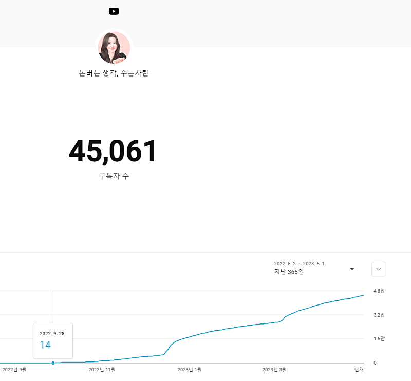

# 말빨로 4만 된 유튜버가 알려주는 '말하기 기술'

- 원천 ID: EPR-CAFE-5314
- 작성자: 주는사란
- 작성일: 2023-05-02T21:41:38.863000+09:00
- 원문: https://cafe.naver.com/ranschool/5314
- 수집일: 2026-09-21
- 텍스트 정리: HTML 문단 순서 유지, 빈 문단·제로폭 공백만 제거. 원본 HTML·JSON 별도 보존. 이미지는 아래에 모아 보관하며 원래 배치는 HTML에서 확인.

## 원문 본문

<!-- P001 -->
제 소개 -

<!-- P002 -->
1. 저는 시작한지 7개월만에 구독자 4만이 된 유튜버 입니다. 본 채널에는 저 외에 다른 어느 누구도 출연한 적이 없으며, 심지어는 카메라도 제대로 닦을 생각을 못해 뿌연 영상으로 이룬 성과입니다.

<!-- P003 -->
2. 첫 학원을 운영하게 된 20살에 최소 40대 이상의 고등학생 학부모를 2300분 이상과 상담했습니다. 제 상담 성공률은 90%이상이며 10명중 1명은 저와 상담한 그 자리에서 결제를 하고 가셨습니다.

<!-- P004 -->
제 자랑을 듣고 싶진 않으시겠지만 오늘 알려드릴 말하기 기술의 권위를 부여하기 위함이니 양해부탁드립니다. 오늘은 나이 불문하고 사람을 끌어당기는 말하기 기술에 대해 알려드리겠습니다.

<!-- P005 -->
말을 잘하기 위해선 듣고, 이해하고, 말하면 된다. 너무 당연한 말일지 모른다. 말을 못 하는 사람은 사실 이 당연한걸 지키지 못해서다. 여기서 말을 잘 한다는 것은 나와 상대방 모두가 대화를 만족하는 것이다.

<!-- P006 -->
말을 잘 못하는 사람들의 특징 4가지를 봐보자.

<!-- P007 -->
1. 듣지 못 하는 경우

<!-- P008 -->
듣는다는 것은 귀에 소리가 들린다는 의미 그 이상의 것이 있다. 말하는 사람으로 하여금 "나는 너의 말에 집중하고 있어" 라는 비언어적 행동(상대방 바라보기, 고개 끄덕임 등)을 보여줘야 한다.

<!-- P009 -->
듣기를 못하게 되면 연애에서도 힘들다. 남녀가 싸울때.  "자기야. 내 말 듣고 있어??" 라는 말을 자주 하는 것만 봐도 알수 있다. 이 말을 들은 상대방은 "다 듣고 있었어" 라고 대답하지만 사실 듣고 있는게 아니다. 듣고 있는지 없는지를 판단하는 주체는 상대방이기 때문이다. (참고로 나는 "다 듣고 있었어"라고 말하는 쪽이다;;ㅎㅎ)

<!-- P010 -->
이런 사람들은 공능제(공감능력제로)로 보이거나 이기적으로 보일수 있다. 인간관계가 좁을 가능성도 높다. 자신이 관심있는것에만 제대로 듣고 관심 없는것에는 제대로 듣지 않으니까. 실제로 제대로 안 듣는 경우도 있지만, 실제로는 제대로 안 듣는게 아니라 듣는 법을 모르는 것이다. 귀로 소리를 들으면 들은건 줄 아는 것이다.

<!-- P011 -->
2. 이해하지 못 하는 경우

<!-- P012 -->
상대방을 이해하지 못 하고 말하는 사람은 "영혼없이 말하지 마"라는 말을 자주 듣게 된다. 상대방의 말을 공감하는 깊이까지 가지 않고 듣는 척만 하는 것이다.

<!-- P013 -->
'사회생활을 잘 하는 사람' 혹은 '최소한의 예의를 갖춘 사람' 정도로 보이기 쉽다. 겉으로는 인간관계가 넓어보이지만 실제로는 깊이가 없는 관계는 없다.

<!-- P014 -->
이 문제는 남녀가 다툴때 가장 많이 나타난다.

<!-- P015 -->
여 : "자기야. 내가 미안해"

<!-- P016 -->
남 : "뭐가 미안한데??"

<!-- P017 -->
여 : "뭘 뭐가 미안해야~ 다 미안해"

<!-- P018 -->
남 : "별로 안 미안하구나?"

<!-- P019 -->
여 : ;;;;

<!-- P020 -->
상대방이 왜 화가났는지 이해를 하고 사과해야되는데 그냥 사과만 하는것이다. 이해한다의 핵심은 '깊이' 다. 상대방이 이 말을 할때의 깊이까지는 못 가더라도 그 근처는 가야된다.

<!-- P021 -->
3. 말하지 못 하는 경우

<!-- P022 -->
말을 못한다는 의미에는 2가지 종류가 있다. 내 생각을 정확히 말로 전달하지 못하는 경우와 상대방이 싫어하는 말을 하는 경우다.

<!-- P023 -->
내 생각을 정확히 말로 표현하지 못하는 사람들의 특징은 책 읽기와 글쓰기를 안해서다. 노력의 문제다. 언제든 책 읽기와 글쓰기를 하면 나아질수 있다.

<!-- P024 -->
반면, 두번째 경우인 상대방이 싫어하는 말을 하는 사람들은 자존감의 문제다. 대화를 하다보면 꼭 상대방을 깎아내리면서 자신을 높이려는 사람이 있다. 직장내에서도 정치질을 하는 사람도 그렇다.

<!-- P025 -->
꼭 상대방을 깎아내리지 않더라도 상대방이 궁금하지도 않은 자기 자랑거리를 하는 경우도 두번째 경우에 포함된다. 동창회나 학부모 모임을 갔다오면 꼭 이런 사람때문에 괜스레 기분 상한다.

<!-- P026 -->
슬프게도 말하기 기술은 이 3가지에서 끝나지 않는다. 한가지가 더 있다. 처음에 4가지라고 말하지 않았는가. 마지막으로 말을 잘 못하는 사람의 특징은 순서를 지키지 않는다.  듣고 => 이해하고 => 말해야 한다. 말을 먼저 하면 상대방을 이해할수 없다. 순서가 바뀐 대화의 끝은 관계단절이다.

<!-- P027 -->
나는 이 말하기 기술만 연마해도 인간관계가 한결 편해질거라 생각한다. 지금까지의 나의 삶에서도 어떤 전문직 자격증 보다도 더 많은 돈을 벌어주는 도구였다.

## 본문 이미지

## 원문에 포함된 링크

- #
