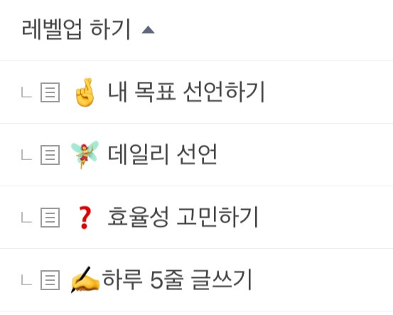

# (5편) ‘이것’으로 살도 빼고 부자도 되는 법 (feat. 운동 안해도 됨)

- 원천 ID: EPR-CAFE-5619
- 작성자: 주는사란
- 작성일: 2023-05-20T00:49:05.393000+09:00
- 원문: https://cafe.naver.com/ranschool/5619
- 수집일: 2026-09-21
- 텍스트 정리: HTML 문단 순서 유지, 빈 문단·제로폭 공백만 제거. 원본 HTML·JSON 별도 보존. 이미지는 아래에 모아 보관하며 원래 배치는 HTML에서 확인.

## 원문 본문

<!-- P001 -->
’이것‘은 운동을 하지 않고도 6kg 이상 빼는 방법이다. 심지어 나를 부자까지 만들어 줄수 있다고 한다.

<!-- P002 -->
사기치지 말라고? 흠흠 그럴리가. 이 방법은 영국 포츠머스대학 연구진이 실험자 114명을 평균 6.44kg를 빼줘서 국제비만학회지에 실린 방법이다.

<!-- P003 -->
당신이 이 방법을 듣고 아는 부자 모두에게 ”이 방법이 부자가 되는 방법이 맞나요?” 라고 물어봐라. 자신의 실력으로 부자가 된 사람이라면 절대 부정할수 없을것이다.

<!-- P004 -->
오늘은 이 방법부터 보자.

<!-- P005 -->
1.  ‘생각하기‘

<!-- P006 -->
생각보다 너무 뻔한 대답에 실망했을걸 안다. 아마 이 글을 보는 분이라면 이미 ‘생각이 중요하다’ 라는 이야기는 들어봤을테니까. 하지만 안다는 것과 철저히 깨닫는건 다르다. 어제 ’생각‘이란걸 하는데 얼마나 썼는지 생각해보자. 아마 10분도 안될것이다. 어제 화장실 변기에 앉아있는 시간보다도 안했다는 말이다.

<!-- P007 -->
자 오늘부터 딱 1분만 나랑 같이 해볼사람만 아래를 보자.

<!-- P008 -->
2. ‘글쓰기’

<!-- P009 -->
이 생각하기를 도와주는 도구가 있다. 바로 글쓰기다.

<!-- P010 -->
글쓰기에는 두가지 종류가 있다. 내적 글쓰기와 마케팅적 글쓰기. 이름만 들어도 느낌이 오겠지만, ‘내적글쓰기’란 내 생각을 글로 적는 것이다. 마케팅적 글쓰기는 무언가 홍보를 위해 쓰는 글이다. 마케팅적 글쓰기를 잘하면 고객과 친해질수 있다. 내적 글쓰기를 잘하면 팬을 만들수 있다.

<!-- P011 -->
당연히 둘 다를 잘해야한다. 내적글쓰기만 잘하는 사람은 자신이 가진 생각의 깊이에 비해 제대로 알려지지 않아 ‘숨은 보물’ 느낌을 준다. 마케팅적글쓰기만 잘하는 사람은 자신이 가진 생각의 깊이에 비해 더 과하게 알려져 ‘빛 좋은 개살구’ 느낌을 준다. 둘 중 고르라면 전자가 더 좋아보이겠지만 꼭 그렇지 만은 않다. 내가 어디에 속하든 다른 하나를 얼마나 빠른 속도로 채우냐의 문제니까.

<!-- P012 -->
각각을 잘하는 방법은 이렇다. 마케팅적 글쓰기는 이미 잘하는 방법을 알려주는 곳은 너무 많다. (내 블로그 강의도 여기에 포함된다. 흠흠) 그냥 그들을 따라하면 된다. 가끔 ‘내적 글쓰기’를 잘하는 사람중에는 잘하고 있는 남의 것 보다는 ‘내 것’을 개척하려는 사람이 있는데, 눈 앞에 있는 급행열차를 일부로 안타고 걸어가는 것과 같다. 물론 걸어가는것 자체가 좋다면 말리진 않겠다.

<!-- P013 -->
마케팅적 글쓰기만 잘하면 당장의 돈을 벌수 있겠지만 오래 가지 않을 것이다. 그들이 당신의 글을 구매한 이유는 아주 얕은 호기심 이기 때문이다. 그들이 당신의 글쓰기가 아닌 ‘당신 자신’을 구매하게 하기 위해서는 ’온전히 나의 것‘이 있어야 한다. 그게 바로 ’내적 글쓰기‘다. 내적 글쓰기를 하기 위해선 생각을 해야 한다. 아마 갑자기 생각을 하라고 하면 ‘무슨 생각?’ 이라며 당황스러울수 있을것이다. ‘생각할 거리’를 만드는 가장 쉬운 방법으로는 ‘책’이 있다. 자기계발에서 ’책‘을 빼놓고 말할수 없는 이유도 여기에 있다.

<!-- P014 -->
당신은 둘 중 어떤게 더 부족한 사람인가?

<!-- P015 -->
개인적으로 나는 후자라고 생각한다. 블로그와 유튜브를 하면서 ‘마케팅적 글쓰기’에 특화된 사람이 되었다. 반면 온전히 내 것을 만드는 시간이 부족했다. 이걸 보완하기 위해 시작한 행동이 카페에 자주 글을 쓰는 것이었다. 물론 이 목표가 큰 욕심이었음을 깨닫는데는 얼마 걸리진 않았다. 정확히 말하면 의지가 부족했던건 아니다. 매일 최소 30분 이상 이 카페에 글을 쓰기 위해 노력했으니깐. 그 결과 거의 다 써놓고 발행하지 못한 글이 임시저장 상태로 18개나 있다. 이 글도 사실 발행 까지 2주나 묵혀있던 글이다. 솔직히 마음에 드는 글은 아니다. 내 생각의 깊이가 충분한 글은 아니라. 근데 지금은 완벽함 대신 그냥 1분만에 쓰는 간단한 글쓰기를 먼저 시작하려고 한다. 이 글의 목표는 하루에 생각하는 습관과 글쓰기 습관을 들이는것이다.

<!-- P016 -->
룰 설명 -

<!-- P017 -->
1) 내적 글쓰기(하루의 내 생각)와 마케팅적 글쓰기(홍보용 글) 둘중 어떤걸 쓸건지 정해서 댓글 적기

<!-- P018 -->
2) 무슨 글을 쓸건지 하루 30초 생각

<!-- P019 -->
3) ‘하루 5줄 글쓰기’ 게시판에 5줄 글쓰기 (말머리 설정에 내적 글쓰기/ 마케팅적 글쓰기 선택)

<!-- P020 -->
같이 하실 분??

<!-- P021 -->
어떻게 써야 할지 모르겠다구요??

<!-- P022 -->
여기에 다 나와있습니다 ㅎㅎ

<!-- P023 -->
안녕하세요😊 주는사란 카페에 오신 것을 환영합니다! 아직 카페가 낯선 여러분들을 위해 주는사란 카페를 100% 활용할 수 있도록 도와드리고자 하나씩 정리해 보았습니다. ...

<!-- P024 -->
cafe.naver.com

## 본문 이미지

## 원문에 포함된 링크

- #
- https://cafe.naver.com/ranschool/5872
