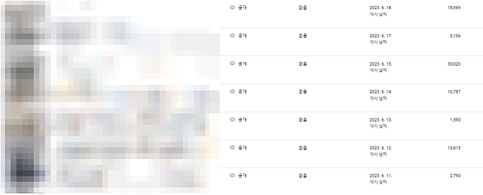
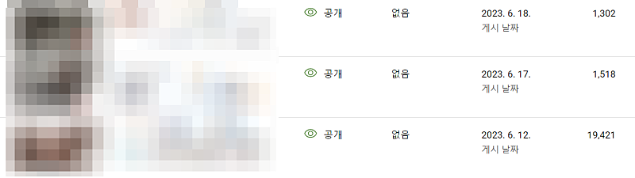
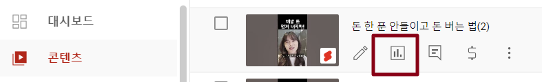
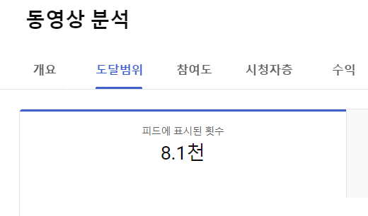

# 망한 유튜브 살리는 2가지 방법 (쇼츠 시작 1주일 성과 공유)

- 원천 ID: EPR-CAFE-6750
- 작성자: 주는사란
- 작성일: 2023-06-22T14:17:30.530000+09:00
- 원문: https://cafe.naver.com/ranschool/6750
- 수집일: 2026-09-21
- 텍스트 정리: HTML 문단 순서 유지, 빈 문단·제로폭 공백만 제거. 원본 HTML·JSON 별도 보존. 이미지는 아래에 모아 보관하며 원래 배치는 HTML에서 확인.

## 원문 본문

<!-- P001 -->
지난주에 쇼츠 채널 2개를 시작했습니다. 먼저, 성과 공유드립니다.

<!-- P002 -->
쇼츠채널 1. 리뷰형 채널

<!-- P003 -->
업로드 : 7개

<!-- P004 -->
1만 이상 조회수 : 4개

<!-- P005 -->
최대 조회수 : 30,020회

<!-- P006 -->
최소 조회수 : 1,590회

<!-- P007 -->
수익 : 약 일주일간 10만원대

<!-- P008 -->
쇼츠채널 2. 브이로그형 채널

<!-- P009 -->
업로드 : 3개

<!-- P010 -->
1만 이상 조회수 : 1개

<!-- P011 -->
최대 조회수 : 19,421회

<!-- P012 -->
최소 조회수 : 1,518회

<!-- P013 -->
뭐야? 생각보다 조회수가 별론데? 라고 생각하실수 있는데, 제 목적은 단순히 조회수가 아닙니다. 조회수보다는 '수익'이 목적인 영상입니다. 유튜브 쇼츠 조회수만을 목적으로 한다면 '이슈'따라서 쭉 찍으면 됩니다. 근데 그렇게 하면 돈이 안된다고 이미 특강이나 아래의 제 영상에서 충분히 말씀드렸습니다. (안 보신분은 꼭 보세요. 이것도 안보면 트랜드 절대 못 따라갑니다)

<!-- P014 -->
그래서 현재 저는 구독자 0명에서도 수익화 가능한 유튜브 쇼츠 채널 키우기를 목적으로 위의 2개의 채널 뿐 아니라 다른 채널에서도 베타 테스트 하고 있습니다. 이 글에서 요즘 쇼츠에 미치면서(?) 알게된 10가지 팁 중 2가지를 알려드릴게요.

<!-- P015 -->
1. 업로드 시간이 중요하다.

<!-- P016 -->
요즘 쇼츠 알고리즘이 약간 이상합니다. (아마 쇼츠 업로드 하는 사람이 너무 많아서 그런것 같아요). 유튜브에서 조회수가 잘 나오려면 유튜브 알고리즘이 내 영상을 노출해줘야 합니다. 제가 말씀드리는 이상하다는 측면은 업로드 하고 아예 노출을 안해주는경우도 있습니다. 혹은 반대로 갑자기 너무 많이 노출을 해주는 경우가 있습니다.

<!-- P017 -->
내 영상이 후자에 속하려면, 알고리즘에 영상이 밀려있을때 업로드하는게 안 좋습니다. 쉽게 말해 인기 많은 음식점에 사람이 많을것 같은 시간에 기다리지 말라는 이야기 입니다.

<!-- P018 -->
보통 쇼츠가 가장 많이 업로드 되는 시간은 평일 저녁 혹은 주말입니다. 그래서 혹시 내 영상의 노출을 봤을때 노출이 거의 없다면 시간이 문제일수 있습니다.

<!-- P019 -->
위 내용을 말씀드리는게 조금은 조심스럽긴 합니다. 왜냐면 이건 제 '경험'에 따른 뇌피셜이지, 유튜브에서 공식적으로 저렇게 말한적이 없습니다. (아마 실제로 이렇더라도 유튜브는 절대 인정하진 않겠지만요) 그래서 위 내용을 맹신하지는 마시되, 혹시 노출이 없을 경우 해당 업로드 시간을 앞으로는 피해서 다른 시간에 올려보시는게 좋습니다.

<!-- P020 -->
2. 지우고 다시 올리자.

<!-- P021 -->
위 내용과 비슷한 이야기긴 하지만, 노출이 안될 경우 구체적으로 어떻게 해야하는지를 알려드리겠습니다.

<!-- P022 -->
만약 아무리 봐도 내 영상이 괜찮은것 같은데, 조회수가 생각보다 안 나왔을 수도 있습니다. (단, 내 영상이 괜찮아야 합니다.) 여러가지 이유로 인해 유튜브 알고리즘이 내 영상을 까먹은(?)걸수도 있습니다. 즉, 노출을 안해줘서 조회수가 안 나온걸수도 있습니다. 그럴때는 영상을 아예 삭제 (비공개 말고 아예 삭제) 한 후 다른 시간에 약 2-3일 뒤에 다시 올려보세요. 알고리즘에 다시 한번 알려주는겁니다. "내 영상도 좀 봐줘" 라구요.

<!-- P023 -->
물론 진짜 영상이 별로라서 조회수가 안나왔을수도 있습니다. 그걸 확인하는 방법은 컨텐츠 - 해당영상 마우스 - 분석 모양 클릭 - 도달범위 에 가시면 '피드에 표시된 횟수'라고 나옵니다. 여기에 숫자가 올라갔는지를 확인하시면 됩니다.

<!-- P024 -->
오늘 제가 쇼츠 채널을 운영하면서 알게된 수익화 채널 운영 노하우 2가지에 대해서 알려드렸는데요.

<!-- P025 -->
근데...설마....아직도 하나도 안해보신건 아니시죠?

<!-- P026 -->
도저히 모르겠으면, 7월 1일 실습특강을 참여하세요. 실습특강에서 나머지 추가 8가지 팁을 알려드리겠습니다.(실습특강은 온라인 판매 절대 안함) 그날 만들어서 올려볼겁니다. 멀리살아서...못가요...라는 것도 솔직히 핑계라고 생각합니다. (물론 실제로 스스로 하실수 있는 분 제외)

<!-- P027 -->
저거로 저는 지금 월 800넘게 번다니까요????

<!-- P028 -->
실습특강은 아래 온라인 특강을 듣고 오신분만 참여할수 있습니다. 참고로 특강은 7월 1일까지만 시청 가능하며, 그 이후에는 판매할 예정은 없습니다. 굳이 돈도 안되는 특강을 하면서까지 알려드리는 이유는 어짜피 저 혼자 아무리 많이 하고 싶어도 한계가 있어서 그렇습니다. 그리고 또 저는 기버니까 ㅎㅎㅎㅎㅎㅎㅎㅎ

<!-- P029 -->
대한민국 모임의 시작, 네이버 카페

<!-- P030 -->
cafe.naver.com

## 본문 이미지

이미지 5: 로컬 보관 실패. [원래 이미지 주소](https://dthumb-phinf.pstatic.net/?src=%22https%3A%2F%2Fcafeptthumb-phinf.pstatic.net%2FMjAyMjA5MjVfNTUg%2FMDAxNjY0MDg3OTMwNzc4.EhYNOaMVqsKmYSUoBQpdO51FdE8NvXWLPIBOahCMZZMg.FF8hkTQq_b9IoHwDDpftRCS__r-VqLv7Nk1A90kFNiIg.JPEG%2FexternalFile.jpg%3Ftype%3Dw740%22&type=ff120) — 수집 응답은 `_관리/이미지수집.json`에 기록.

## 원문에 포함된 링크

- #
- https://cafe.naver.com/ranschool/6114

## 원본 HTML에 포함된 외부 게시물 메타데이터

외부 게시물의 현재 본문을 재수집한 것이 아니라, 카페 게시 당시 함께 저장된 제목·설명이다. 잘린 문구는 보완하지 않았다.

- 원문 링크: https://youtu.be/sTqk3xNSk04

창업 1달만에 초보가 대박 유튜브 만들어낸 과정 (하루 루틴, 목표 설정 방법 모두 공개)

유튜브 특강 신청하기👉🏻https://cafe.naver.com/ranschool/6114유튜브 첫 영상에 조회수 1.2천회 후기👉🏻https://cafe.naver.com/ranschool/6232[이메일 (강연/광고/출연문의)]👉🏻isanghanad@gmail.com...

