# (0편) 주는사란이 했던 일, 하는 일, 파는 것 총정리

- 원천 ID: EPR-CAFE-7484
- 작성자: 주는사란
- 작성일: 2023-07-23T17:31:53.683000+09:00
- 원문: https://cafe.naver.com/ranschool/7484
- 수집일: 2026-09-21
- 텍스트 정리: HTML 문단 순서 유지, 빈 문단·제로폭 공백만 제거. 원본 HTML·JSON 별도 보존. 이미지는 아래에 모아 보관하며 원래 배치는 HTML에서 확인.

## 원문 본문

<!-- P001 -->
제가 10년간 13개의 자영업과 사업, 현재는 마케팅 대행사에 유튜브까지 이것저것 너무 많이 하다보니 "얘는 도대체 뭐하는 애지?" 궁금한 분들을 위해 제 소개를 하려고 합니다.

<!-- P002 -->
저는 ‘돈 버는 생각’하는 것이 취미인 30대 사업가입니다. 제가 돈 버는 생각하는 것을 좋아하는 이유는 돈 자체를 버는 것도 물론 좋지만 돈이 벌리는 그 순간에 “내 생각이 진짜 세상에 통하는구나”란 느낌이 좋기 때문입니다.

<!-- P003 -->
했던 일

<!-- P004 -->
그래서 지금까지 총 11가지의 일을 했었습니다.

<!-- P005 -->
1. 국영수 고등학생 학원 10년 운영 (2023년 02월까지만 하고 이후 중단한 상태)

<!-- P006 -->
2. 이자카야 2개지점 (목동,홍대점)

<!-- P007 -->
3. 배달전문프랜차이즈 (5개지점)

<!-- P008 -->
4. 부동산 경매투자

<!-- P009 -->
5. 앱개발 (학원리뷰어플)

<!-- P010 -->
6. 공인중개사 취득

<!-- P011 -->
7. 서울시 부동산 5개 지점

<!-- P012 -->
8. 분양 대행사

<!-- P013 -->
9. 감정평가사 1차 인터넷 강사

<!-- P014 -->
10. 서울에 50평 짜리 땅 사서 부동산 건물 신축 (현재 중단하고 매도중)

<!-- P015 -->
저도 처음에는 힘들었습니다. 돈되는 일은 불법 말고는 다했습니다. 20살부터 친구와 술자리 한번 했던 기억이 없으며, 어린 여자애가 설친다며, 욕도 들었습니다. '어떻게' 해야 돈을 벌수 있는지 알려주는 사람이 없었습니다. 20대 초에 만났던 남자친구와는 매일 전단지 데이트 하는게 일상이었습니다.

<!-- P016 -->
그렇게 돈에 미쳐 25살에 월 천만원씩 벌게되니 제 안에는 허세가 가득했습니다. 허세가 가득했던 어느 25살, 동업자와의 다툼으로 모든 걸 내려놓았더니 빚 3천만원과 리스로 산 벤츠하나만 남았습니다. 그렇게 다시 시작해 빚 다 갚을때까지 3개월이 걸렸고, 뭐 아직 성공이라고 말하기엔 애매하지만, 지금의 제가 있기까지 4년이 걸렸습니다. 그래서 이제는 뭘 해야할지 뭘 하면 안될지를 알고 있는데요.

<!-- P017 -->
제가 처음에 방황했을때 이런 생각 들더라구요. "어디 물어볼 사람 없나?" 라구요. 무엇보다 제가 관종끼가 있어서 어디가서 말하고 떠드는거 굉장히 좋아합니다. 그래서 지금 유튜브를 하고 있는데요.

<!-- P018 -->
하고 있는 일

<!-- P019 -->
유튜브를 하다보니 종종 제게 "무슨 일 하세요?" "왜 이렇게 많은 일을 하세요?" 라고 물으면, 사실 대답하기가 애매합니다. 그래서 하고 있는 일을 모두 정리해봤습니다.

<!-- P020 -->
1. 마케팅 대행사

<!-- P021 -->
‘마케팅 대행사’는 제가 하는 일들 중 가장 메인이 되는 사업인데요. 10년간 과외부터 고등전문 수학학원, 배달 프렌차이즈, 음식점, 분양대행사를 직접 운영하고 마케팅 해본 경험들이 현재 마케팅 대행사의 시작이였습니다.

<!-- P022 -->
그렇게 제 사업이 아닌 다른 사람의 사업도 마케팅을 해보자고 시작한 일이 현재는 업계 1,2위를 다투는 매출 6000억 (대표님 말씀) 규모의 회사의 마케팅 대행까지 맡을 정도로 커지게 되었습니다. 제가 맡았던 매출 6000억대 회사 사무실입니다. (현재 중단)

<!-- P023 -->
마케팅 하고 있는 매출 6000억대 회사 사무실 내부

<!-- P024 -->
그리고 지금은 기존에 하던 업체(10개이하)를 직원 2명과 하면서 최근에는 새로운 유튜브를 시작해서 확장하고 있습니다.

<!-- P025 -->
2. 유튜브 (주는사란 외 5개 채널)

<!-- P026 -->
1) 주는사란

<!-- P027 -->
아마 지금 이 글을 보시는 대부분의 분들이 ‘주는사란’이라는 유튜브 채널을 통해 절 알게 되셨을텐데요. 저는 주는 사란을 작년 9월쯤 시작하여 아직 채 1년이 조금 넘은 2024년 4월 기준 15만이 넘어서 너무 감사한 나날을 보내고 있습니다.

<!-- P028 -->
근데 제가 사실 주는사란을 하면서 주는사란 외에 5개 채널을 더 키웠었어요.

<!-- P029 -->
2) 건강채널/애견채널 (본영상)

<!-- P030 -->
두 채널 모두 한달만에 수익창출 조건을 돌파했습니다. 저를 오래보신 분들은 아시겠지만 저는 조회수 수익보다 유튜브를 통한 ‘부가수익’을 더 중요하게 생각하는데요.

<!-- P031 -->
현재 이 채널들은 구독자가 1만명, 5천명 정도 되는데요. 저는 두채널모두 구독자가 1000명도 안됬을때부터 한달에 800만원이 넘는 매출을 올렸습니다. 현재는 대행을 멈추게 되어 진행을 하진 않습니다.

<!-- P032 -->
3) 쇼츠채널 3개

<!-- P033 -->
쇼츠만 올리는 채널도 3개가 있는데요. 시작한지 한달(2023년 6월 시작) 만에 250만 조회수 영상과 100만이 넘는 영상 3개를 만들었습니다. 또 2주전에 새로 시작하여 하루에 딱 1시간만 시간을 투자한 채널은 오늘 구독자 393명을 달성했습니다!

<!-- P034 -->
위 채널들은 인스타에도 올리는데, 인스타에서도 100만회 이상 영상이 2개이며 8만회 넘는 영상은 10개 이상입니다.

<!-- P035 -->
이외에도 여러 채널 테스트 중인데, 테스트 하다보니 구독자 오르는 채널도 있네요. ㅎㅎ 대행을 맡아던 채널은 대행 마무리 되면서 소유권을 넘겨드렸구요. 여러 테스트 계정을 운영하면서 다음 채널을 준비하고 있습니다.

<!-- P036 -->
제가 운영하고 있는 계정

<!-- P037 -->
지금까지 제 소개를 했는데요. 저에 대해 더 알고 싶은 분이 계시다면 (감사합니다 ㅎㅎ) 아래 제가 운영하는 SNS를 참고해 주시면 감사하겠습니다.

<!-- P038 -->
1. 커뮤니티 :  네이버 카페 (카페명 : 부퇴사)

<!-- P039 -->
지금 이 카페의 '주는사란의 돈버는 생각' 게시판에 가시면, 제 가치관과 사는 방법을 보실수 있습니다. 제 글에 댓글 혹은 올려주신 여러분의 '자기소개'는 제가 모두 봅니다. 시간이 될때마다 틈틈히 댓글 답변 드리고 있습니다. (쪽지는 보지 않습니다ㅠㅠ)

<!-- P040 -->
2. 사생활 엿보기 : 인스타그램

<!-- P041 -->
인스타에는 제 개인 사생활이 담긴 피드와 스토리를 보실수 있습니다. 인스타 댓글은 가능한 꼭 답글 달고 있습니다. 개인적인 소통 너무 좋습니다. (DM은 잘 보지 않으니 참고 부탁드립니다ㅠㅠ)

<!-- P042 -->
팔로워 1,392명, 팔로잉 8명, 게시물 58개 - 주는사란 (자기계발, 창업, 사업, 마케팅)(@ran0220)님의 Instagram 사진 및 동영상 보기

<!-- P043 -->
adsld.link

<!-- P044 -->
3. 마케팅 칼럼 : 네이버 블로그

<!-- P045 -->
네이버 블로그에서는 마케팅을 무료로 배우실수 있습니다. 아래 블로그는 노출용 블로그는 아니며, 구독자분들께 마케팅 정보를 드리려고 개설한 블로그 입니다.

<!-- P046 -->
안녕하세요. 저는 10년간 중·고등학원부터 부동산, 음식점, 프랜차이즈 본사, 분양대행사까지 해본, 4만 유...

<!-- P047 -->
blog.naver.com

<!-- P048 -->
4. 출연/광고/제안 문의 : 이메일

<!-- P049 -->
<이메일 주소 : isanghanad@gmail.com>

<!-- P050 -->
위 이메일 주소는 매니저님이 관리해주고 계십니다.

<!-- P051 -->
파는 것

<!-- P052 -->
지금까지 제가 지금까지 하고 있는 일을 말씀드렸는데요. 위의 경력으로 지금 팔고 있는 것을 정리해 보겠습니다.

<!-- P053 -->
1. 온라인 강의

<!-- P054 -->
요즘 유튜버들이 뭐만하면 강의를 파니깐 욕을 많이 먹는데요. 제 생각엔 강의료에 비해 턱없이 뻔한 이야기만 하다보니깐 강의에 대한 인식이 안 좋아진거라 생각합니다. 무엇보다 강의료로만 돈을 더 벌고 막상 본인이 알려준 방식은 안하는 분들도 있다보니 그런것 같습니다.

<!-- P055 -->
제 생각엔 강의를 팔고도 욕을 안 먹으려면, 진짜 내가 그 방법으로 돈을 벌었고, 그 방법으로 계속 돈을 벌고 있으면 된다고 생각합니다. 그래서 저는 제가 마케팅 대행사를 계속 할때까지만 아래 강의를 판매할 예정입니다. 저는 아래 방법으로 돈을 벌었고, 지금도 아래 방법으로 돈을 벌고 있거든요.

<!-- P056 -->
제가 10년간 학원 하면서 느낀건, 공부를 잘했던 것과 잘 가르치는건 별개더라구요. 저는 10년간 아이들을 가르치면서 솔직히 가르치는게 좋거든요. 그리고 쫌.... 잘합니다.ㅎㅎㅎ 우리나라에서 손에 꼽는 학군지에서 10년간 학원을 운영했다는 것 자체가 그걸 증명한다고 생각합니다.

<!-- P057 -->
여튼 저는 위와 같은 가치관때문에 아래와 같은 온라인 강의를 판매하고 있습니다.

<!-- P058 -->
아래 페이지를 통해 신청하실 수 있습니다.

<!-- P059 -->
안녕하세요. 부퇴사 카페에 오신 것을 환영합니다😄 처음 오신 분들을 위해 카페의 필요한 정보를 한 곳에 모았습니다. 그림을 클릭하시면 해당 게시글로 바로 이동 가능합니다!...

<!-- P060 -->
cafe.naver.com

<!-- P061 -->
이 강의에서는 유튜브 / 인스타 / 블로그 / 데이터랩 / 자동화 시스템 구축법 을 알려드릴겁니다. 정확히는 제가 이때부터 시작한 유튜브 / 블로그가 있습니다. 이거로...

<!-- P062 -->
cafe.naver.com

<!-- P063 -->
2. 저와 직접 만나는 법 (오프라인)

<!-- P064 -->
제게 메일이나 인스타 DM을 통해 만나자고 해주시는 분들의 연락이 한달에 약 20건 이상 오곤 합니다. 저도 더 많은 분들을 만나고 싶어서 유튜브를 한거라...너무 다 뵙고 싶지만, 현실적으로 어려운 부분이 있는데요.

<!-- P065 -->
강사출신이라 저도 만나서 강의하는걸 굉장히 좋아해서 종종 오프라인 강의를 합니다. 오프라인 강의 공지는 본 카페에 업로드 하고 있습니다.

<!-- P066 -->
카페에서 올라오는 제 글을 보고 싶으시다면, 본 글의 상단으로 올라가셔서 제 아이디를 누른 후 +구독 버튼을 눌러주시면 됩니다.

<!-- P067 -->
여기까지 해서 제가 했던일, 하는일, 파는 것에 대해서 말씀드렸는데요. 이 카페에서 제가 여러분에게 드릴수 있는것 2가지에 대해 아래 글에 정리해 놨습니다. 각 글을 따라가시면, 여러분이 이 카페에서 얻으실수 있는 모든 것을 알수 있을겁니다.

<!-- P068 -->
총 글은 아래와 같이 이뤄져 있습니다.

<!-- P069 -->
(0편) 주는사란 소개

<!-- P070 -->
(1편) 이 카페에서 0원으로 얻을수 있는 2가지

<!-- P071 -->
(2편~5편) 보통사람이 건물주 되는 방법

<!-- P072 -->
위 글을 읽는 시간은 약 40분 정도 소요됩니다. 지금 여러분이 투자하시는 40분으로 제가 10년간 13개의 일을 하면서 느낀 지혜를 얻어가실수 있습니다.

<!-- P073 -->
그럼 1편부터 보러 가볼까요?

<!-- P074 -->
그럼 1편부터 보러 가볼까요?

<!-- P075 -->
대한민국 모임의 시작, 네이버 카페

<!-- P076 -->
cafe.naver.com

<!-- P077 -->
더욱 발전해서 도움되는 사람이 되겠습니다 💕

## 본문 이미지

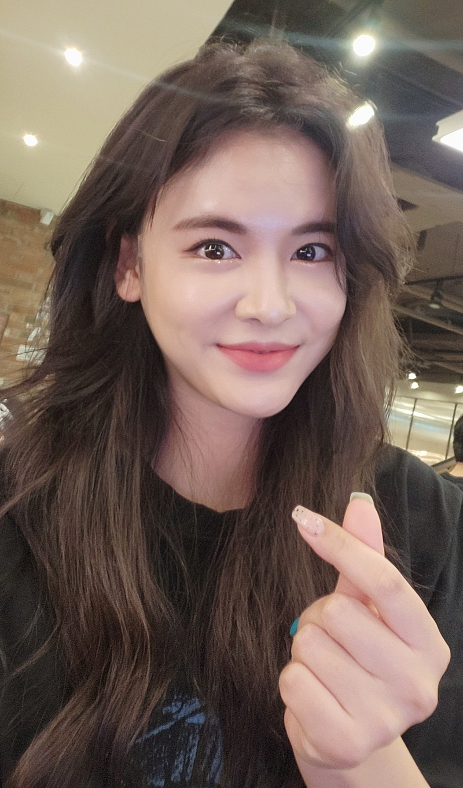

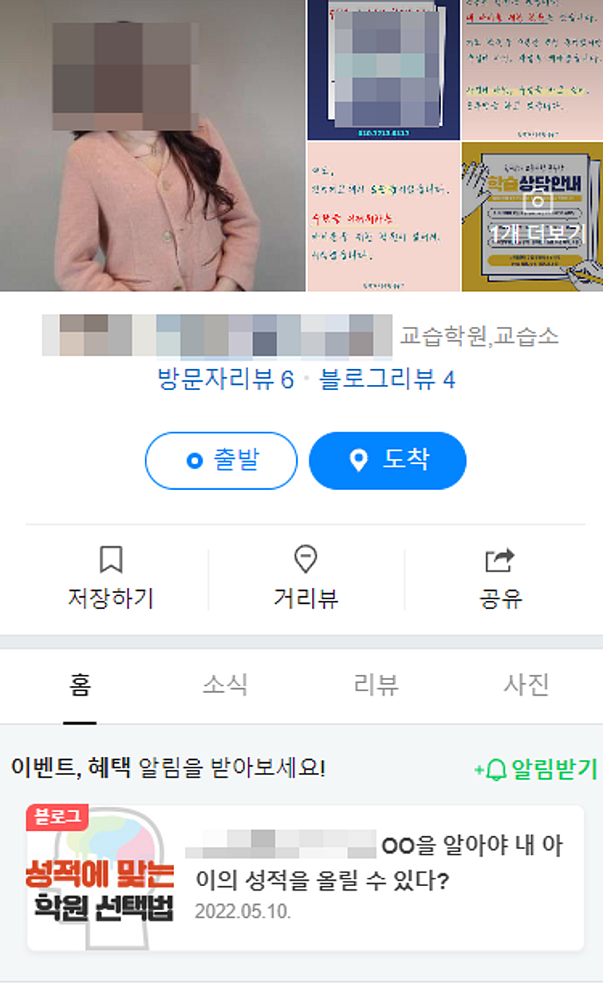

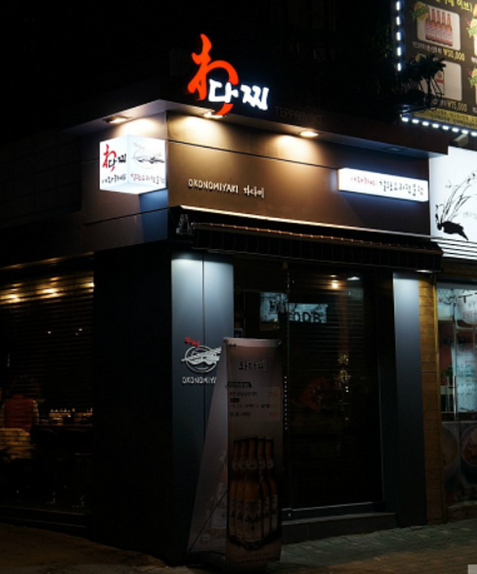

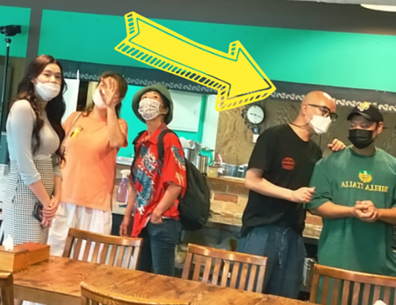

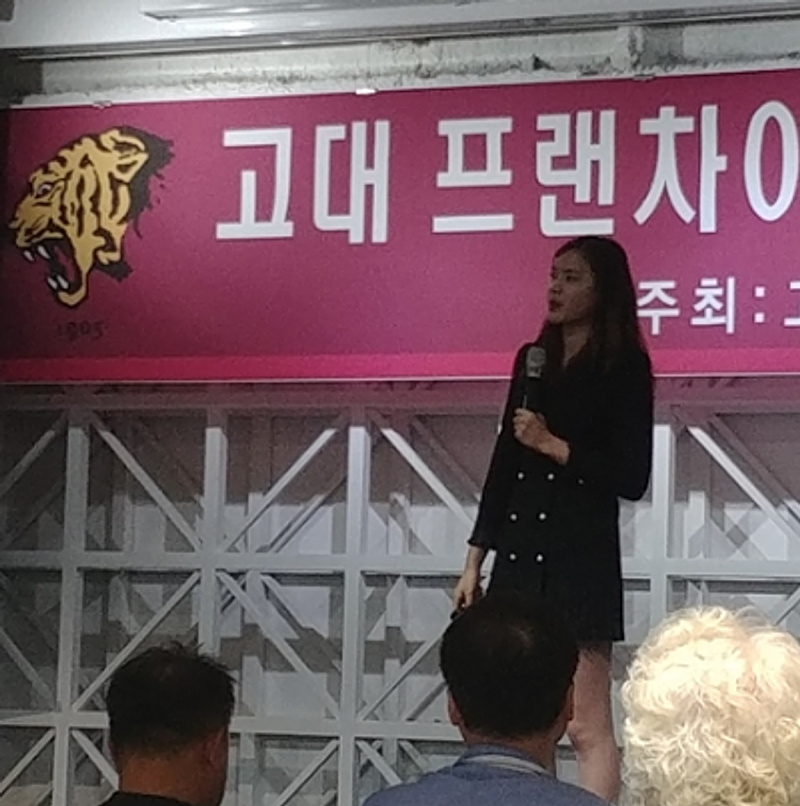

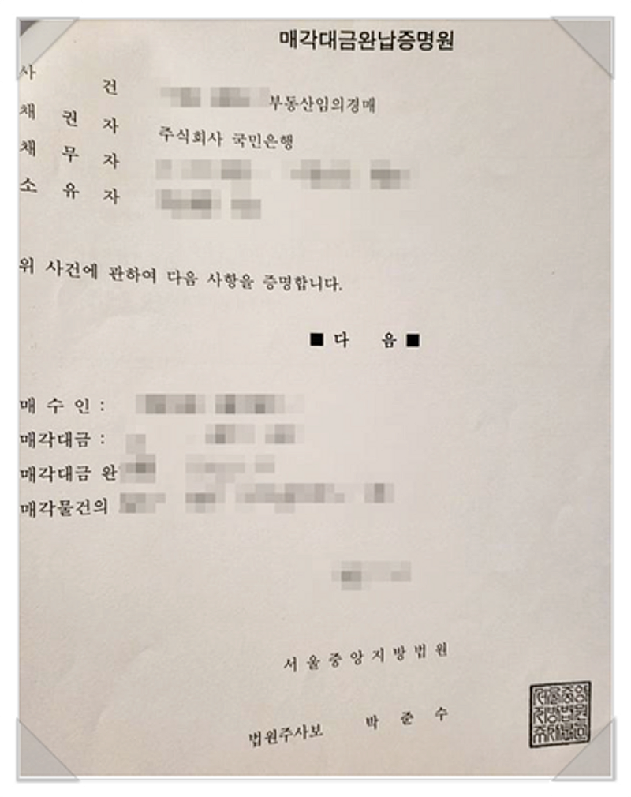

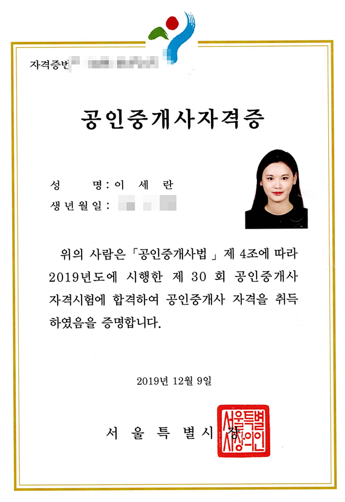

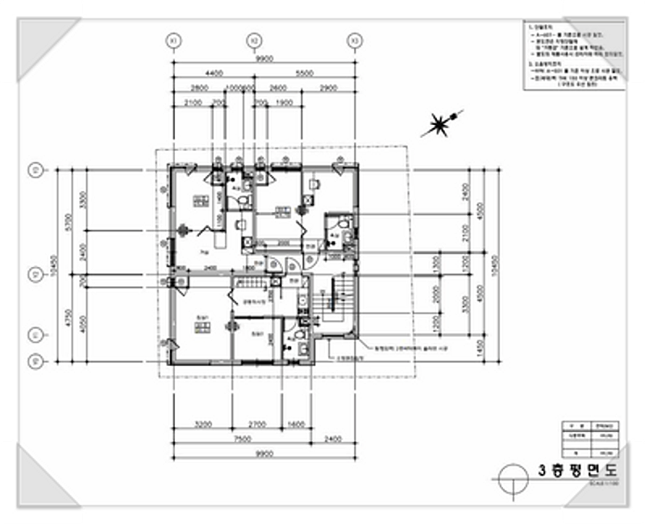

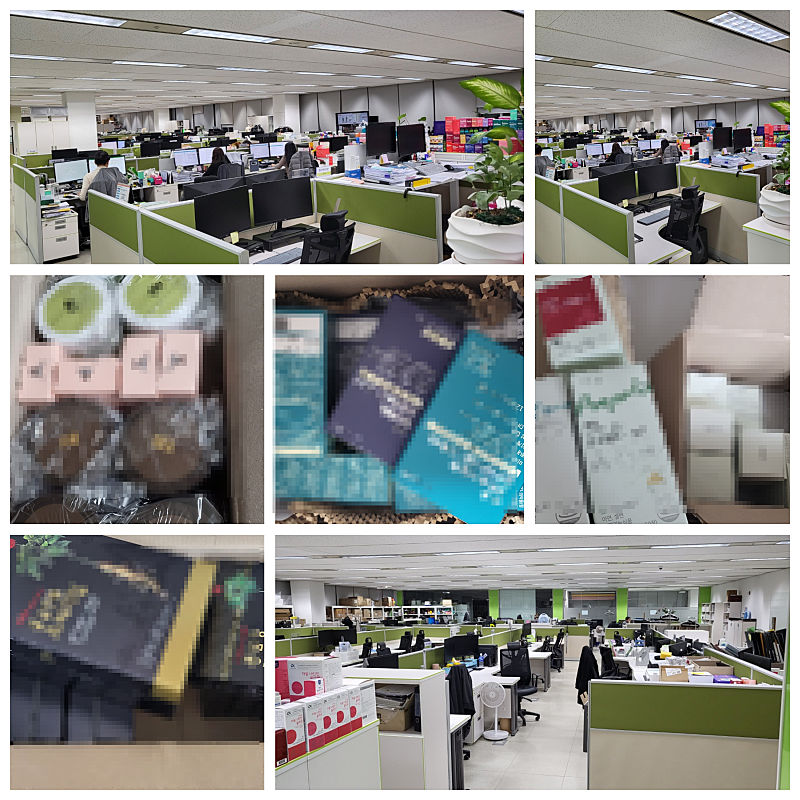

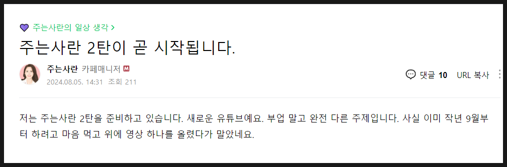

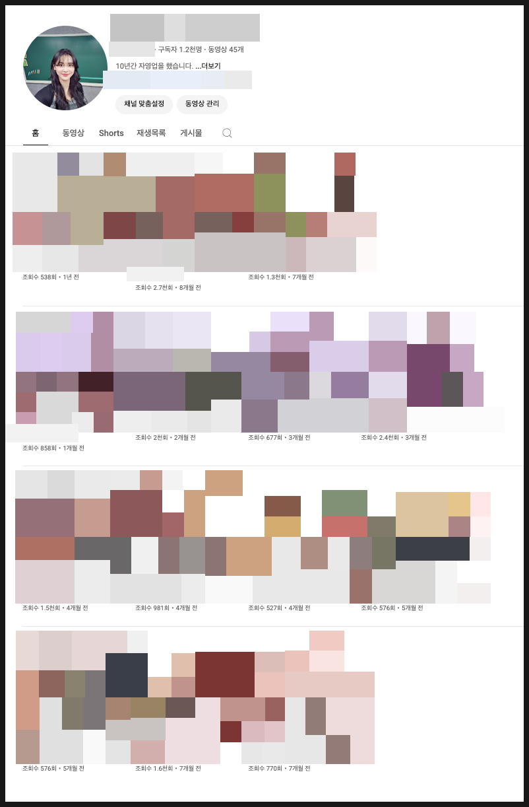

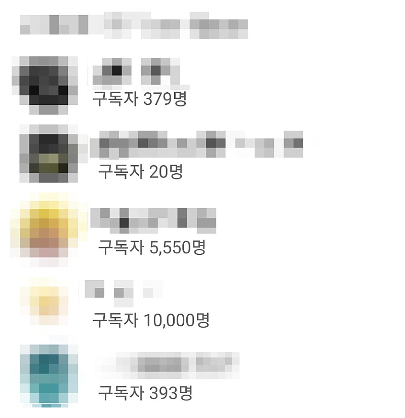

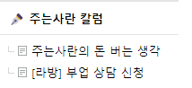

이미지 15: 로컬 보관 실패. [원래 이미지 주소](https://dthumb-phinf.pstatic.net/?src=%22https%3A%2F%2Fscontent-nrt1-1.cdninstagram.com%2Fv%2Ft51.2885-19%2F324557368_234606922232443_4769332679400401156_n.jpg%3Fstp%3Ddst-jpg_s100x100%26_nc_cat%3D108%26ccb%3D1-7%26_nc_sid%3D8ae9d6%26_nc_ohc%3DGdp40-fDU0IAX__fWX9%26_nc_ht%3Dscontent-nrt1-1.cdninstagram.com%26oh%3D00_AfDkR6GRys7P4hwQQ4s7vAldJP3XsgSZDtCnJcQNpsyxHw%26oe%3D64E46213%22&type=ff120) — 수집 응답은 `_관리/이미지수집.json`에 기록.

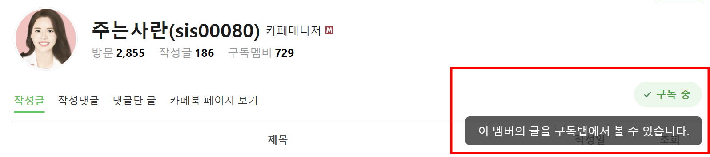

이미지 17: 로컬 보관 실패. [원래 이미지 주소](https://dthumb-phinf.pstatic.net/?src=%22https%3A%2F%2Fcafeptthumb-phinf.pstatic.net%2FMjAyMjA5MjVfNTUg%2FMDAxNjY0MDg3OTMwNzc4.EhYNOaMVqsKmYSUoBQpdO51FdE8NvXWLPIBOahCMZZMg.FF8hkTQq_b9IoHwDDpftRCS__r-VqLv7Nk1A90kFNiIg.JPEG%2FexternalFile.jpg%3Ftype%3Dw740%22&type=ff120) — 수집 응답은 `_관리/이미지수집.json`에 기록.

## 원문에 포함된 링크

- #
- https://adsld.link/instaran
- https://blog.naver.com/giver-ran/223078206267
- https://cafe.naver.com/ranschool/7577
- https://cafe.naver.com/ranschool/33097
- https://cafe.naver.com/ranschool/3
