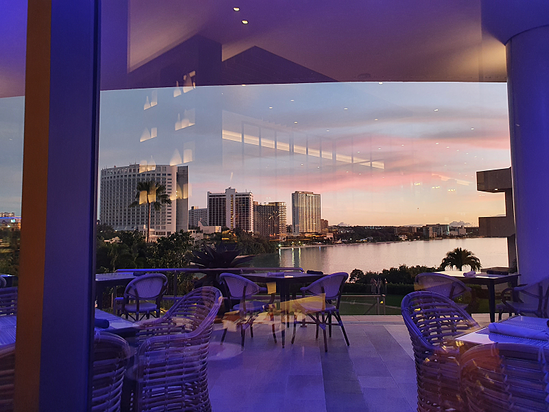
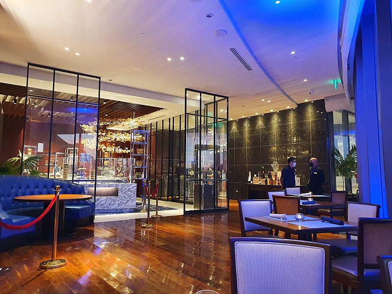
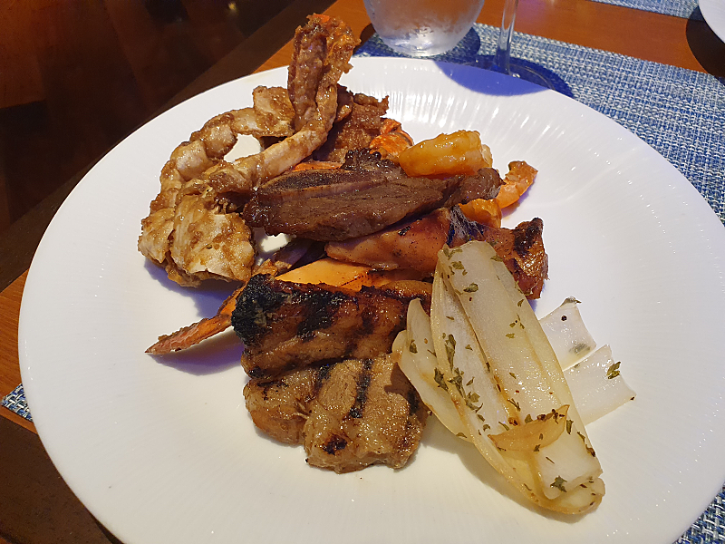
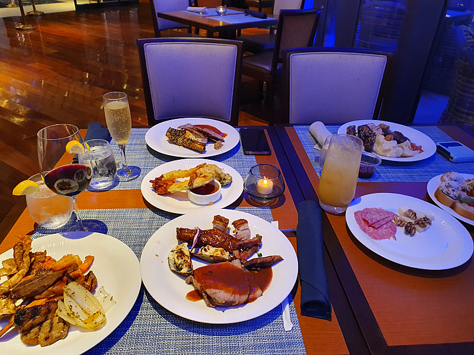
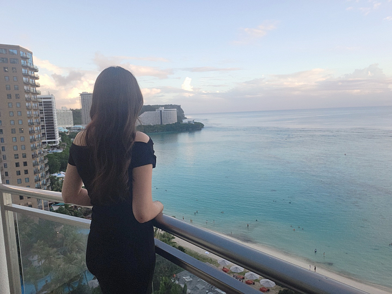

# 같은 일을 해도 버는 돈이 다른 이유

- 원천 ID: EPR-CAFE-81
- 작성자: 주는사란
- 작성일: 2022-11-04T19:36:48.233000+09:00
- 원문: https://cafe.naver.com/ranschool/81
- 수집일: 2026-09-21
- 텍스트 정리: HTML 문단 순서 유지, 빈 문단·제로폭 공백만 제거. 원본 HTML·JSON 별도 보존. 이미지는 아래에 모아 보관하며 원래 배치는 HTML에서 확인.

## 원문 본문

<!-- P001 -->
고등학교 친구들과 4박 5일 괌에 왔는데요. 마지막날 밤, 6성급 호텔 뷔페를 먹었는데, 재미난 에피소드가 있어서 적어봅니다.

<!-- P002 -->
괌에와서 이 뷔페만 먹어서 다른 뷔페가 다 그런진 모르겠으나, 이 뷔페는 한국에 있는 뷔페와 2가지 차이가 있었습니다.

<!-- P003 -->
1. 뷔페이긴 하나, 코너마다 직원이 있어 음식을 직접 가져가는 것이 아니라, 말을 하면 떠주는 시스템 입니다. (아마 코로나영향인것 같긴 합니다)

<!-- P004 -->
2. 음료는 샴페인, 와인, 맥주까지 모두 무제한이나 해당 음료가 뭐가 있는지는 모르고, 모두 서빙하는 직원이 가져다 줍니다.

<!-- P005 -->
#EP. 01

<!-- P006 -->
코너는 총 5가지? 정도 있었습니다. 고기코너 / 샐러드,타파스코너 / 스시코너 / 반찬??코너 / 디저트 코너 이런식으로 있었는데요. 각 코너에는 음식이 많을 뿐 아니라 무엇보다 진열을 되게 애매하게 해놔서, 뭐가 먹는 건지 뭐가 진열상품인지 알기 어려웠고, 어떻게 먹는건지 모르게 진열해 놨더라구요. (제가 못본걸수도;;)

<!-- P007 -->
코너마다 보통 2-3명의 직원이 있었는데, 직원 응대 방식이 재밌었습니다. 샐러드 타파스 코너를 처음 갔었는데 처음 직원은 달라는 것만 주었습니다. 아무말도 하지 않았고, 그냥 자신의 업무에 충실했습니다.

<!-- P008 -->
먹어보고 맛있어서 한번 더 먹으러 갔었는데, 다른 직원은 제가 이걸 먹는걸 보더니, 이걸 좋아하는 사람들은 보통 이런것도 좋아하는데 먹어볼래? 라고 이야기 하더라구요. 그리고 소스도 여러가지 추천해주었습니다. 못먹는 종류가 있는지 물어보더니 그건 빼고 더 담아주고, 더 먹고 싶으면 자기가 또 추천해주겠다고 오라고 하더라구요.

<!-- P009 -->
처음에는 샐러드 타파스 코너에 사람이 없었는데 시간이 지날수록 줄을 서기 시작했습니다. 사람들은 그 코너에 아무것도 안하는 직원 2명이 아닌 여러개를 추천해주는 직원에게 서비스를 싶어서 그 직원이 손님이 없을때까지 기다리더라구요. 그리고 그 직원은 덕분에 제가 본것 기준으로 팁을 3번정도 받았습니다.

<!-- P010 -->
#EP. 02

<!-- P011 -->
음식을 여러개를 떠서 테이블에 올려놓고 먹고 있으니 서빙하는 A라는 직원이 와서 음료를 뭘 먹을지를 물어봤습니다. 한 친구는 와인을 먹었고 다른 친구는 샴페인을 저는 술을 못먹어서 주스를 먹었습니다. A라는 직원은 와인의 이름과 레드 or 화이트 정도를 묻더니 뭘 먹을지 물어봤습니다. 마찬가지로 샴페인도 이름만 말해주더니 뭘 먹을지 물어보더군요. 이름을 들어도 알리가 없었습니다. “어짜피 무제한이니깐 그냥 다 하나씩 먹어보자” 하고 하나씩 먹기 시작했습니다.

<!-- P012 -->
한잔씩을 다 마시고 다시 시키려고 보니 이번엔 B라는 직원이 와서 음료를 뭘 먹을지 물어봤습니다. 이 직원은 제친구에게 와인 스타일을 물어봤습니다. “단거를 좋아하니? 소프트한걸 좋아하니? 지금 먹었던건 입맛에 맞았니?” 그걸 듣더니 와인을 추천해주었습니다. 심지어는 와인을 가져와서 조금만 따라주더니 마셔보고 맛있으면 더 주겠다고 하더라구요. 당연히 대만족이었습니다.

<!-- P013 -->
샴페인을 먹는다는 친구에게도 물어봤습니다. “단게 좋니? 스파클링이 많은게 좋니?” 마찬가지로 샴페인을 추천해주었습니다. 친구는 굉장히 만족해 했습니다. 심지어는 술 싫어하는 제가 먹어도 굉장히 맛있었습니다.

<!-- P014 -->
와인을 먹은 친구가 레드와인을 두잔 마시더니 이번엔 화이트를 먹고 싶다고 했습니다. B라는 직원은 화이트 중에서 방금 너가 먹었을때 맛있다고 했던거랑 비슷한 종류가 있다며 추천해주었습니다. 역시나 너무 맛있었습니다.

<!-- P015 -->
심지어는 제게도 술을 안먹는다고 하니 자신이 가지고 있는 음료 종류에서도 추천해 주었습니다. 파인애플 주스를 먹고 있었는데, 이번에 새로나온 음료가 있다며 이것도 먹어보라며 가져다 주더라구요. 제가 샴페인 먹는 친구꺼를 먹어보고 맛있다고 하니 굉장히 기뻐하며 “너무 뿌듯하다” 라며 샴페인도 가져다 주었습니다. 우리는 직원 B에게 팁을 나름 거하게 주고 나왔습니다.

<!-- P016 -->
나중에 알게된 사실인데, 사실 여기에 와인과 샴페인 총 종류는 한 5가지 정도였습니다. A라는 직원은 이렇게 생각했을수도 있습니다.

<!-- P017 -->
“어짜피 와인 다 그게그거고, 종류 많지도 않은데 이걸 내가 추천할 필요가 있나”

<!-- P018 -->
“팁 기본으로 이정도는 받는데 이렇게까지 해야하나”

<!-- P019 -->
A 직원은 몰랐을수도 있겠지만, 이 뷔페에서 직원들의 팁 수입은 최소 10배 이상 날거라 생각합니다.

<!-- P020 -->
우리나라는 팁 문화는 아니지만, 제가 50-60명의 직원을 고용해보면서 느낀건, 결국 잘되는 사람과 아닌 사람은 여기서부터 차이가 있는것 같습니다. 월급이 얼마건 어떻게든 그것 이상의 값어치를 하려는 사람이 있는 반면, 어짜피 나는 이 월급 받으니깐 내가 일을 했건 안했건 그냥 월급날만 기다리는 사람도 있습니다.제가 이걸 말씀드리는 의도는 후자를 욕하고 싶은게 아니고, 그게 스스로에게 손해라는걸 알아야 한다는 것입니다.

<!-- P021 -->
저도 A직원과 같았던 시절이 있었습니다. 이자카야를 할때였는데, 새벽 2시가 마감인데, 새벽 1시에 들어오는 손님이 있었습니다. 사실 받으면 안되는데 돈은 벌어야겠고, 근데 이미 지칠때로 지쳐서 딱 2시에는 문닫고 가고 싶으니깐 계산대에 앉아서 먹는걸 계속 지켜봅니다. 눈치를 주는 거죠. “적당히 마시고 가세요~”

<!-- P022 -->
그러면 손님들은 제대로 못먹고 더 비싼걸먹으려다가도 대충 먹고 가게됩니다. 무엇보다 이렇게 눈치 받은 손님은 다신 안옵니다. 그때는 이게 결국 나에게 독이 된다는걸 몰랐습니다. 그냥 그 시간에 잠깐 돈 벌고 가면 그만이야라는 생각이 컸던것 같습니다.

<!-- P023 -->
A 직원과 B직원의 서빙실력에서 차이가 있어서 받는 팁이 달랐을까요?

<!-- P024 -->
제가 마케팅을 남들보다 더 대단하게 잘해서 돈을 더 버는 걸까요?

<!-- P025 -->
직장에서 일을 잘하는 사람과 못하는 사람이 실력 차이일까요?

<!-- P026 -->
저는 같은 일을 해도 더 많이 벌수 있냐 아니냐는 마음가짐에 달려있다고 생각합니다. 저희 직원분중에서도 제가 무슨 일을 드리면 기한을 한번도 안밀리는 분이 있고, 매번 기한에 간당간당 주시는 분이 있습니다. 1을 알려드리면 2-3도 공부를 해서라도 채우는 분이 있고, 알고 있는 1만 하는 분이 있습니다. 당연히 전자가 월급이 더 높습니다.

<!-- P027 -->
물론 실력도 차이가 있을겁니다. 왜냐? 의지가 다르니 처음에는 실력차이가 없었겠지만 점점 차이가 날겁니다. 그게 같은 일을 해도 수입이 차이가 날수 밖에 없는 이유입니다.

<!-- P028 -->
여러분은 같은 일을 하는 다른 분들보다 얼마나 더 혹은 덜 벌고 계시나요?

<!-- P029 -->
글이 너무 진지 했던것 같아 웃으시라고 설정샷 하나 투척합니다 ㅋㅋㅋㅋㅋㅋㅋㅋㅋㅋㅋㅋㅋㅋㅋ

## 본문 이미지

## 원문에 포함된 링크

- #
