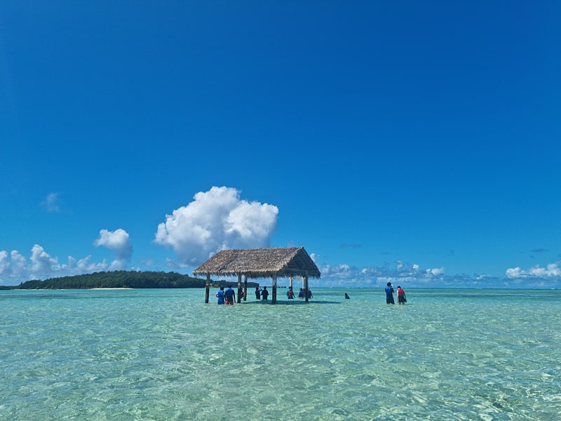
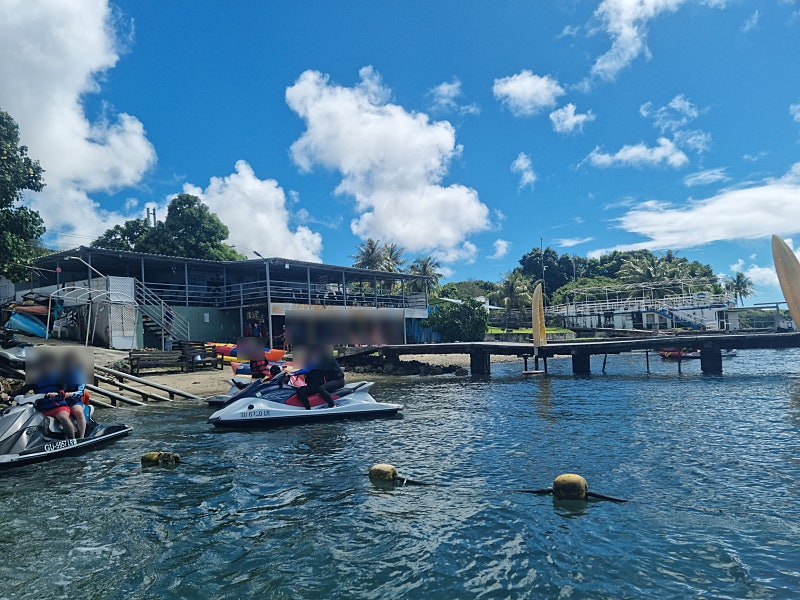
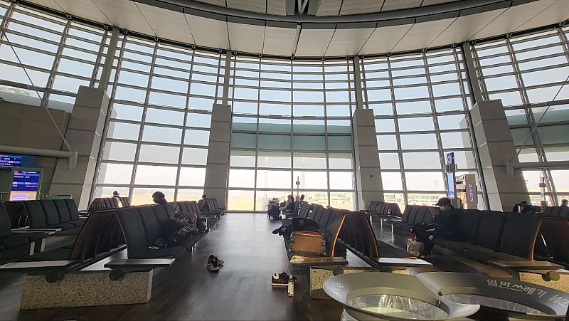
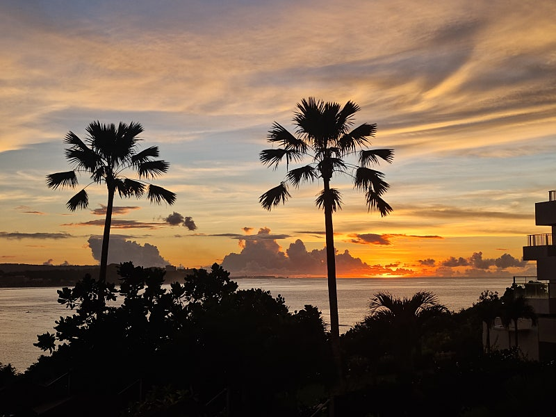
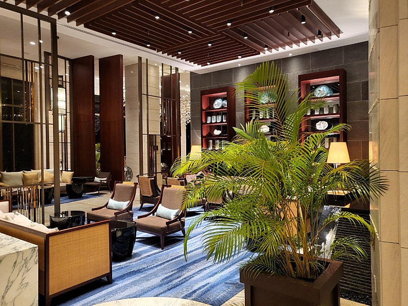
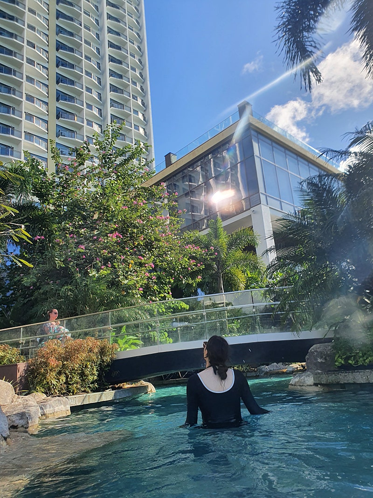
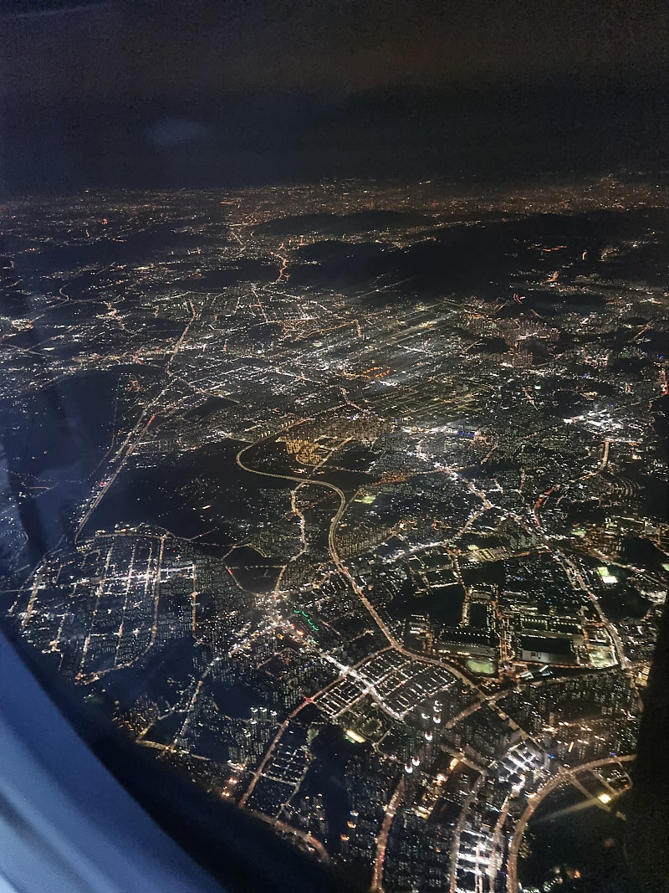

# 나는 사실 또라이다 (재수없음 주의)

- 원천 ID: EPR-CAFE-83
- 작성자: 주는사란
- 작성일: 2022-11-05T13:05:52.970000+09:00
- 원문: https://cafe.naver.com/ranschool/83
- 수집일: 2026-09-21
- 텍스트 정리: HTML 문단 순서 유지, 빈 문단·제로폭 공백만 제거. 원본 HTML·JSON 별도 보존. 이미지는 아래에 모아 보관하며 원래 배치는 HTML에서 확인.

## 원문 본문

<!-- P001 -->
고등학교 친구 둘과 괌에 4박 5일 여행중 있었던 에피소드 두번째입니다. 이 친구들과 10년째인데 이번 여행을 하면서 두가지 차이점이 있다는 걸 알았습니다.

<!-- P002 -->
#EP01. 생각의 차이

<!-- P003 -->
둘째날, 비키니 아일랜드라는 곳을 가기 위해 투어를 결제했습니다. 이 투어는 22만원 이었는데, 호텔에서 섬까지의 픽업비용 + 점심 + 각종 엑티비티 (제트스키, 땅콩보트, 바나나보트 등) 를 하는 비용이 포함되어 있었습니다. 도착해서 보니 운영하시는 분이 한국분이셨고, 투어하는 모든 분들도 한국분이시더라구요. 하긴 한국인 없는 곳이 없긴 했습니다. 약간 먼 제주도같은 느낌??

<!-- P004 -->
투어에 대해 설명해주시는데 이렇게 말하시더라구요 .

<!-- P005 -->
“오늘은 사람이 많이 없네요”

<!-- P006 -->
“코로나 이후로 한창 사람많았는데 오늘은 편하네~”

<!-- P007 -->
그걸 듣더니 친구 한명이 이렇게 말하더라구요.

<!-- P008 -->
“사람 없어서 좋다. 우리 보트 많이 탈수 있겠다”

<!-- P009 -->
이 이야기를 듣는데, 저는 머릿속에서 이런생각이 들었습니다.

<!-- P010 -->
“인당 22만원씩 받으면, 지금 16명 정도 있으니깐 하루에 352만원 정도네. 오늘이 사람 적은거라고 했으니깐 최소 352만원만 잡아도 한달에 20일만 운영한다해도 월 매출 7000이군. 여기 직원이 한 10명정도, 인당 월급 300씩 준다고 해도 3000나가는 거고, 여기 땅값 아무리 비싸도 3억 정도면 될것 같고, 다른 부대비용 나간다고 하면 한달에 최소 2-3천, 잘될때는 4-5천정도 벌겠군”

<!-- P011 -->
그래서 제가 친구한테

<!-- P012 -->
“이런거 하면 한달에 2-3천 정도 벌겠네”라고 하니깐

<!-- P013 -->
“그새 그거 생각했어?”하더라구요.

<!-- P014 -->
저는 맨날 이런 생각만 해서, 이런 생각 안 드는게 더 신기했거든요. 사실 저도 이런 생각안하고 가만히 있고 싶은데 뇌가 돌아가는걸 어떡해 ㅋㅋㅋ 이런 계산하는게 더 재밌는걸. 사실 지금 이 글을 쓰는 비행기 안에서도 비행기안에 비어있는 좌석 대충 보고 한명당 얼마고 그러면 이 비행기를 띄웠을때 항공사가 얼마벌지를 계산하고 있었어요…ㅋㅋㅋㅋ

<!-- P015 -->
적다보니 또라이 같긴 하네요;;ㅎㅎ

<!-- P016 -->
#EP02. 휴식의 다른 의미

<!-- P017 -->
이렇게 말하면 이상하지만, 저는 노는것 쉬는것 이런걸 별로 안 좋아합니다. 제가 제일 싫어하는게 안부 묻는것, 옛날일 회상하는 것입니다. 앞으로 발전을 위해 회상하는게 아니라 “그때가 좋았지” 이런거요. 그래서 친구가 별로 없나;;ㅎㅎ

<!-- P018 -->
이 친구들과 10년이나 되었지만 친구들과 여행 스타일이 정말 안맞습니다. ㅎㅎ 다행히 친구들이 저를 이해해줘서 지금까지 매년 여행을 오는 것 같은데요. (나 버리면 안댕~ㅎㅎ) 제 친구들은 여행을 오면 꼭 해야하는것, 꼭 가야하는 곳, 꼭 먹어야 하는 곳 이런거를 엄청 찾아다니는 스타일입니다.(물론 먹는게 절반이긴 하지만;;ㅎㅎ)

<!-- P019 -->
반면, 저한테 휴식은 바빠서 그동안 하고 싶었던것을 하는 시간입니다. 충분한 생각을 하지 못했던 부분들을 다시한번 생각하고 정리하는 것, 구체화 하는 시간 입니다.

<!-- P020 -->
그래서 저는 별로 밖에서 나가고 돌아다니는걸 안좋아합니다. (사실 구체화 이런건 개소리고 걷는거 싫어합니다 ㅋㅋ) 무슨이유건 많이 돌아다니는걸 안좋아하는 덕에 휴양지 여행만 다니는데요. 이번 여행에서도 투어하는 날 빼고는 거의 호텔에서만 있었던 것 같습니다.

<!-- P021 -->
이럴거면 왜 여행을 가냐고 하는사람들이 있는데, 느낌이 달라요 ㅋㅋㅋㅋㅋ

<!-- P022 -->
덕분에 하도 심심해서 이런걸 했습니다.

<!-- P023 -->
1. 유튜브 대본 6개 + 6개 촬영

<!-- P024 -->
2. 새로 맡게된 마케팅 기획안 작성

<!-- P025 -->
3. 카페에 올릴글 3개

<!-- P026 -->
친구들이 수영하고 있을때 다 했더니 친구들이 그러더라구요.

<!-- P027 -->
“놀러 왔으면 놀아야지, 일만 하네”

<!-- P028 -->
그래서 제가 그랬죠.

<!-- P029 -->
“나한텐 이게 노는건데” 라고 하니 어이없다는 듯이 웃더라구요.

<!-- P030 -->
근데 전 진짜 이게 더 좋거든요. 해야하는 일에 구애 안받고 하고 싶은 일만 하는거. 친구들이랑 저한테 각자 휴식의 의미가 다른것일 뿐이죠. 그렇다고 친구들의 휴식이 별로고 제 휴식이 좋다. 이런건 아닙니다. 그냥 저는 이게 진짜 좋아서 그랬을뿐이거든요.ㅎㅎ

<!-- P031 -->
누군가는 저를 보면서 이렇게 생각할수도 있어요.

<!-- P032 -->
“나는 굳이 저렇게까지 해서 돈 벌고 싶진 않아”

<!-- P033 -->
저도 가끔 이런 스스로가 피곤할때가 있어요 ㅋㅋㅋ

<!-- P034 -->
사실 지금도 제친구 두명 모두다 비행기에서 자고 있는데 저 혼자 이 글을 쓰고 있습니다. 저도 안 자고 싶어서 안자는게 아니고 원래 자려고 했는데........ 카페에 쓰고 싶은 내용이 자꾸 생각나서 잠이 안 오더라구요;; 머리가 돌아가는중@@@

<!-- P035 -->
더 쓰고 싶은데, 노트북 배터리가 없네요.

<!-- P036 -->
이제 진짜 자야겠습니다.

<!-- P037 -->
그럼 한국에 가서 또 쓰겠습니다~ 뿅

## 본문 이미지

## 원문에 포함된 링크

- #
