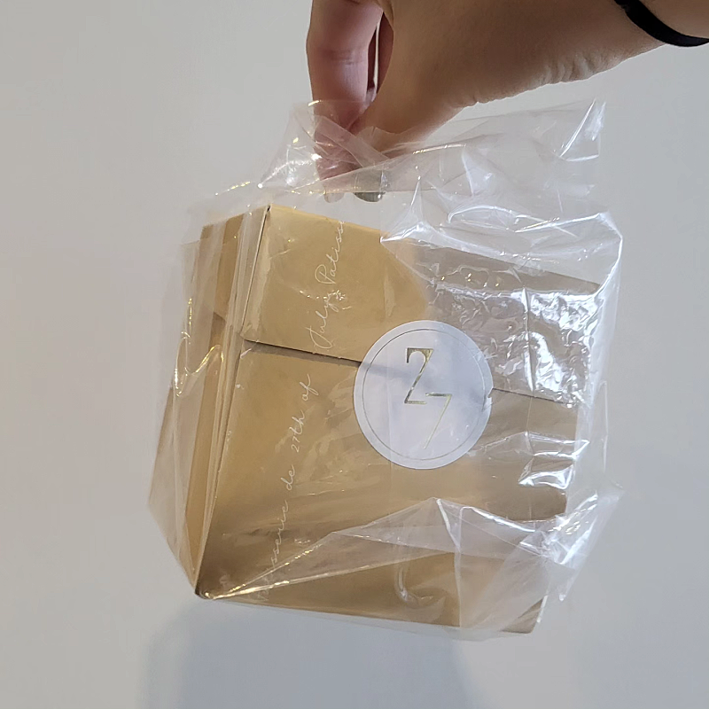
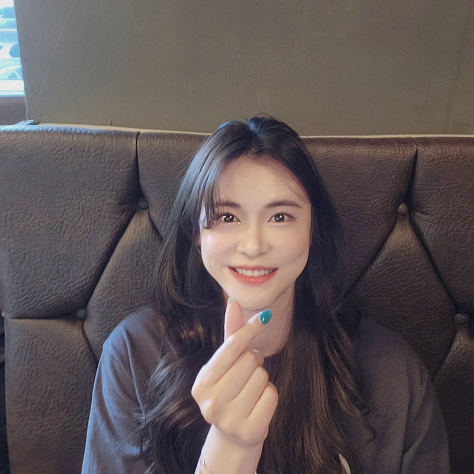

# 고마움을 표현하는 방법에 대하여 (쑥쓰러워 하는 사람)

- 원천 ID: EPR-CAFE-8351
- 작성자: 주는사란
- 작성일: 2023-08-08T18:49:55.507000+09:00
- 원문: https://cafe.naver.com/ranschool/8351
- 수집일: 2026-09-21
- 텍스트 정리: HTML 문단 순서 유지, 빈 문단·제로폭 공백만 제거. 원본 HTML·JSON 별도 보존. 이미지는 아래에 모아 보관하며 원래 배치는 HTML에서 확인.

## 원문 본문

<!-- P001 -->
살다보면 쑥쓰럽다는 이유로 고마움을 제대로 표현하지 않는 경우가 있더라구요. 왜 그럴까를 생각해봤습니다. 이글을 쓰게된 이뉴는 제가 어제 주PD님 유튜브 강의를 다녀왔는데요. 거기서 구독자 4분을 만났습니다. 그중 한분이 '기버카페'가 거의 1주년이 됐다고 하면서 축하한다고 선물을 주시는 거예요. 넘 감사했는데, 제대로 표현을 못했거든요ㅠㅠ

<!-- P002 -->
제가 보기보다는 좀 소심하고 부끄럼을 많이 탑니다. 그래서 어제 문득 이런 생각을 해보았어요. "상대방에게 내 마음을 온전히 표현하면서, 나도 민망하지 않는 선에서 고마움을 표현하는 방법은 없을까?" 하구요. 돌이켜보니깐 저한테는 10년간 사업하면서 총 3가지의 전환점이 있었는데요. 그 3가지 전환점 모두 감사함을 제대로 표현했을때 기회가 주어지더라구요.

<!-- P003 -->
그래서 오늘은 그 방법을 나눠볼까 합니다. 저도 좀 다시한번 마음을 다잡구요 ㅎㅎ

<!-- P004 -->
칭찬이나 선물을 받으면 마음으로는 너무 좋은데, 이상하게 그걸 실제로 표현하기 너무 어려울때가 있지 않나요? 또는 반대로 많은 고민과 노력을 칭찬과 선물을 줬는데, 애매하게 대답해서 "괜히 줬나?"싶을 때가 한번쯤은 있으셨을거예요. 감사를 표현하는 법과 받는 법, 이 두가지만 알아도 주위 사람이 바뀌는것 같아요.

<!-- P005 -->
감사를 표현하지 못하는 이유

<!-- P006 -->
제가 감사한 그 분과 헤어지고 생각해봤어요. "왜 나는 감사함을 제대로 표현하지 못했지?" 하구요. 저한테는 3가지 정도 문제였던것 같아요.

<!-- P007 -->
1. 우리나라 사람 특

<!-- P008 -->
어릴때부터 누군가가 뭘 준다고 할때 '3번까지는 거절해야 예의다' 라고 생각했던것 같아요. 그래서 너무 고마운 선물이라도 바로 받으면 "예의가 없었나?"라는 생각이 들더라구요..;;

<!-- P009 -->
요즘 MZ 들은 아니라고 하지만, 저는 아직도 사회생활을 하다보면 당연히 받아야 하는 것임에도 요구하기가 민망하다고 느낄때가 있는데요. 예를 들어, 음식점에서 종업원분이 제 식탁과 멀리있을때, 불러서 메뉴를 시키는 것 조차 어려워 하거든요. 그래서 꼭 친구한테 부탁해요...ㅋㅋ

<!-- P010 -->
2. 제대로 못 배웠다.

<!-- P011 -->
'10대 놀라운 뇌 불안한 뇌 아픈뇌'라는 책에 따르면, 감사하는 방법은 부모님한테 배우게 된다고 하더라구요. 근데 부모님도 무뚝뚝하거나, 부모님 사이가 좋지 않아 서로에게 감사를 표현하는 걸 본적이 없는 경우에는 감사를 표현하고 받는 법을 배우지 못한데요. 학교에서도 가르쳐주기는 하지만, 이론적인 이야기 뿐이니까요.

<!-- P012 -->
저도 20살까지는 부모님 사이가 굉장히 좋지 않으셨어요. 저희가 다 크고 나니깐 좋아지시더라구요....;; 저희가 문제였나봐요 ㅎㅎ 서로에게 "고마워"라는 말을 한걸 본적이 없거든요. 그리고 부모님이 저한테도 "고마워"라고 말한 것도 기억나는건 없어요. 제가 감사에 대해 배운건, 고2시절 진짜 친한 친구와 크게 싸우면서 충격요법으로 배웠어요. 물론 아직도 굉장히 평균에 비해 미숙한 편이라고 생각합니다. (엄마탓 하는건 아님;;ㅎㅎ)

<!-- P013 -->
3 감사함을 표현하는게 낮은 자세라고 착각한다.

<!-- P014 -->
이건 모든 사람이 그런건 아닌데요. 근데 제 경험상 감사함을 제대로 표현하지 못하는 사람 중 약 40%정도는 감사함을 표현하는 것 자체가 자신이 상대방한테 더 낮은 입장이 된다고 '착각' 하는 경우가 있는것 같아요.

<!-- P015 -->
제가 26살에 빚 지기 전에, 음식점 하나가 엄청 잘되면서 그때 배달 프랜차이즈를 했는데요. 계속 대표 소리를 듣다보니깐 완전 맛탱이가 갔던것 같아요. 그때 어린 나이에 고생한다고 도와주신 분도 많았는데, 생각해보면 그 분들께 감사하다는 인사를 한적이 거의 없는 것 같아요. 지금이라도 연락 드려서 감사하다고 해야겠어요.

<!-- P016 -->
감사 활용법

<!-- P017 -->
어제 감동을 받고는 집으로 오는 1시간 내내 그 감동에 대해 직원분들과 이야기 했어요. (밤 늦게 전화드려 죄송합니다;;ㅎㅎ) 같이 다 감동이라 진짜 다시한번 마음을 다잡았어요. "그래 내가 이런 분들은 기억해야지" "도움을 드려야지" 하구요. 어제 받은 감사로 저는 다시한번 '감사하는 방법' 에 대해 알게 되었어요.

<!-- P018 -->
1. 감사를 제대로 표현하면 그 사람에게 각인이 된다.

<!-- P019 -->
어느날 매출 6000억대 대표님이 저한테 그러셨어요. "우리 의남매 맺자"구요. 내가 너 꼭 도와주겠다고 하셨어요. 지금까지 정말 많은 도움을 받았죠. 근데 그때는 뭔가 잘보이고 싶은 마음에 진짜 제가 아는 모든 것을 항상 정리해서 보내드린것 같아요. 제가 감사를 표현할 길이 그것 밖에 없었거든요. 그리고 어디 여행 다녀오면 작더라도 꼭 선물을 보냈었거든요. 편지도 쓰고 ㅎㅎ 감사하게도 그 마음을 항상 알아주셨어요.

<!-- P020 -->
저도 유튜브를 하게 되면서 너무 많은 사람을 알게되면서 솔직히 많은 분들을 기억하지 못할때도 있거든요ㅠㅠ 근데 꼭 소소하더라도 저를 기억하고 감사인사를 표현하는 분들은 진짜 각인이 되더라구요. 어제 그 분 성함도 하는 유튜브도 잊지 못할거예요. 제가 오프라인 강의 할때는 음료수가 있는데도 매번 음료수를 사와주신 분도 계셨어요. 그런 분들은 바로 기억에 남는 것 같습니다.

<!-- P021 -->
저도 이 방법을 앞으로 좀 더 활용 해야겠어요.

<!-- P022 -->
2. 주기적으로 '감사데이'를 정하자.

<!-- P023 -->
평소에는 사실 바쁘다는 핑계로 감사를 전하기가 쉽지 않은것 같아요. 그래서 주기적으로 아예 정해야겠어요. 매달 8일은 감사데이로요. 오늘이 8일이니까요 ㅎㅎㅎ

<!-- P024 -->
제가 옛날에도 감사에 관해 쓴 글이 있는데요. 이젠 주기적으로 해야겠어요.

<!-- P025 -->
여기에 감사한 분이 너무 많은데 감사 인사를 한번도 못 한것 같아 감사 인사를 하고 싶었습니다. 모든 분들을 말씀드리진 못하겠지만, 그래도 최대한 아래에 지금까지 제 유튜브 ...

<!-- P026 -->
cafe.naver.com

<!-- P027 -->
감사 제대로 표현하는 법

<!-- P028 -->
그러면서 어떻게 감사를 표현하는게 좋을까?에 대해서 생각해봤는데요. 딱 3가지만 지키면 될것 같아요. 정답은 없지만, 저처럼 쑥스럼을 많이 타시는 분들게 추천드리는 방법입니다.

<!-- P029 -->
1. 정확한 시점을 언급 한다.

<!-- P030 -->
"고마워" 라고 하는 것 보다는 "오늘 전화해 줘서 고마워" 라고 말하는게 전달이 더 잘되더라구요. 이건 설득하는 글쓰기도 똑같거든요. 구체적으로 말할수록 정확히 상대방에게 내 마음이 전달되는것 같아요.

<!-- P031 -->
2. 선물이나 행동 그 자체보다는 그 사람의 '마음'에 감사한다.

<!-- P032 -->
어제 그분이 제게 주신건 디저트였는데요. "디저트 감사합니다" 보다는 "카페 1주년이라는걸 확인하신 그 마음과 학원 오시기에도 바쁘셨을텐데 디저트 사러 내주신 시간, 그리고 제게 먼저 다가와주시겠다는 그 마음이 너무 감사합니다" 라구요. 그럼 그 사람이 내 마음을 정확히 알고 있다는 생각에 같이 감동 받을 것 같아요.

<!-- P033 -->
3. 최소 일주일 안에 표현한다.

<!-- P034 -->
너무 늦어지면, 그 사람이 자신의 표현한 마음에 답하지 않았다는 생각에 이미 마음이 상해버리기도 하더라구요. 상대방의 마음이 상하기 전에 표현하는게 중요한것 같습니다.

<!-- P035 -->
승훈님

<!-- P036 -->
어제  카페 1주년이라는걸 확인하신 그 마음과

<!-- P037 -->
학원오시기에도 바쁘셨을텐데 디저트까지 사와주신 그 시간,

<!-- P038 -->
그리고 제게 먼저 말 걸어주신 용기에 감사합니다.

<!-- P039 -->
어제 바로 표현했어야 했는데,

<!-- P040 -->
너무 놀라서 지금이라도 마음 전합니다!

<!-- P041 -->
감사합니다

## 본문 이미지

## 원문에 포함된 링크

- #
- https://cafe.naver.com/ranschool/5511
