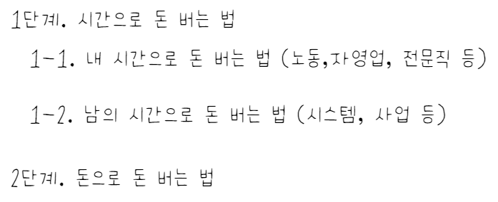
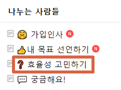

# (3편) 월급쟁이가 3년안에 퇴사 할 수 있는 유일한 방법

- 원천 ID: EPR-CAFE-9
- 작성자: 주는사란
- 작성일: 2022-10-02T17:04:41.403000+09:00
- 원문: https://cafe.naver.com/ranschool/9
- 수집일: 2026-09-21
- 텍스트 정리: HTML 문단 순서 유지, 빈 문단·제로폭 공백만 제거. 원본 HTML·JSON 별도 보존. 이미지는 아래에 모아 보관하며 원래 배치는 HTML에서 확인.

## 원문 본문

<!-- P001 -->
안녕하세요.

<!-- P002 -->
다 같이 잘 벌어서 서로에게 '인맥'이 되어줄수 있는 커뮤니티가 되고 싶어 카페를 개설한 주는사란입니다.

<!-- P003 -->
이번 글에서는 본격적으로 내가 정한 기간내에 원하는 목표 만큼의 금액을 벌기 위해 '어떻게' 할수 있는가에 대해서 말씀드리겠습니다. 저는 돈이 어떻게 벌리는지에 대해서 깨달은후 8년간 벌었던 총 수입의 4배를 벌수 있게 되었습니다.

<!-- P004 -->
이 글을 읽기 전, 아직 선언하기를 하지 않으셨다면, 이 글을 읽어도 시간 낭비일 뿐입니다. 이 글은 보통 사람들이 건물주가 되는 유일하지만 보통의 방법의 2번째 글이며, 첫번째 글을 못 읽으셨다면, 아래 글을 먼저 읽어주세요.

<!-- P005 -->
오늘은 보통 사람들이 서울 건물주가 되기까지의 가장 보통의 방법을 적어보려합니다. 서울의 건물주가 되는 법은 경제적 자유를 이루는 방법과 같습니다. 결국 본질은 내가 '일을 ...

<!-- P006 -->
cafe.naver.com

<!-- P007 -->
지난 글 내용을 복습해 보겠습니다. (제가 학원 강사 출신이라 복습,정리 이런거 좋아합니다...ㅎㅎ)

<!-- P008 -->
1. 경제적 자유나 건물주가 되는 방법은 생각보다 간단하고, 유일하다

<!-- P009 -->
돈을 번다 => 돈을 모은다 => 투자를 한다 => 경제적 자유를 이룬다

<!-- P010 -->
2. 그중 첫번째, 돈을 벌기 위해서 가장 첫 스텝은 ‘구체적이고, 나에 맞는’ 목표를 세워야 한다.

<!-- P011 -->
3. 근데 그건 혼자 못한다. 그러니깐 ‘내 목표 알리기’ 게시판에 쓰고 나누자!

<!-- P012 -->
도대체,, 어떻게 돈을 벌어야 하나

<!-- P013 -->
'어떻게 돈을 벌까' 에 대한 이야기를 해보겠습니다. 사실 어떻게 돈을 벌까에 대한 답은 없습니다. 하지만 방법은 있습니다. 그리고 오늘은 그 방법을 알려드리겠습니다.

<!-- P014 -->
이 방법은 제가 8년간 학원, 이자카야 2개지점, 프랜차이즈본점, 부동산 5개지점, 분양대행사, 인터넷강사, 부동산 투자, 건물 짓기, 마케팅 회사 운영, 스타트업, 플랫폼비즈니스 까지 세상에서 돈벌수 있다는 왠만한 일들을 해보면서 느낀 경험으로 알게된 방법입니다.

<!-- P015 -->
돈을 버는 방법

<!-- P016 -->
우리나라에서 돈을 버는 방법은 크게 2가지로 나눌 수 있습니다.

<!-- P017 -->
1. 시간으로 돈을 버는 법

<!-- P018 -->
2. 돈으로 돈을 버는 법

<!-- P019 -->
이 두가지 방법 중 여러분은 지금 당장 무엇을 할수 있으신가요? 아마 대부분은 1번의 방법으로 돈을 벌고 계실겁니다.(저도 2년전까지 그랬습니다) 왜냐 우리는 돈이 없습니다. 그래서 우리는 1번의 방법 부터 해야합니다.

<!-- P020 -->
근데 이렇게 뻔한 사실을 우리는 인정하지 않을때가 있습니다. 사실 주식투자와 코인투자 등의 리스크가 있는 투자에서 돈을 잃는 사람들의 대부분은 2030입니다. 왜냐? 이들은 본인들이 1번의 방법으로 돈을 벌어야 함에도 본인의 그릇을 깨닫지 못하고 자꾸 2번을 시도 하기 때문입니다.

<!-- P021 -->
그래서 우리는 인정해야합니다.

<!-- P022 -->
나는 돈이 없다.

<!-- P023 -->
그러니 일단 시간을 쓰자. 인정하면 편하고, 인정하면 잃지 않습니다.

<!-- P024 -->
매출 6000억 회사 대표도

<!-- P025 -->
시간을 써서 돈 버는 이유

<!-- P026 -->
이 사실을 기분나빠 할 필요가 없습니다. 제가 얼마전 우연히 친해진 분중에 우리가 이름을 들으면 누구나 알만한 회사의 대표님이 있습니다. 이분은 연매출 6000억(대표님 말에 따르면) 입니다. 근데 제가 알기론 이분도 시간을 써서 돈을 버는 일만 합니다. 본인이 사는 집 한채가 부동산의 전부이며, 주식도 하지 않습니다. (물론 그 집이 30억이긴 합니다;;ㅎㅎ)

<!-- P027 -->
그럼 이 사람들은 왜 돈으로 돈을 버는 방법을 쓰지 않을까요? 그건 '이런' 이유가 있습니다.

<!-- P028 -->
시간으로 돈을 버는 법

<!-- P029 -->
사실 시간으로 돈을 버는 법 중에는 더 세부적으로 2가지로 나뉩니다.

<!-- P030 -->
1-1. 내 시간으로 돈을 버는 법

<!-- P031 -->
1-2. 남의 시간으로 돈을 버는 법

<!-- P032 -->
여기에 매출 6000억 짜리 대표님이 돈으로 돈을 버는 2번 방법을 쓰지 않는 이유가 있습니다. '남의 시간으로 버는 돈' 이 '돈이 벌어주는 돈' 보다 더 크기 때문인거죠.

<!-- P033 -->
내 시간으로 버는 돈과 남의 시간으로 버는 돈을 저는 '노동'과 '시스템'으로 생각합니다.

<!-- P034 -->
1-1. 내 시간으로 돈을 버는 법 (노동)

<!-- P035 -->
1-2. 남의 시간으로 돈을 버는 법 (시스템)

<!-- P036 -->
결국 시간이 벌어주는 돈에는 노동을 해서 버는 돈이 있고, 시스템을 만들어서 버는 돈이 있습니다.

<!-- P037 -->
내 시간으로 버는 돈

<!-- P038 -->
노동을 해서 버는 돈을 우리는 월급이라고 부릅니다. 이 월급은 단순히 회사 직장인만을 말하는 것은 아닙니다. '내가' 없으면 돈이 벌리지 않으면 사실 '월급'과 다를바는 없습니다.

<!-- P039 -->
저도 마찬가지 입니다. 저는 하루에 2시간 혹은 4시간 정도 일을 하면 한달에 공부방 수입으로만 월 1500정도 법니다. 근데 이 돈을 아무리 많아도 결국 '월급' 일 뿐입니다. 뭐 쉽게 말해 직장인이라고 한다면 승진을 빨리해 젋은나이에 임원이 된 정도죠. 결국 나이가 들고 수업을 더이상 못하게 되면 끝입니다.

<!-- P040 -->
의사, 변호사, 회계사 등 우리가 일명 '사'자로 불리는 전문직도 마찬가지 입니다. 의사가 병원에 없고, 변호사가 소장을 쓰지 않고, 회계사가 세무신고를 하지 않으면 돈을 벌수 없습니다. 변호사가 소장 안쓰고 그냥 직원이 다쓴다음에 도장만 찍는건데? 회계사가 신고 안하고 직원이 기장 다 하면 확인만 하는건데? 라는 생각이 들수도 있습니다. 근데 이것도 다 내 시간을 '적게' 쓸뿐 결국 본질은 '내 시간을 써서 버는 돈' 입니다.

<!-- P041 -->
배부른 소리 하고 있네?

<!-- P042 -->
제가 하루에 2시간이나 4시간만 일하고 월 1500씩 번다고 하면, 다들 부러워 합니다. 제 친구는 아주 팀페리스 납셨다고 농담도 합니다. 당연히 저도 이 모든것에 감사합니다. 근데 계속 말씀드렸듯 이건 제 시간을 써서 버는 돈일 뿐입니다. 결국 그이상을 갈수가 없습니다. 사실 저는 욕심이 많아...이거로 만족이 안됩니다;;ㅠㅠ

<!-- P043 -->
우리는 지금까지 공부를 열심히 해서 나의 '적은' 시간으로 '많은'돈을 받는 직업이 최고다 라고 배웠습니다. 학교에서도 그렇게 가르쳤고, 부모님도 그렇게 알고 있습니다. 그래서 이 틀에서 벗어나는게 힘듭니다. 이건 우리의 잘못이 아닙니다. 세상이 그랬어요...ㅎㅎ

<!-- P044 -->
저는 이런 뻘짓을 8년간 했고, 깨닫지 못했습니다. 물론 여전히 이 굴레에서 벗어나지 못하고 있습니다. 공부방에서 버는 매달 1500만원을 놓지 못해 여전히 하고 있습니다. 아직 놓지는 못했지만, 2년 안에는 벗어날수 있을거라는 확신을 갖게 되었습니다.

<!-- P045 -->
결국 우리는 내 시간 대신 남의 시간을 쓰는 방법으로 가야 수입을 바꿀수 있습니다.

<!-- P046 -->
남의 시간으로 돈을 버는 법으로 넘어가려면?

<!-- P047 -->
근데 여기서 주의하실게 있습니다.

<!-- P048 -->
내 시간을 쓰는 법을 모르면,

<!-- P049 -->
남의 시간을 쓸수 없습니다.

<!-- P050 -->
너무 당연한데, 우리는 실수할때가 많습니다. 나도 회사에서 있는 시간이 짜증나 월급루팡하면서 일 안하는 동기나 후배가 있으면 짜증이 납니다. 나도 회사에서 시킨일을 가능한 계속 미루면서, 카페나 음식점 가서 월급받고 일하는 종업원이 내가 불렀는데 모른척 하면 화가 납니다.

<!-- P051 -->
내 시간을 쓰는 법을 알아야합니다. 내 시간을 쓰는 법을 알게되면, 내 시간이 아껴집니다. 그러면 전문직이나, 저처럼 시간당 페이가 올라갑니다. '적은'시간으로 지금보다 더 '많은' 돈을 벌게 됩니다.

<!-- P052 -->
내 시간을 쓰는 법

<!-- P053 -->
지금 내 시간을 더 잘 쓰는 법은 간단합니다.  지금 일을 나의 좀더 '적은'시간으로 해내야 하는거죠. 쉽게 말해 '효율성'에 대해 고민해 봐야합니다.

<!-- P054 -->
지금 내 일을 더 효율적으로 해서 시간 줄이기 (더 적은 시간으로 많은 일 해내기)

<!-- P055 -->
이게 시작입니다. 이게 안되면 남의 시간을 쓸수 없습니다. 왜냐? 사람은 로봇이 아닙니다. 감정이 있기 때문에 본인 시간을 대충 쓰고 남의 시간을 소중히 여기지 않는 사람을 대표로 두지 않습니다. 결국 우리는 내 시간을 소중히 여겨야 됩니다. 지금 우리는 돈이 없기 때문에 내 시간을 아끼는 것이 돈을 아끼는것과 같으며, 내 시간을 쓰는것이 돈을 쓰는 것과 같습니다.

<!-- P056 -->
여러분은 내 돈(시간)을 어떻게 쓰고 있나요?

<!-- P057 -->
돈은 아끼면서 시간을 아낄줄 모르면 결국 그 다음단계(남의 시간으로 돈 버는 법) 근처에도 못갈거라 확신합니다.

<!-- P058 -->
너무 뻔한말 한번 해보겠습니다..ㅎㅎ

<!-- P059 -->
시간이 돈이다.

<!-- P060 -->
저도 쓰는 지금 손이 오글거리지만,,, 사실이니 어쩔수 없네요..ㅎㅎ

<!-- P061 -->
자 그럼 내 돈과 같은 시간을 쓰는 법을 알아야 합니다. 근데 그건 한 5번째 정도??에서 말씀드릴꺼예요. 일단 다음 글에서는 남의 시간으로 돈 버는 법에 대해서 적어보겠습니다.

<!-- P062 -->
역시나 정리시간입니다. (ENTJ라.. 양해좀 부탁드려요;;ㅎㅎ)

<!-- P063 -->
1. 돈을 버는 방법은 총 2가지 방법이 있다.

<!-- P064 -->
2. 아직 나는 '내 시간으로 돈을 버는 법'을 하고 있더라도, 결국 '남의 시간으로 돈을 버는 법'으로 가야 수입이 늘어난다.

<!-- P065 -->
3. 남의 시간으로 돈을 벌기 위해서는 먼저 내 시간을 잘 써야 한다.

<!-- P066 -->
4. 내 시간을 잘 쓰는 법은 지금 하고 있는 일을 더 '적은'시간을 투자해서 더 '많은'일을 할수 있도록 효율성을 고민하는게 시작이다.

<!-- P067 -->
5. 내 시간을 잘 못쓰는 사람을 따르는 직원은 없다. 내 시간을 못 쓰면 절대로 남의 시간도 쓸수 없으며, 당연히 수입도 늘지 않는다.

<!-- P068 -->
자 이제 여러분은 지금 일을 어떻게 더 '효율적'으로 할지에 대해 고민해 봐야합니다.

<!-- P069 -->
역시나 우리는 혼자는 못합니다... 스스로를 믿지 마세요 (저도요..ㅎ) 같이 합니당

<!-- P070 -->
다음편 바로가기

<!-- P071 -->
대한민국 모임의 시작, 네이버 카페

<!-- P072 -->
cafe.naver.com

## 본문 이미지

이미지 3: 로컬 보관 실패. [원래 이미지 주소](https://dthumb-phinf.pstatic.net/?src=%22https%3A%2F%2Fcafeptthumb-phinf.pstatic.net%2FMjAyMjA5MjVfNTUg%2FMDAxNjY0MDg3OTMwNzc4.EhYNOaMVqsKmYSUoBQpdO51FdE8NvXWLPIBOahCMZZMg.FF8hkTQq_b9IoHwDDpftRCS__r-VqLv7Nk1A90kFNiIg.JPEG%2FexternalFile.jpg%3Ftype%3Dw740%22&type=ff120) — 수집 응답은 `_관리/이미지수집.json`에 기록.

## 원문에 포함된 링크

- https://cafe.naver.com/ranschool/8
- #
- https://cafe.naver.com/ranschool/25
