# 부업스파르타반, 중도 포기자 발생? 6일만에 첫 문의 받은 사례?

- 원천 ID: EPR-CAFE-9911
- 작성자: 주는사란
- 작성일: 2023-08-24T14:17:03.817000+09:00
- 원문: https://cafe.naver.com/ranschool/9911
- 수집일: 2026-09-21
- 텍스트 정리: HTML 문단 순서 유지, 빈 문단·제로폭 공백만 제거. 원본 HTML·JSON 별도 보존. 이미지는 아래에 모아 보관하며 원래 배치는 HTML에서 확인.

## 원문 본문

<!-- P001 -->
두달 전에 유튜브에서 문득 "아무것도 없이 300만원을 한달안에 벌어볼 수 있을까?" 하는 마음으로 시작한 챌린지가 성공하면서 지금의 부업스파르타반까지 오픈하게 되었습니다.

<!-- P002 -->
사진을 클릭하시면 해당 영상을 볼 수 있습니다.

<!-- P003 -->
아무래도 제가 직접 했던 과정을 보여드리다보니, 부업스파르타반 1기 공지가 올라간 뒤로 글 조회수는 2400회가 넘었으며, 아주 비싼 강의료에도 불구하고 선발인원의 4배가 넘는 분들이 지원해 주셨는데요.

<!-- P004 -->
현재는 부업스파르타반 1기가 2주차에 접어들었습니다. 이제 드디어 성과가 나오기도해서 성과 공유차 글을 작성해 봅니다. 혹시 부업스파르타반 참여를 희망하는 분들께는 도움이 되실것 같습니다.

<!-- P005 -->
좋은 소식을 먼저 전달드릴게요.

<!-- P006 -->
6일만에 첫 문의

<!-- P007 -->
부업 스파르타반 1기는 8월 12일 토요일 첫 주차를 시작했는데요. 사실 첫 주차 시작 전부터 사전과제를 드려서 아주 빡세게 시작했습니다. 1주차에 오셔서는 과제부터 힘들어서 "할수 있나?" 걱정하신 분이 많았더라구요.

<!-- P008 -->
그렇게 1주차에 사전과제를 바탕으로 아이템 선정이 완료 되었습니다. 제가 0원에서 300만원 30일 챌린지를 '간판'으로 성공해서 그런지 다들 간판을 하고 싶어하시더라구요. 그렇게 저희는 간판 회사 프랜차이즈를 시작하게 되었습니다.

<!-- P009 -->
1주차에는 간판 회사를 어떻게 마케팅 해야할지를 배웠어요. 사업자는 어떻게 내는지, 광고는 어디가 효과가 좋았는지, 저희 성과를 바탕으로 다 알려드렸습니다. 그렇게 2주차까지 해야할 일에 대해서 '빨간펜 학습지' 하듯이 다 적어드렸어요 ㅎㅎㅎ

<!-- P010 -->
그렇게 1주차에 마케팅 세팅을 끝내버리고 나서 수강생 중 첫 문의는 6일만인 18일에 왔습니다.

<!-- P011 -->
그렇게 한분이 문의가 시작되더니 18일 이후로는 계속 문의가 오더라구요. 골고루 1-2건 이상씩 문의를 받아서 진행중입니다.

<!-- P012 -->
지금은 부업스파르타반 총 문의를 확인해 보니 약 13건 이상의 문의를 받았더라구요! 현재 시작 12일 만의 성과입니다.

<!-- P013 -->
첫 계약

<!-- P014 -->
현재 위 13건의 문의 중 1건은 어제 드디어 계약이 되었습니다. 나머지 12건은 아직 방문 견적 전이거나, 방문 견적 후에 진짜 견적 내기 직전, 혹은 공장에서 견적 확인 받기 전등의 단계라서 아직 결정이 나지 않았습니다. 아마 이대로라면 다음주면 계약이 훨씬 많아 질것 같아요. 지금 거의 계약을 앞둔 분들도 약 3분 정도 계십니다.

<!-- P015 -->
그래도 첫 계약이 된 내용 공유드리면 좋을것 같아 올려봅니다.

<!-- P016 -->
중도 포기자 발생

<!-- P017 -->
이렇게만 보면 사실 뭔가 술술 잘 풀린것 같지만, 그렇지만은 않았어요. 중도 포기자 분도 있었거든요.

<!-- P018 -->
원래 부업스파르타반 1기는 총 12분이 시작을 함께 했습니다. 첫 합격자는 10분이었으며, 이후 2분을 추가선발해 총 12분이되었는데요. 그중 아쉽게도 추가 선발 인원이었던 한 분이 1주차가 마무리 된 후 중단을 요청하셨습니다.

<!-- P019 -->
중단을 요청한 이유에는 크게 2가지 있었는데요.

<!-- P020 -->
1. 부업스파르타반에 대한 오해

<!-- P021 -->
부업스파르타반은 제가 0원에서 300만원 30일 챌린지를 하듯 '업종 선정' 부터 '문의' '수익' 까지 저와 같이 해보는 반입니다. 제가 유튜브에서 한 0원에서 300만원 30일 챌린지를 성공할수 있었던 가장 큰 이유는 '팔 기술' 이 있었기 때문이라 생각하거든요. 그리고 이 반은 그 '팔 기술'을 배우고, 실제로 '팔아보는' 그런 반입니다.

<!-- P022 -->
이 말이 이해가 안되시는 분은 아래 영상을 참고해주세요.

<!-- P023 -->
근데 이분은 제가 알고 있는 업종을 정해서 제가 아는 '지식'을 알려준다고 생각하셨던것 같습니다. 제가 모집글에 쓴 내용을 꼼꼼히 못 읽으셨다고 하더라구요.

<!-- P024 -->
이런 오해로 생각하셨던 방향과는 다르신것 같다고 하셔서 환불해드렸습니다 ㅎㅎ

<!-- P025 -->
이 사례로 인해 앞으로 부업스파르타반 2기에서는 크게 2가지를 수정하려구요. 첫번째로는 업종을 제가 정하고, 그 업종을 하실분에 대한 기준을 올려드린 후 선별할 예정입니다. 두번째로는 단순히 신청서가 아니라, 면접을 볼 예정입니다. 그냥 신청서의 내용에 있는것 만으로는 그 분이 진짜 이 과정을 해낼 수 있는 분인지 파악하기가 어려워서요.

<!-- P026 -->
물론 이렇게 말씀드리면, "아니 내돈 내고 내가 듣겠다는데, 무슨 면접까지봐?" 하실수 있는데, 저도 돈 받고 욕먹기 싫어서 그래요~ 여러분도 적은돈도 아니고 날리기 싫으실 테니깐 그렇게 진행하는게 서로 좋을것 같다는 생각에서 입니다 ㅎㅎ

<!-- P027 -->
2. 생각의 차이

<!-- P028 -->
앞서 말씀드렸듯이 부업 스파르타 반은 새로운 지식이나 정보를 알려주는 강의가 아닙니다. 이미 그건 유튜브 영상에서 충분히 알려드렸기도 하구요. 또 잘 아시겠지만 우리가 돈 버는 '방법'을 몰라서 돈을 못 버는 게 아닙니다. 돈 버는 방법보다는 '행동'하지 않기 떄문입니다. 근데 이게 꼭 실행력만의 문제는 아니라고 생각합니다.

<!-- P029 -->
사람은 기본적으로 손해를 피하려는 성향을 다 가지고있기 때문에, 불확실한일에 시간과 돈 쓰는 것을 두려워합니다. 그래서 '간판은 공장 찾기가 어려워, 견적 내기가 어려워' 합리화를 하면서 그만두게 되죠. 저는 이 부분을 부업 스파르타 반에서 해결해드리고 싶었습니다. '간판이 진짜 돈이 될까?' 라는 의구심이 들때마다 저희에게 문의오는 걸 보여주면서 진짜 돈이 된다! 는 걸 말해주고 심지어는 간판 설치현장에 오셔도 된다고까지 말했습니다.

<!-- P030 -->
그러다보니 2주차가 지난 지금 '이게 돈이 될까?'라는 생각보다는 '이게 돈이 된다!'는 확신이 생기면서 더 적극적으로 공부하고 연습하시더라구요. 여기서 어제 실제로 첫 계약까지 따내신 수강생분도 나오다보니 지금은 모든 수강생분이 확신을 가지고 '어떻게 하면 내가 이걸로 돈을 더 벌 수 있을까?' 이런 생각을 하시더라구요.

<!-- P031 -->
그래서 저는 이 부업 스파르타반이 '자전거는 이렇게 타는거야' 라는 단순한 방법을 알려주는 것이 아니라 '자전거는 이렇게 타는 건데 혼자서 하기 힘들지? 내가 혼자 탈 수 있을때까지 뒤에서 잡아줄게~' 라고 말하는 강의가 되길 바랍니다.

<!-- P032 -->
이미 자전거 타는 방법은 검색만 해도 수두루빽빽하게 나오잖아요?ㅎㅎㅎ 제가 뒤에서 잡아드릴게요.

<!-- P033 -->
실제로 지금은 간판을 시작한지 얼마 안되서 수강생분들이 궁금한 점을 새벽까지 많이 질문해주고 계신데요. 저희도 게을리 할 수 없어서 늦은 새벽시간에도 관계없이 일일이 질문에 다 답변해드리고 있습니다ㅎㅎㅎ

<!-- P034 -->
플레이스 3일만에 계약하신 분이 나와서 저도 기뻐서 이 글을 작성하게 되었습니다 ㅋㅋㅋ

<!-- P035 -->
정리

<!-- P036 -->
1. 플레이스 3일만에 계약 1건 성사

<!-- P037 -->
2. 이탈자 1명 발생

<!-- P038 -->
3. 부업 스파르타반은 단순한 정보 전달 X => 0원부터 돈을 버는 그 과정의 시행착오를 같이 해주는 강의 O

## 본문 이미지

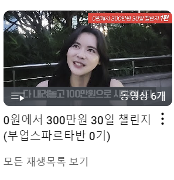

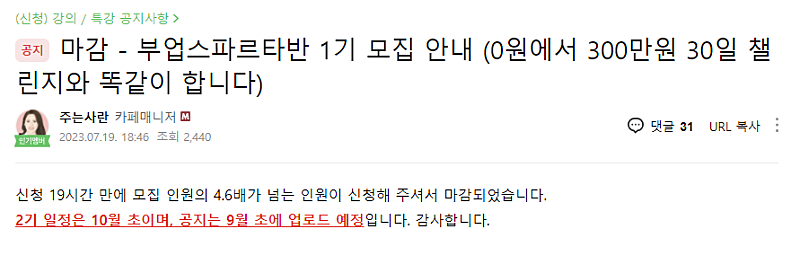

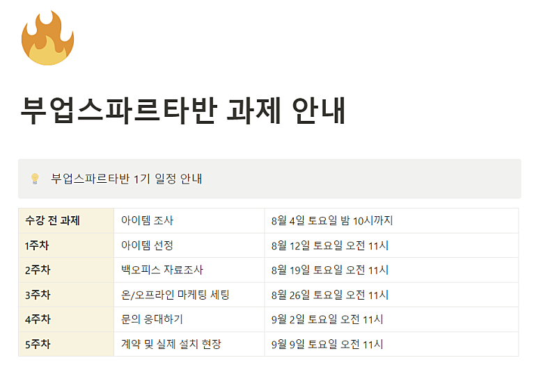

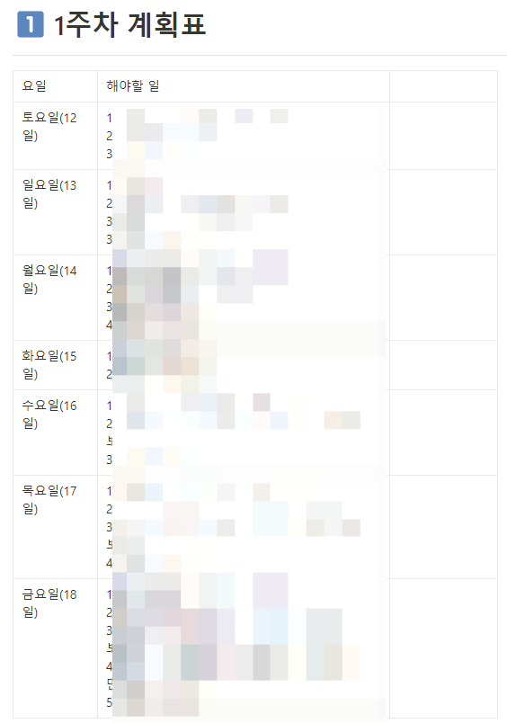

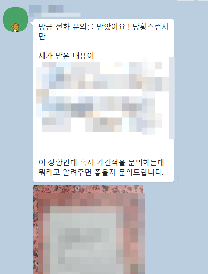

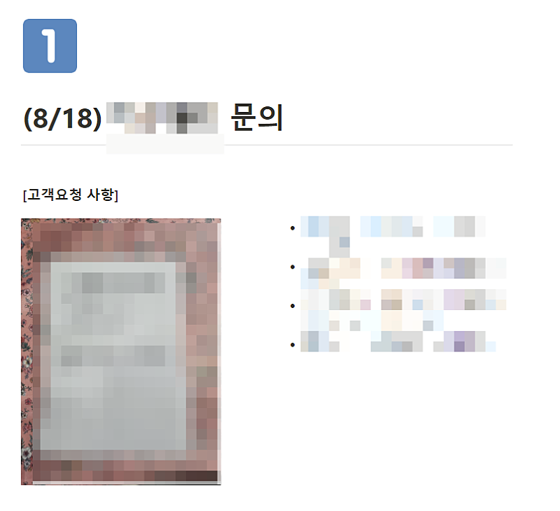

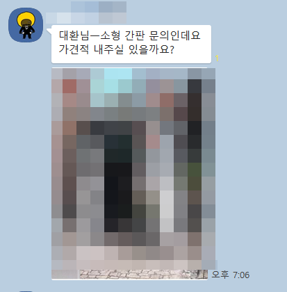

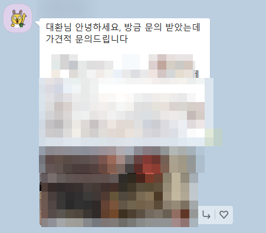

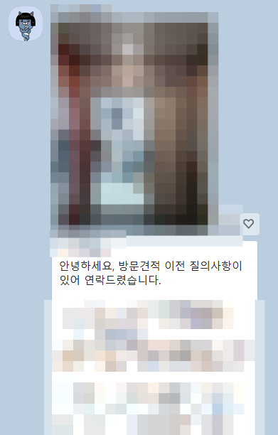

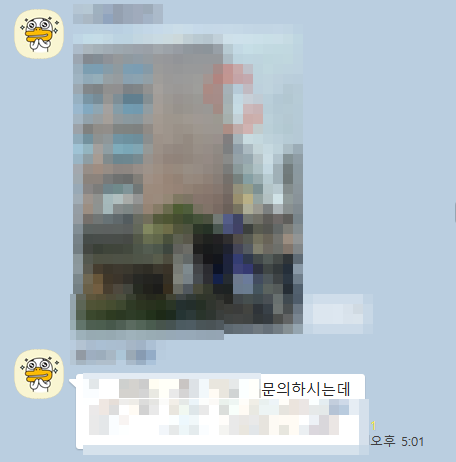

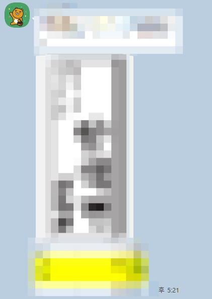

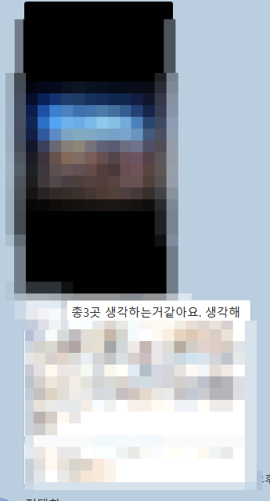

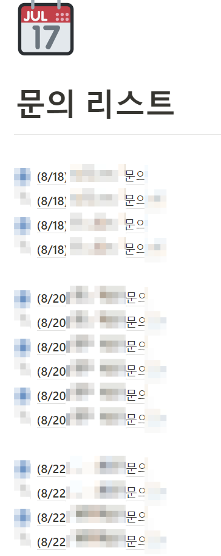

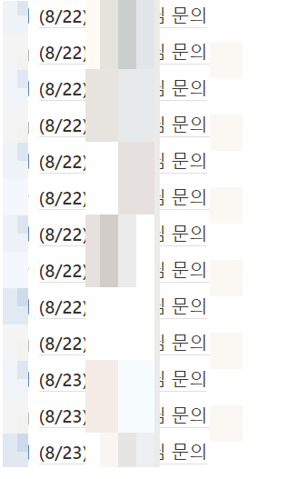

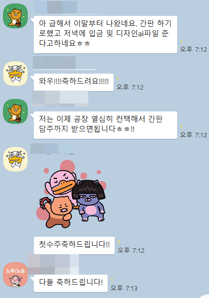

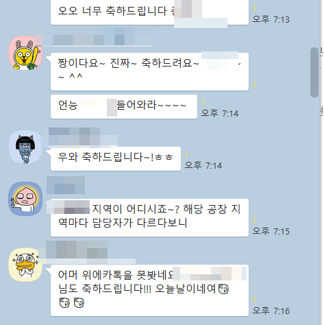

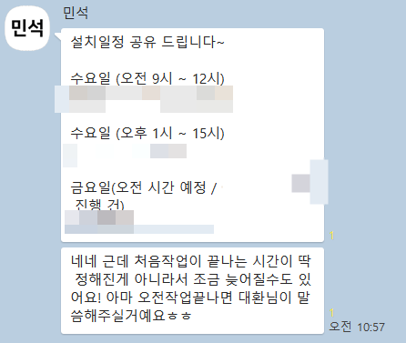

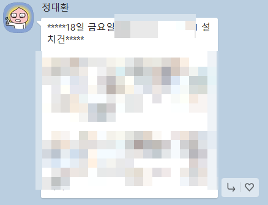

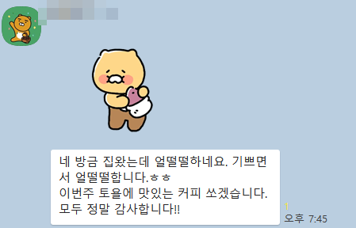

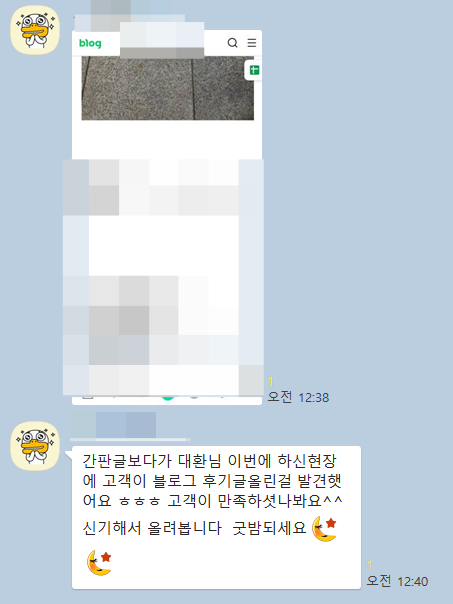

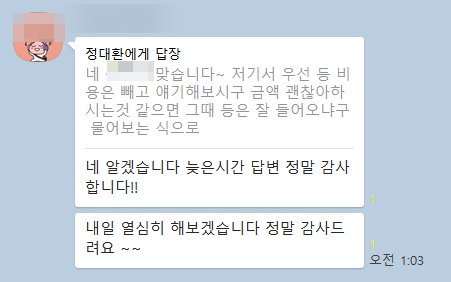

## 원문에 포함된 링크

- #

## 원본 HTML에 포함된 외부 게시물 메타데이터

외부 게시물의 현재 본문을 재수집한 것이 아니라, 카페 게시 당시 함께 저장된 제목·설명이다. 잘린 문구는 보완하지 않았다.

- 원문 링크: https://youtu.be/CYPFhzzBBWY?si=ZsNbAxSRaO_eBYZg

1시간 블로그 무료 강의를 이해할수 있다면, 마케팅 대행 부업으로 돈 벌수 있습니다.  (주는사란)

#블로그 #블로그글쓰기 #블로그마케팅 #마케팅대행사 #부업 #마케팅강의 #마케팅교육 #마케팅 #애드센스 #체험단 #체험단모집

